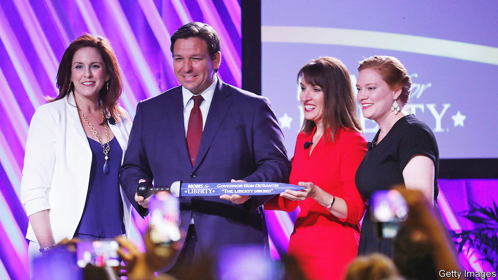

###### MAGA mummies

# Republican presidential candidates canoodle with Moms for Liberty 

##### They hope that whipping up maternal fervour will propel them to the nomination 

 

> Jul 6th 2023 

According to Catalina Stubbe, under the guise of sex education Florida schools are teaching boys to masturbate. This may be the result of demonic forces she saw at work in her own child’s classroom. When her seven-year-old’s maths homework repeatedly featured the number 666 (interpreted by some to signal the devil) she knew there were leftists behind it. Ms Stubbe is not only the parent of a schoolchild in Florida. She is the national director of Hispanic outreach for Moms for Liberty, a parents’-rights group made up of self-proclaimed “joyful warriors” who refuse to “co-parent with the government”.

Born out of the pandemic anti-mask movement, the organisation now boasts 120,000 members. Its enthusiasts attend school-board meetings across 45 states to get books containing obscene images, critical race theory (CRT) or gender ideology stripped from library shelves. On June 29th hundreds of “mama bears” gathered in Philadelphia, where the Declaration of Independence was written and thus American liberty was born, to mobilise to protect their cubs from the “K-12 cartel”. 

The country’s top Republicans came to court them. Five presidential candidates, including the front-runners, Donald Trump and Ron DeSantis, spoke at the four-day event. Vivek Ramaswamy, a businessman-turned-politician, vowed to defund the Department of Education and Mr Trump promised to let parents fire principals. All committed to battling the “indoctrination” of children. 

Their ringing endorsements came after Moms for Liberty was dubbed an anti-government extremist group by the Southern Poverty Law Centre (SPLC), a non-profit civil-rights organisation, in June. It gives the designation to groups that traffic in conspiracy theories and believe the government is tyrannical. After a year’s monitoring it characterised Moms for Liberty’s work as a crusade to “dismantle public schools” and promote anti-LGBTQ curriculums while accusing the left of “grooming” children. Much of what is documented in the report, however, looks more like fairly regular right-wing organising. Nikki Haley, chasing a long-shot presidential nomination, tweeted: “If @Moms4Liberty is a ‘hate group,’ add me to the list”.

Maternal instincts

The Moms scoff at the label and say they simply aim to depoliticise classrooms and protect children from age-inappropriate content. But last year an Arkansas Mom was investigated for threatening to gun down local librarians, and in June an Indiana chapter quoted Adolf Hitler in its newsletter. National leaders say that the quote, “He alone, who OWNS the youth, GAINS the future”, was not meant to praise Hitler but rather to warn against “monsters” who control classrooms (a photo of Joe Biden ran with the message). Liberals called them “Klanned Parenthood” and “Moms of the Third Reich”. Tia Bess, Moms for Liberty’s director of engagement, who is black and gay, points to her involvement as evidence that the group has “zero racism or homophobia”. 

Moms for Liberty’s rapid ascent into the heart of Republican politics proves it hit a nerve. Since Glenn Youngkin campaigned against CRT and covid-19 school closures in his bid for Virginia’s governorship in 2021, debates over schooling have ignited conservatives. Savvy networking and organising made Moms for Liberty the new face of the cause: that one of the group’s founders is married to the chairman of Florida’s Republican Party no doubt helped woo Mr DeSantis, who is among the Moms’ heftiest backers. Funding from conservative outfits like the Leadership Institute and the Heritage Foundation solidified it as a key part of the new-right machine. 

As your correspondent waded through the Philadelphia hotel lobby where the Moms’ annual summit took place—the organisers refused to give her press credentials and cancelled scheduled interviews at the last minute—a woman in a suit who claimed to be a detective approached and demanded to see her driver’s licence and to know her street address. When asked why, the woman said she needed to check that your correspondent “wasn’t Antifa” (a left-wing anti-fascist group and a bogeyman of the right). Some prodding confirmed that the woman was indeed a plain-clothes cop, who had voted for Mr Trump, found journalists dubious and believed that “not all Proud Boys are extremists”, referring to an exclusively male white-nationalist group with a reputation for misogyny and a propensity for violence. 

Moms for Liberty ran a training session in Philadelphia titled “(wo)manhandling the media”, warning members that “the media is not [their] friend”. That approach has helped it get its message to the masses. A new poll from /YouGov shows that 47% of Americans have an opinion of Moms for Liberty, whether favourable and unfavourable, which is not bad for an upstart social movement. 

The movement might not be as electorally significant as that number suggests, though. An analysis by TargetSmart, a Democratic data firm, attributes Mr Youngkin’s win not to anxious parents but to a “silver surge” in turnout among elderly Republican-leaning voters. A CBS News poll from 2022 found that 85% of Americans oppose banning books that contain political ideas they disagree with, and this past spring less than one-third of the school-board candidates Moms for Liberty endorsed won seats. 

Whipping up maternal fervour may help Republican politicians in the primaries. But come the general election in 2024, an allegiance to Moms for Liberty could become more of a liability. ■


