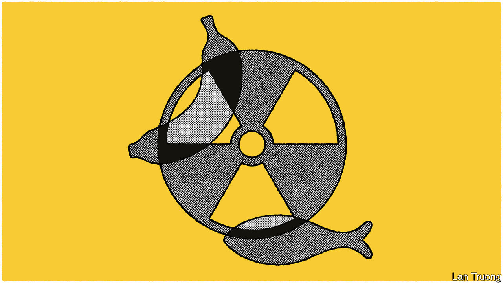

###### Banyan

# Asia is rowing about Fukushima nuclear wastewater 

##### China says Japan is treating the ocean like a sewer. That’s rich 

 

> Jul 13th 2023 

A DOZEN YEARS after the disaster at the Fukushima nuclear plant, it still casts a pall over life in Japan. Many of over 100,000 residents evacuated from around the nuclear plant at the time of the accident remain displaced. Abroad, Fukushima’s legacy is now exacerbating the region’s bilious, disputatious and grievance-laden geopolitics.

A cascade of accidents caused the disaster. A massive earthquake on March 11th 2011 triggered a tsunami, which swamped the plant’s emergency generators. Three reactors melted down. Hydrogen explosions ripped apart sections of the site. And quantities of radioactive water were released into the Pacific. The nuclear industry was culpable—for poor planning, cack-handed management at TEPCO, the Fukushima plant’s operator, and regulators cosily in thrall to it. Only heroic work by many of the nuclear plant’s workers helped prevent even worse consequences.

The enormous task of making the wrecked plant safe continues. At the heart of the clean-up is a question of what to do with the contaminated water used to cool melted fuel and fuel debris—or which has fallen as rain, or seeped into the site as groundwater. An advanced filtration process known as ALPS removes 62 of 64 radionuclides from the water to acceptable levels. Of the two remaining radionuclides, the main concern is tritium, which can damage DNA. But TEPCO says the levels are very low. It wants to release 500 Olympic-sized pools’ worth of the water into the ocean over three decades. Japan’s government backs it.

On July 4th the UN’s International Atomic Energy Agency also gave its approval, saying the radiological impact on humans and the environment would be “negligible”. At around 1,500 becquerels per litre, the concentration of tritium is about seven times less than the WHO’s guidelines for drinking water. Nigel Marks, a nuclear-materials expert at Curtin University in Perth, Australia, says that a lifetime’s consumption of fish caught off Fukushima wouldn’t “even add up to the amount of radioactivity in a banana”.

So what’s the fuss? Local fishermen and tourism operatives fear another knock to the battered Fukushima brand. Even as it is, China and South Korea ban seafood from Fukushima and neighbouring prefectures. If the water release goes ahead, China, the biggest importer of Japanese seafood, may go further—and impose a total ban on Japanese seafood imports.

That would be motivated by nationalist politics, not concern for Chinese consumers. Communist Party officials are using the ruckus to denigrate Japan, a country they consider insufficiently contrite over its imperialist past and troublesome in objecting to China’s regional ambitions. One Chinese hothead has said releasing the water would amount to “crimes against humanity”. The government’s chief spokesman accuses Japan of treating the ocean as its “private sewer”. That is rich coming from a major marine polluter. China’s Yangjiang nuclear plant releases more tritium into the sea than is proposed at Fukushima.

In South Korea, the issue is more complicated. The conservative government of Yoon Suk-yeol, which is committed to rebuilding South Korea’s strained ties with Japan, is playing down the risks. Meanwhile, with elections approaching, the left-wing opposition is trying to whip up alarm over supposed Fukushima risks to get at Mr Yoon. In an effort to provide reassurance, a lawmaker from the president’s party plunged her hands into a fish tank in a Seoul market and began drinking the water. Worried South Korean consumers are meanwhile panic-buying sea salt.

In Japan, support for the water release is mixed. The country’s nuclear industry, still recovering from the tsunami, is naturally all for it. Public opinion—at least beyond Fukushima prefecture—appears delicately balanced. As Japanese see their electricity bills rise, due to the high price of imported gas, their former opposition to nuclear energy is softening. This may be making them more accepting of releasing Fukushima water than they would otherwise be.

Yet even in Japan there is precious little trust in the nuclear industry, which has a history of cock-ups and cover-ups. Even after post-disaster reforms, TEPCO was forced in 2018 to admit its ALPS system had malfunctioned and the water would need to be reprocessed. And trust, notes Jeff Kingston of Temple University in Tokyo, is “not a renewable resource”. At home the nuclear industry lacks it. Abroad so does Japan.■


