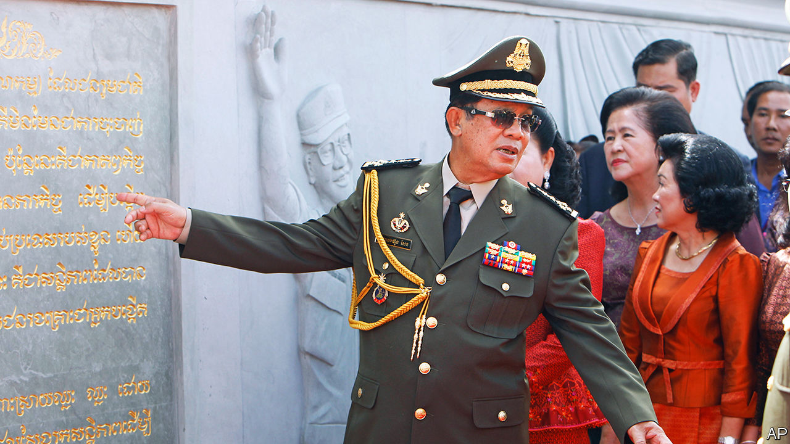

###### Hun Sen’s handsome monument

# Cambodia’s autocrat is fixing his succession 

##### That is making the country’s upcoming election a farce 

 

> Jul 13th 2023 

By the end of the 14th century, the urban sprawl of Angkor made it the world’s biggest city. Its potentate, the king of the Khmer Empire, controlled much of modern-day South-East Asia. Now all that remains of this former kingdom is Angkor Wat, a complex of ancient palaces and shrines in northern Cambodia that is visited by millions of tourists each year. And also a certain attitude displayed by the country’s current strongman. Despite his humble origins as the son of rural peasants, Hun Sen, Cambodia’s prime minister for 38 years, acts as if he is another of its fabled kings. He has even constructed a marble and concrete monument to his rule—modelled on Angkor Wat.

Yet as the 70-year-old leader’s thoughts turn to retirement, Mr Hun Sen knows his Ozymandian monument, on the outskirts of Phnom Penh, Cambodia’s capital, will not secure his legacy. Though he is campaigning for re-election, ahead of a vote due on July 23rd, Asia’s longest-serving leader has already anointed a successor—his eldest son, Hun Manet.

A graduate of America’s West Point military academy with a doctorate in economics from the University of Bristol, the 45-year-old Mr Hun Manet has raced through the ranks of the ruling Cambodian People’s Party (CPP). He is expected to take over the premiership after the poll. At Mr Hun Sen’s self-aggrandising monument, there is a relief depicting the father and son together alongside China’s leader, Xi Jinping. 

Mr Hun Sen is making sure the election does not overthrow his succession plan. He has banned the country’s main opposition, the Candlelight Party, from registering for it. He has shut down Voice of Democracy, one of Cambodia’s last independent news outlets. During his long tenure, around 6,000 opposition members have been forced or induced to join the ruling party, through a combination of threats and financial sweeteners, estimates Sophal Ear of Arizona State University. Cambodia’s few remaining opposition activists now live in fear.

Mr Hun Sen’s inclusion of Mr Xi in his family-state portrait is apt. He has afforded China huge economic, military and political influence in Cambodia, in effect turning the country into a Chinese client state. Yet Mr Hun Sen would prefer to be remembered for the decades of economic growth and peace he has overseen. His newly constructed tribute to himself is called the Win-Win Monument, named after a policy he implemented in the late 1990s to end decades of conflict by offering amnesty to members of the Khmer Rouge. That communist military group was responsible for the deaths of some 2m Cambodians between 1975 and 1979.

Mr Hun Sen’s personality cult is rooted in an idea that he alone saved Cambodia from the Khmer Rouge. Reliefs at the Win-Win Monument depict abundant harvests, bustling ports and a chart showing GDP growth ticking upwards. From 1998 until 2019 Cambodia’s economy grew by an annual average rate of almost 8%, making it one of the fastest-growing economies. As tourists return to the country after the covid-19 pandemic, the World Bank expects the economy to grow by 5.5% this year.

Cambodia’s impressive growth has withdrawn millions from poverty. According to the World Bank, the country’s poverty rate roughly halved, falling to 18%, in the decade to 2020. But growth has exacerbated other problems, including environmental destruction, corruption and crime. Cambodia is ranked 150th out of 180 among countries assessed by Transparency International for perceived corruption. One of the main backers of the Win-Win Monument is Ly Yong Phat, a Cambodian-Chinese tycoon whose family has ties to a casino raided in connection to human-trafficking and scams. Inequality is also extreme. “My parents’ generation accepts their fate: as long as there is no war, life is OK,” says one young Cambodian. “But the inequality really bothers my generation.”

It is hard to express dissent. The CPP holds all 125 seats in Cambodia’s parliament—and no one expects that to look terribly different after the election. Government employees are being pressed to vote. “It’s not so much an election as an obligation,” says one observer. This democratic charade is another conspicuous feature of Mr Hun Sen’s legacy.■

