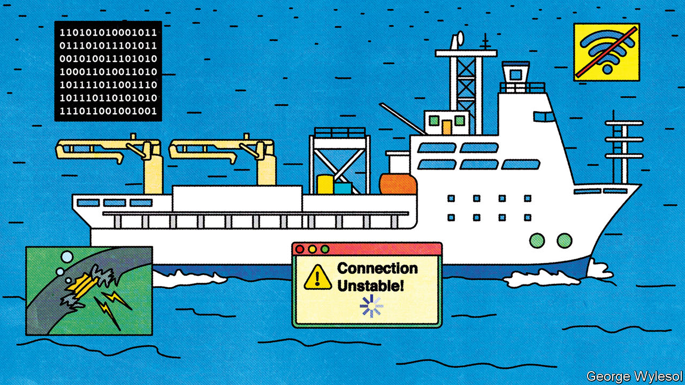

###### Asia’s digital geography

# In Asia data flows are part of a new great game 

##### Geopolitical tension and digital protectionism threaten to undermine a more connected region 

 

> Jul 10th 2023 

THE 8,600-TONNE ship bobbing in the bay of Nagasaki, in Japan’s south, is aptly named. The , which means “bonds” in Japanese, is a cable-laying vessel. It is equipped with robots that can descend 3,000 metres under the sea to install and repair the subsea cables that allow millions of Asians to message friends, shop online, trade stocks and read this article. It is a task that has become more indispensable and more difficult in the 23 years since the ship’s captain, Sakurai Atsushi, laid his first cable, connecting Japan’s main island of Honshu with . 

The digital bonds that bind Asia are in many ways tighter than ever. The region’s appetite for data is growing at an even faster pace than the rest of the world’s. Asia saw international  grow by 39% in 2022, compared with the global average of 36%, according to TeleGeography, a research firm. The combination of expanding user bases and growing economies makes Asia “one of the hottest markets in the world” for new internet infrastructure, says Ohta Takahisa of the submarine network division of NEC, a Japanese IT firm. Yet the forces straining those bonds are also mounting. Geopolitical tension, protectionist laws and a mishmash of rules governing data threaten to impede its free flow.

While in the past constructing internet infrastructure tended to be a “collaborative effort” between countries and between firms, in recent years its enabling environment has soured amid growing friction between China and America. Both are increasingly racing to build and control digital infrastructure that the other cannot access—as illustrated by a recent report by Reuters that America had secretly linked a privately built cable between Australia and Oman to its naval base on Diego Garcia, a British outpost in the Indian Ocean. Natural hazards and fishing trawlers present less charged, but also growing, risks, especially to subsea cables. 

At a small museum beside the ’s dock, Captain Sakurai and his colleagues point to chunky gutta-percha telegraph cables that in the 19th century carried information across the region, a precursor to today’s fibre-optic version. Subsea cables are now the conduits for some 99% of intercontinental internet traffic (satellites, an alternative, are costlier and slower). The cables run along ocean beds to coastal “landing stations”—where the zeroes and ones are transferred to data centres—and thence onwards to users’ devices. Aside from a heavy government hand in China’s cable industry, such infrastructure tends to be privately financed and owned. A small handful of companies dominate the production and installation of cables; big tech firms are their main users.

Concerns about the security of communications infrastructure are as old as submarine cables themselves. Cable sabotage was a big worry in the build up to the first world war, notes Camino Kavanagh of King’s College London. But such worries have flared in recent years. “Customers are asking more about the security of cables and routes,” says Uchiyama Kazuaki of NTT World Engineering Marine Corporation, the firm that owns the 

Some fret about hackers and spies. Others mull the risk of malign activity related to potential conflict, in particular around Taiwan. The most congested cable route in Asia is also its most contested: the South China Sea is the “main street” of submarine cables, especially between Japan, Singapore and Hong Kong, notes Murai Jun, a Japanese internet pioneer. Physical and environmental hazards are also disruptive. Tonga was largely cut off from the internet in early 2022 after a volcanic eruption and tsunami severed its lone fibre-optic cable. As fishing trawlers seeking to feed South-East Asia’s growing population have become more common, so have accidental cable ruptures. “The internet is very, very vulnerable,” says Tsuchiya Motohiro of Keio University near Tokyo. 

As content providers move data centres and content closer to consumers, more data are flowing within the region. Intra-Asia data flows make up over 50% of the region’s bandwidth, up from 47% in 2018, while the share going to America and Canada has fallen from 40% to 34% over the same period. Yet geopolitics is also reshaping how and where Asia’s digital infrastructure gets built. As China’s territorial claims in the region have grown, getting permits in some areas has become more contentious. China has also been competing with America and its allies, such as Japan and Australia, to offer cables and financing for connectivity to remote Pacific island nations. America has increased oversight of cable construction, nixing several planned cables linking America with Hong Kong; a new Undersea Cable Control Act is working through Congress. 

Alternative pathways and nodes are emerging. Hong Kong was traditionally one of three major data hubs in Asia, with Japan and Singapore. Now Western countries “need a new hub”, says Esaki Hiroshi of the University of Tokyo. “The infrastructure frontline is shifting.” The Philippines and Guam have emerged as attractive substitutes. Apricot, a new cable linking Guam, Indonesia, Japan, the Philippines, Singapore and Taiwan, avoids the South China Sea. The aim is to increase “route diversity”, says Sato Yoshio of NTT, which is helping to build the cable for Google and Meta. Yet it would be premature to speak of a digital decoupling. While American and Chinese carriers have largely stopped laying cables together and forming new direct links, the networks between America and China still connect, notes Mr Mauldin. “It’s not quite as extreme as media coverage makes it out to be.” 

Ultimately the biggest challenge may lie not in constructing or protecting the infrastructure to move data across borders, but in creating rules to govern it. “There’s a vacuum in terms of rules, norms and agreements that govern digital trade,” laments Nigel Cory of the Information Technology and Innovation Foundation, a research institute in Washington. 

Various models vie for influence. China pushes an approach rooted in sovereignty and security. Several data-protection laws, including the Cybersecurity Law, the Data Security Law and the Personal Information Protection Law form the core of a system based on control over and access to data through localisation requirements. The European Union has made privacy central to its approach, through its GDPR legislation. America mostly puts commerce first. But its turn away from trade agreements makes it harder to engage with and influence Asian governments.

Others in Asia are trying to come up with their own alternatives. Singapore has also emerged as a pioneer of new digital trade agreements, such as the Digital Economy Partnership Agreement, which also includes Chile and New Zealand. Its pragmatic approach to aligning and modernising rules for sharing data across borders has made it a model for best practice in the region, says Jeff Paine of the Asia Internet Coalition, an industry association. In 2019 Abe Shinzo, the late Japanese prime minister, proposed the concept of Data Free Flow with Trust. That rather nebulous idea is materialising as a set of global norms to counter digital protectionism. As Matthew Goodman of CSIS, a think-tank in Washington, puts it: “It’s about the un-China approach to data governance.” 

But those pushing a more liberal approach to data governance will struggle to make the case to Asian governments. To many, the Chinese model resonates, says Deborah Elms of Asian Trade Centre in Singapore: “If data is the new oil then I want to own it, goes the thinking…it can be hard for folks to see the upside of letting data flow freely.” Vietnam, which is hardly friendly towards China, has adopted some of its methods for controlling data. Authoritarian regimes are not the only ones to slide toward digital protectionism. India insists data must be stored locally: to give its law-enforcement agencies easy access, to protect against foreign snooping and as a way to boost investment in the tech sector. When it comes to digital policy, most governments “pick and choose like they’re at a smorgasbord”, says Mr Cory.

Digital spaghetti

The result is often a mess of conflicting rules. “If we thought we had a spaghetti bowl in the past on traditional goods, some of these digital rules risk becoming much much worse,” Ms Elms says. What’s more, regulating digital trade is more complicated than overseeing beef and steel. Technology often changes too fast for rule-makers to keep up, most governments lack policymakers with relevant technical expertise and most digital issues cut across different domains, extending beyond the traditional remit of trade negotiators.

Localisation measures and other bars to cross-border data flows will raise costs, harming small and-medium-sized businesses most of all. Without regional co-ordination, such digital protectionism is taking root, says Shiro Armstrong of the Australian National University in Canberra: “It means forgoing so much of the ability of data to be used for productive purposes.” ■

