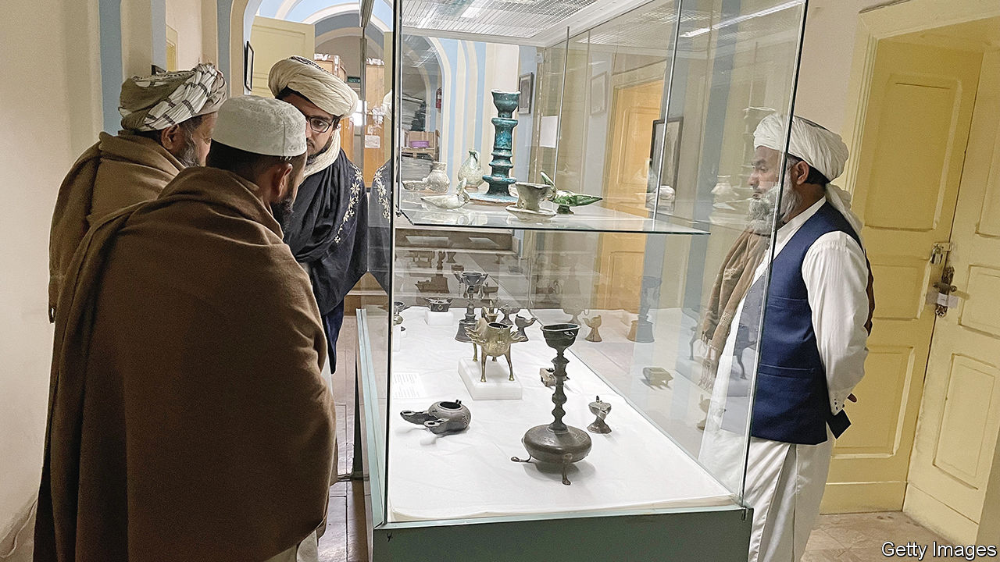

###### Nights at the museum

# The Taliban embrace cultural heritage 

##### Afghanistan’s rulers no longer want to smash up the country’s pre-Islamic riches 

 

> Jul 11th 2023 

When the Taliban barrelled into Kabul in August 2021, the curators of Afghanistan’s national museum stashed away its pre-Islamic treasures. During the Islamists’ previous spell in power,  minister of finance led an axe-wielding wrecking crew to smash up thousands of the pre-Islamic artefacts bequeathed by Afghanistan’s staggeringly rich history. Determined to prevent a repeat performance, museum employees camped for nights on end in the battered 1920s Kabul villa that houses its collections.

Yet this time  have shown no interest in demolishing the museum’s thousand-year-old statues of Buddha and pagan wooden effigies of Nuristan (many of which have been laboriously stuck back together by museum staff over the past two decades). The staff say the Taliban culture ministry, which oversees the museum, is supportive. Senior officials, including Kabul’s mayor and the minister of foreign affairs, have made friendly visits. A handful of rank-and-file Taliban drop in most days, adding to a flow of visitors dominated by school parties. “They seem surprised and pleased that they have a history and a culture,” says the museum’s acting director, Muhammad Zubair Ebadi. “Totally, their mentality has changed.”

The Taliban, who in 2001 destroyed the giant sixth-century Buddhas carved into the cliffs of Bamiyan, in central Afghanistan, are also showing a benign attitude towards archaeological digs. They are even backing a project to save the remains of a synagogue left by the long-departed Jewish community of Herat. With improved security across the country—chiefly thanks to the end of the Taliban’s own insurgency—a mini-spike in archaeology has been inspired. “They have been really, really helpful,” says Jolyon Leslie, a South African architect and veteran of Afghanistan’s cultural sector. A special police unit has been tasked with preserving cultural heritage. Taliban officials in the southern province of Zabul were punished after being caught trying to sell ancient artefacts.

Still, satellite imagery suggests much more needs to be done to stop the looting of archaeological sites. There is also no guarantee the clerics will maintain their benevolent attitude. They turned to systematic cultural destruction only five years after they first assumed power, once their relations with the outside world had hit rock bottom. And the Taliban’s leader, Haibatullah Akhundzada, appears again to be taking a more hardline direction. Against the wishes of many of his ministers, he has imposed bans on female education and employment. On July 2nd the Taliban ordered the closure of beauty parlours.

The clerics are said to be concerned to prevent their foot-soldiers switching to another militant group, Islamic State Khorasan Province, which has more uncompromising views, including on non-Muslim culture. Wisely, the museum’s curators have no imminent plans to restore their treasured Buddhas and Nuristani statues to its galleries. “They are all valuable and we don’t want to risk them being broken by someone,” says Mr Ebadi tactfully. ■

