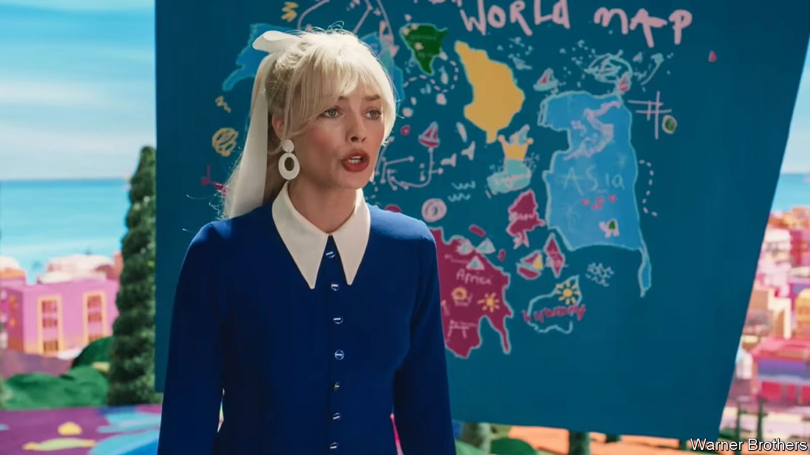

###### In a Barbie world

# Why has Vietnam banned the “Barbie” film? 

##### Censors say it shows a map with China’s disputed nine-dash line in the South China Sea 

 

> Jul 13th 2023 

Vietnam has banned the new “Barbie” film because it features a map showing China’s claim to the South China Sea. The map—pictured—appears to include the “nine-dash line” that China uses to mark its claim to most of the sea, despite protests from Brunei, Malaysia, the Philippines, Taiwan and Vietnam. The film’s Hollywood producer, Warner Brothers, called the map a “childlike crayon drawing…not intended to make any type of statement”. Hollywood has long tried to ingratiate itself with China’s censors. China is vying with America to be the biggest film market. ■

