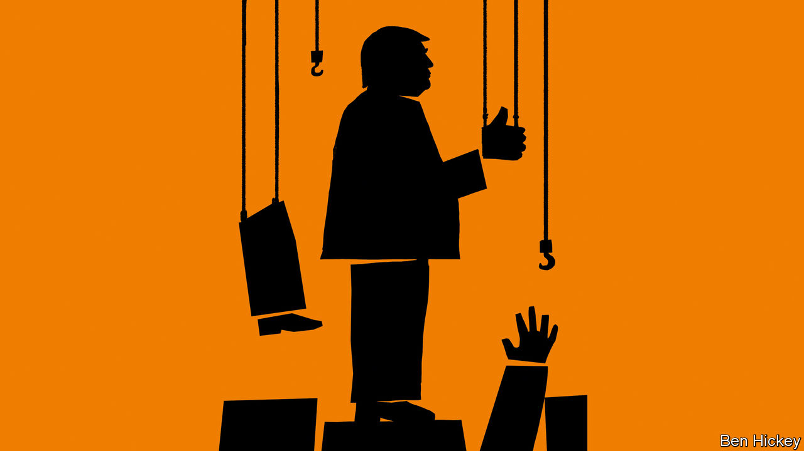
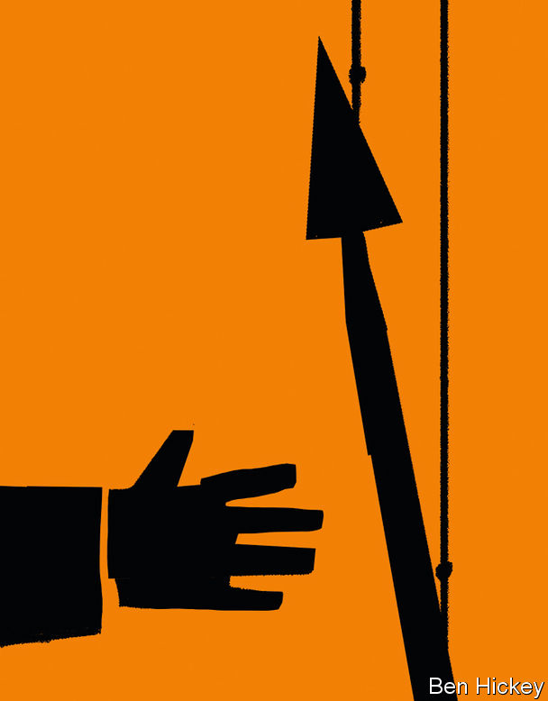
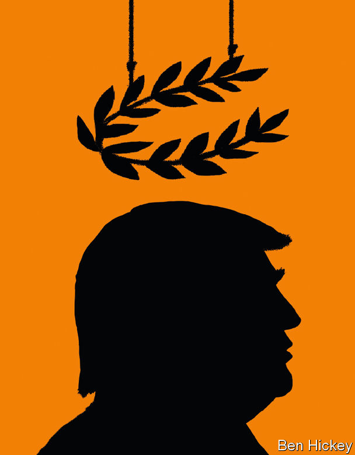

###### Chaos meets preparation

# A second Trump administration would get its way far more than the first 

##### The America First movement is readying the necessary personnel and policies 

 

> Jul 13th 2023 

BROOKE ROLLINS is sitting at her desk in Fort Worth, Texas, at the back of an anonymous, low-rise building. It looks uncannily like an office in the White House, with its lemony cream wallpaper, dark wood furniture and photographs of the president signing bills as admirers look on. Only one detail jars: the 18th-century rifle leaning against the wall.

The resemblance is not a coincidence. Mrs Rollins worked in the White House under Donald Trump and briefly ran his Domestic Policy Council. She purchased her West Wing furniture when she left. Towards the end of Mr Trump’s first term, she was in charge of putting together a policy agenda for his second one. After Mr Trump lost his bid for re-election in 2020, she set up a think-tank to continue that work, the America First Policy Institute (AFPI).

AFPI aspires to be an administration-in-waiting. Its staff of 172 includes eight former cabinet secretaries from the Trump administration and 20 other political appointees. “I will leave things ready for the next Republican president,” Mrs Rollins says. Campaign-finance laws prevent her from saying so, but she means Mr Trump.

AFPI is the newest think-tank preparing for a second term for Mr Trump, but it is not the biggest. The Heritage Foundation, which prides itself on having done the preparatory work for Ronald Reagan’s “revolution”, has its own presidential transition project. This is led by Paul Dans, a lawyer who worked in the White House’s Office of Personnel Management during Mr Trump’s presidency. In 1981 copies of a manual for government produced by Heritage were placed on the chairs of each of Reagan’s cabinet members before their first meeting. Heritage is updating that idea, co-ordinating an effort by 350 conservative wonks and former administration officials to write a plan for government in time for the Republican primaries next year. Those who have criticised Mr Trump or his agenda will not be part of it.

As well as drafting policies for each department, Mr Dans and his colleagues are building a list of potential recruits to serve in the next Republican administration. He likes to describe the effort as a conservative LinkedIn. Fully staffing an administration requires about 4,000 political appointees, 1,200 of whom must be approved by the Senate. Heritage and its allied think-tanks are vetting the people to fill those jobs now.

Dismiss that which insults

What would prove disqualifying? “If you kind of have shown yourself to have fought against the Trump administration, or there are issues where you’ve actually been counter to it,” says Mr Dans. “You know where people stand by where they sit, so to speak. Their postings and social media, their allegiances over time can give people a pretty good picture.” Blaming Mr Trump for the ransacking of the Capitol in 2021, or supporting his impeachment in the days that followed, for example, would be enough to keep someone off the list.

Thanks to these efforts, the next Trump administration, if there is one, will have fleshed-out plans and the know-how to advance them. That would make it very different from Mr Trump’s first term. “We didn’t have the people because nobody thought we would win,” says Steve Bannon, who managed Mr Trump’s campaign and was an influential figure at the beginning of his presidency. (Mr Trump fired Mr Bannon, but later stopped him being tried for misuse of funds from a non-profit group he headed by pardoning him.)

Mr Bannon mentions the National Security Council (NSC) as an example of the staffing problems the Trump administration faced. It struggled to come up with half the necessary number of political appointees, he says. They were an odd mixture of people like Michael Anton, a corporate PR man and apocalyptic political commentator, and old foreign-policy hands who turned out to be queasy about Mr Trump’s courting of North Korea’s dictator and his hostility to American allies.

What was true of the NSC applies to other agencies, too. “You have got to hit the beach with three or four thousand guys,” Mr Bannon says. Mr Dans agrees. “In Hollywood they like to describe things as ‘this meets that meets the other’. This is the Manhattan Project meets the Empire State Building meets D-Day.”

The initial objective for this invading force is to capture the civil service. One lesson that Mr Trump’s backers drew from his first term is that no policy matters more than control of the bureaucracy, because no policies can be implemented without it.

To that end Mr Trump’s commandos will “deconstruct” the administrative state—the 300 or more federal offices that issue and interpret regulations. The philosophical version of this idea is that, over time, as the role of the federal government has grown from fighting wars and running the postal service into the Leviathan it is today, unelected bureaucrats have assumed powers that should belong to Congress. The Twitter version is that the deep-state liberals who thwarted Mr Trump when he was in office and have persecuted him since he left must be vanquished. Either way, Mr Trump’s shock troops will try to wrest power back from the bureaucracy.

In practice it is hard to see how government would function without the administrative state. Congress struggles to fulfil basic responsibilities like passing a budget on time. To imagine that the same body could act as, say, the regulator of financial markets is a stretch. That may be the point. The MAGA movement is not libertarian, but in many ways it would like the federal government to do far less than it does now.

The would-be Trump appointees plan to subdue the bureaucracy using Schedule F, shorthand for an executive order issued by Mr Trump in 2020 and rescinded by Joe Biden when he became president. It reflects a view that the federal bureaucracy, whatever its size, should not have any entrenched authority. For the first century of its existence, civil servants were appointed to jobs by the government of the day based on an algorithm of personal contacts and favours owed known as the spoils system. Then in 1881 a deranged office-seeker assassinated the president, spurring the passage of the Pendleton Act, which created a class of professional bureaucrats who stayed in their posts even as the presidency changed hands. Since the 1940s, when Franklin Roosevelt was expanding the government, it has been hard to fire federal bureaucrats, AFPI complains.

Many political appointees in the Trump administration believe that a minority of civil servants used their protected status to thwart or undermine the president’s wishes. James Sherk, a policy adviser in the Trump White House who is now at AFPI, cites two cases on which lawyers in various government departments reportedly refused to work: one against Yale University for allegedly discriminating against Asian-Americans, and one aimed at protecting nurses from having to perform abortions. Schedule F would empower Mr Trump’s appointees to remove perceived obstructionists at will.

“Schedule F is now, I think, Republican doctrine,” says Russell Vought, who ran the Office of Management and Budget under Mr Trump. “I don’t know how a Republican gets elected and doesn’t do that.” It would also be straightforward to enact: Mr Trump could just reissue his old executive order. Again, there is a reasonable version of this idea, in which a small number of recalcitrant civil servants lose their jobs, and a campaign version, where Schedule F becomes the instrument of Mr Trump’s righteous purge of Washington.

To be with those I like is enough

The combined effect of appointing only loyalists and cowing the bureaucracy would be both to remove constraints on Mr Trump and to ensure his wishes are acted on more often. In his first term Mr Trump’s opponents took some comfort from the idea that not all the people around him were true believers, and were willing to stall his most alarming ideas. The  ran an anonymous piece by a political appointee who claimed there was an internal resistance within the administration that acted as a check on presidential power. In a second Trump term, there will not be any “grown-ups in the room”, as Mr Trump’s detractors called such people.

 


Once a second Trump administration had bent the bureaucracy to its will, what policies would it pursue? The department-by-department plans being drawn up at AFPI, Heritage and elsewhere give some guidance. They involve some predictable fusillades in the culture wars, such as completing a wall along the border with Mexico and directing all federal officials to consider only people’s biological sex, rather than “self-identified” gender. But some of the putative policy agenda is both more sweeping in scope and more of a break with past Republican orthodoxy.

One such area is the economy. The new right is enthusiastic about the kind of industrial policy the Biden administration has pursued. “No one in Ohio…cares that the  editorial board doesn’t like the CHIPS bill on free-market economic grounds,” J.D. Vance, a senator, recently told a gathering at American Compass, a think-tank, referring to a law subsidising semiconductor factories. In some cases Mr Trump’s supporters would go further: Mr Vance advocates taxing companies that shift work offshore.

The main partisan disagreement over industrial policy is no longer whether to have one at all, but over the Democrats’ habit of smuggling diversity requirements and environmental goals into it. As the Republicans have become a more working-class party than the Democrats, people like Mr Vance have tried to synthesise a  that is both pro-labour and hostile to union leaders. His advocacy of subsidies for industry without “the woke bullshit” is probably more popular than the Biden administration’s approach. 

That enthusiasm for an active state coexists with a more conventional Republican programme of lowering taxes, coupled with a belief that well-intentioned efforts to cut poverty usually backfire. AFPI’s policy book talks of making permanent the tax cuts in the Tax Cuts and Jobs Act of 2017, some of which are due to expire in 2025. AFPI’s policy wonks also advocate attaching work requirements to Medicaid (health insurance for the poor) and other government benefits. In Arkansas, the only state to have implemented work requirements for Medicaid, a quarter of those enrolled in the programme lost their health insurance and there was no noticeable increase in employment. The reforms would at least save some money, but not enough to have much impact on the federal deficit.

Expensive industrial policy, lower taxes and only small reductions in benefits—in other words, less revenue and more spending—would not balance the books, much less trim government debts or refill the funds that pay for Medicare (subsidised health insurance for the disabled and the old) and Social Security (the state pension), which are due to run dry in the early 2030s. On past evidence the bond market is likely to continue to finance the growing gap between the government’s income and expenditure. Investors might become nervous, however, if the Federal Reserve’s independence were in question. Some Trumpists think it should be, since they do not like to cede so much power to unelected bureaucrats. That is a minority view, Mr Vought concedes, but could gain ground: “I guarantee that if that debate was in front of President Trump, that he wouldn’t just throw you out of the Oval Office.”

Another area in which a second Trump term could bend the arc of history is in environmental policy. In his first term emissions of greenhouse gases kept falling, even though he reversed many of Barack Obama’s policies to slow climate change. Investors assumed that government policy would soon revert to a greener norm and coal-fired power stations have lifespans of several decades, so the administration’s fondness for them was not enough to get new ones built. In this respect, too, a second Trump administration would be more methodical and better organised.

Whatever satisfies the soul is truth

AFPI’s policy book talks about ending “the war on fossil fuels” and makes untethered assumptions about how much bigger the economy would be without it. (AFPI estimates that America’s gdp will be 6% smaller by the end of this decade than it would have been without the Obama administration’s emissions-reductions targets.) The argument is presented in both pragmatic and moral terms. Why should American oil stay in the ground while Saudi oil flows? And why should the use of fuels which can bring so much prosperity to so many be circumscribed? Never mind that Mr Biden’s administration has granted more permits to drill than Mr Trump’s did, that America is the world’s largest producer of oil or that it is in the national interest to limit global warming.

America Firsters like oil, gas and coal and the relatively well-paid, manly jobs for high-school graduates they bring. They are also opposed to the green transition, which they see as unnecessary government meddling that raises energy prices for ordinary Americans. Both Kevin Roberts, who runs Heritage, and Mrs Rollins, who started AFPI, used to be senior figures at the Texas Public Policy Foundation (TPPF), a think-tank which opposes the development of wind farms and solar plants.

Over a quarter of Texas’s electricity is generated by renewables, and TPPF has helped to propagate the idea that this makes the state’s power grid unstable. Investors in renewables say Texas’s electricity regulator has become hostile to new projects. TPPF, meanwhile, is battling renewables as far afield as New York, Rhode Island and Massachusetts, where it has initiated a lawsuit against a big offshore wind farm on behalf of fishermen. If the federal Environmental Protection Agency and Justice Department were run by people who shared these instincts, investors in renewables would face the same sort of political risks as owners of coal plants.

A third area which is likely to see great upheaval if Mr Trump becomes president again is foreign policy. Among America First types, there is deep disagreement about Ukraine. AFPI’s policy book talks about facing the threat from Russia. Yet Mr Bannon says, “I don’t give a shit about Ukraine—what I give a shit about is the invasion of America’s southern border.” Mr Vought makes the same point in a more wonkish way: “Ukraine is being subsidised by our taxpayers to fight and not make strategic calculations that they would otherwise make if we weren’t subsidising it. And it’s not in our interest to subsidise that conflict.” Mr Trump himself says he would end the war. He may not be able to do that. But Ukraine and its other allies ought to take seriously the possibility that America may no longer be with them in 18 months.

Policy towards China is less contested. The Trump administration was more confrontational towards China than any of its predecessors. The Biden administration has continued in the same vein, albeit with less inflammatory rhetoric and more considered policies. “The difference between the Biden administration and the Trump administration on protectionism is that the Biden administration is competent,” says Dan Drezner of Tufts University. A second Trump term would be more likely to build on what the Biden team have done rather than, say, loosening export controls.

 


Heritage’s plan for 2025 foresees an immediate ban on TikTok and also on Confucius Institutes. American pension funds would be encouraged to divest from “problematic” Chinese entities. The government should be prepared “to employ punitive policy measures” to prevent American investment in sensitive areas in China and Chinese investment in America. American companies considering large-scale investments in anything deemed critical would have to submit information about counterparties and anticipated use of funds to the US government before investing, “under a presumption of denial”. 

Whether Mr Trump would authorise the use of force if China were to invade Taiwan is hard to say. Some who worked in his administration note that whenever they were about to adopt tougher policies on China, the bosses of big American firms would call the White House and tell him that the move would alarm financial markets and he would back down. The same dynamic may apply in a second term. In a memoir of his time as Mr Trump’s national security adviser, John Bolton suggests the former president was not really committed to Taiwan’s security. Others claim he would be “stronger” than Mr Biden.

Other allies could expect the same peremptory treatment as in Mr Trump’s first term. He reportedly told aides he wanted to leave nato. Even AFPI, which on foreign policy is closer to the old Republican orthodoxy, thinks that military support should be withdrawn from countries that do not spend at least 2% of GDP on defence, a level that neither Japan nor most countries in nato meet. The modern America First movement, like its namesake during the second world war, contains some true isolationists. But it also contains an influential clutch of people like Elbridge Colby, who served in the Department of Defence and believes in a muscular foreign policy. He thinks China is such a threat that America should pull back from its defence commitments in Europe and the Middle East to concentrate on the Pacific.

No matter how well-laid the plans for a second Trump term, nor how thoroughly vetted the people carrying them out, Mr Trump would still be in charge, which means there is a limit to how methodical it could be. But it would be altogether more formidable than the version of 2017-21. As for the candidate himself, he is aware of the plans being made on his behalf but has never been excited by the details of public policy. For the professional wonks in the movement, that is an opportunity.

“ doesn’t think that populists can govern, right?” asks Mr Vought. “We believe we’re trying to be an answer to that viewpoint. So we’re trying to look systemically: how does someone who has an American First perspective, a populist perspective, govern credibly and effectively? Because they know the inner workings of government so well.” The winner of next year’s presidential election will be sworn in in 18 months. The institutions of the new right expect it to be Mr Trump, and this time they will be prepared. ■


