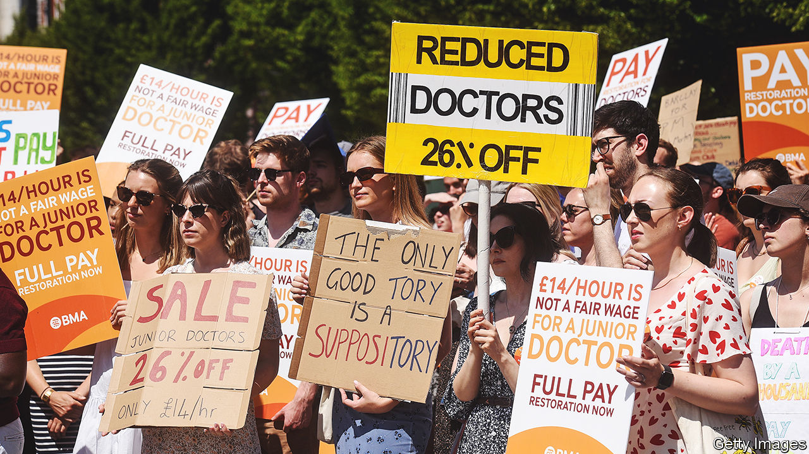

###### Not on call

# Britain’s doctors are on strike, again 

##### Is their trade union the country’s most powerful? 

 

> Jul 13th 2023 

Aslef, THE train drivers’ union, can stop the trains running. The Communication Workers Union, which represents postal workers, can withhold parcels and letters. Yet their power is dwarfed by that of the British Medical Association (bma), the trade union of which more than two-thirds of British doctors are members. In pursuit of better pay, it has the power to withdraw vital medical care. 

On July 13th junior doctors in England began a five-day walk-out from hospitals, including emergency departments. More than 46,000 junior doctors in England are members of the bma; most were expected to strike. Consultants, doctors who have completed specialist training, will provide cover, before striking themselves for two days from July 20th. General practitioners are also . 

Strikes by doctors are rare because they raise ethical dilemmas for a profession which swears to do no harm to its patients—until 2023 there had only been two previous bouts in the 75-year history of the  (nhs). That so many are now walking out is indicative of an extraordinary moment in British industrial relations. It is also a sign of the bma’s renewed power.

Formed in 1832, the union has long been a thorn in the side of governments. The architect of the nhs, Aneurin Bevan, decried it as a “small body of politically poisoned people”: to secure its labour he had to “stuff their mouths with gold”. Yet in recent years its members have grumbled that the bma has been drained of its venom, more professional body than trade union. During the previous wave of junior doctors’ strikes in 2015-16, it seemed to show stronger support for a sugar tax than for its own strikers. 

No longer. The pressures of the covid-19 pandemic, soaring inflation and social media have transformed some geeky medics into fire-breathing unionists. The shift began in 2021, when activist doctors used a disengaged membership to their advantage. Co-ordinating online, they won elections to the bma’s highest council, as well as the junior doctors committee. Junior doctors are now focused on a single issue: reversing a real-terms pay cut of 26% since 2008. In a ballot in February with 77% turnout, 98% voted for industrial action. The latest strike is their fourth in five months. 

The consultants committee, part of the bma, points out, as it prepares for its first strike since the 1970s, that consultants’ pay has fallen by 35% in real terms since 2008. But in recent decades, whereas junior doctors have increasingly struggled with student debt, consultants have done comparatively well. A new contract in 2003 gave them a big salary bump. Between 2000 and 2009 consultants’ pay increased by 34% in real terms.

In purchasing-power parity terms, British consultants had the fifth-highest salaries of specialists in 28 oecd countries in 2020, at $155,000 (excluding private work). Hospital nurses, by comparison, ranked 23rd of 33 countries, with salaries of $44,000. Consultants have also benefited from a recent reform which gave tax breaks to those with large pensions. While most Britons still view doctors as pandemic heroes, only 46% back consultants striking, according to a recent poll, compared with 58% for junior doctors. Hospital waiting lists are already at a record 7.5m; 650,000 procedures have so far been cancelled due to strikes. As more pile up, the risk of a backlash increases. 

The strength of the bma is that it represents every kind of doctor. That is also its biggest challenge, notes Richard Smith, a former editor of the , which is owned by the BMA. Junior doctors (who prefer to be known simply as doctors) argue that they are often overlooked by consultants in favour of “noctors”: other health professionals such as associate physicians, who are less qualified but better paid. Junior doctors in Scotland have suspended their own strike to mull a 12.4% pay offer from the Scottish government: that risks dividing members on national lines. But this, as its members point out, is a new bma. It is better at holding the line. ■


