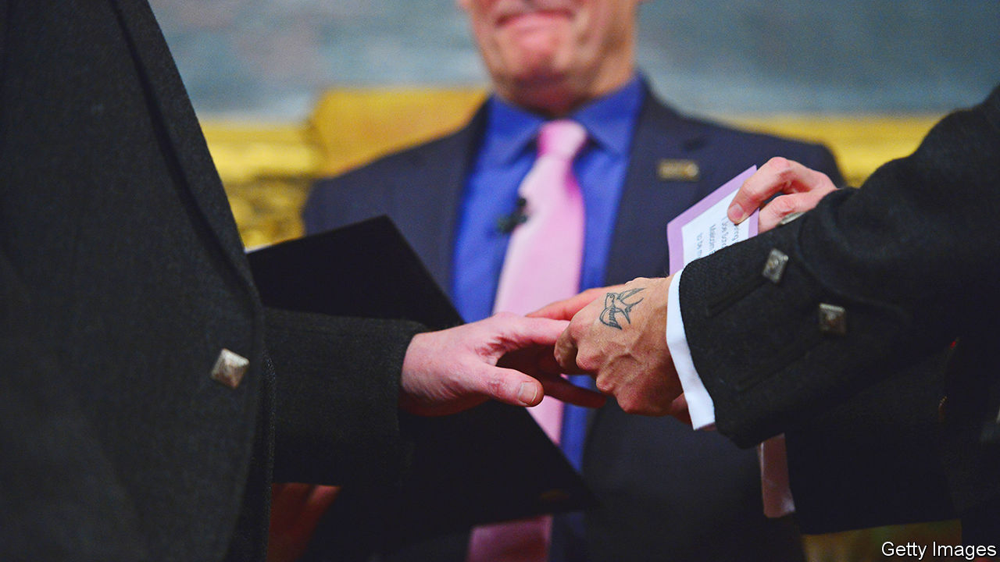
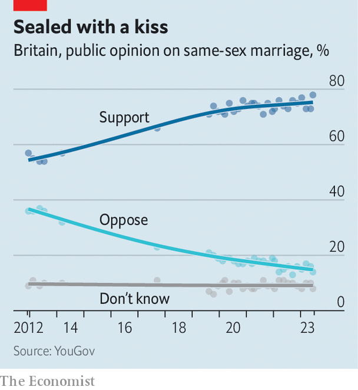

###### Same-sex weddings

# Many Britons have changed their minds on gay marriage 

##### But ten years after it was legalised, the Church of England remains a holdout 

 

> Jul 13th 2023 

David cameron may not have expected  to be among his proudest legacies. The landmark social reform, which was passed by the House of Commons on July 17th 2013, did not appear in any party’s manifesto for the election in 2010. The resulting coalition government initially said it would retain a ban on gay marriage. In his memoirs the former prime minister admitted that he had gone on “a journey”; one that caused him to “worry and even wobble”. 

Once he found his resolve, Mr Cameron was met with prophecies of doom. His mps warned him that he was “barking mad” and would split the Conservative Party. Lord Carey, the former Archbishop of Canterbury, said the change would “fatally weaken what is still one of our country’s greatest strengths,” paving the way to polygamy and marriage between siblings. David Silvester, a Conservative councillor, cited the scriptures when he claimed that Britain would be “beset by natural disasters”. 

 


The roof did not fall in (though Mr Silvester did blame Mr Cameron for some flooding in 2014). Indeed, same-sex marriage has proved remarkably popular. As of 2020, the most recent year for which there is data, more than 42,000 gay couples in England and Wales had tied the knot. (Scotland and Northern Ireland passed separate laws.) Polling in June found that more than three-quarters of Britons now support gay marriage, up from just over half in 2012. Just 14% are opposed. 

The success of same-sex marriage legislation shows how political leaders can shape and accelerate deeper shifts . Britons have long been becoming more liberal and less religious. The previous New Labour government had done much to sweep away repressive legislation. It ended Section 28, which prevented schools and local authorities from “promoting homosexuality” and introduced civil partnerships. Campaigners were pushing for more.

Nevertheless, Mr Cameron chose to confront his party on a subject many would rather have avoided. “I don’t support gay marriage despite being a Conservative. I support [it] because I’m a Conservative”, he told his party’s annual conference in 2011. The government proceeded carefully, conducting a consultation which elicited the largest ever response. Still, Conservative mps attempted wrecking amendments and 134 voted against the bill, which meant that Mr Cameron had to rely on opposition votes. But the law was changed, and attitudes changed with it. Gay marriages became not an abstract threat but something undertaken by friends, colleagues, neighbours. Almost half of Britons now say they know a married gay couple. 

This change reveals some deeper shifts. Gordon Brown, Mr Cameron’s predecessor, opposed gay marriage in office because it was “intimately bound up with questions of religious freedom”. Many others across the House did, too. Few would now admit to such a view. Danny Kruger, a Conservative mp, told a recent conference on “national conservativism” that marriages between men and women were “the only possible basis for a safe and successful society”. But there appears little constituency for such a message in Britain now. Number 10 quickly shot down the remarks. Like most successful and enduring policies same-sex marriage has moved beyond contention. Though Britain was not the first to legalise it, 19 other countries have since given gay marriage their blessing. 

A thornier legacy concerns the relationship between church and state. The government designed the law to ensure no organisation or minister could be forced to marry same-sex couples. That pleased the Church of England and helped the bill’s passage through Parliament. But it has led to a decade of ecclesiastical discord as liberal members of the church argue for the right to perform or partake in gay marriages. A fudge in which the church said it would “bless” (meaning not marry) same-sex couples pleased no one. A group of mps led by Ben Bradshaw, a gay Anglican, is looking at ways to amend the legislation to allow willing priests and parishes to take part, which they argue could also help boost dwindling numbers in the aisles. “Either be the established church or go off and be a sect,” says Mr Bradshaw. ■


