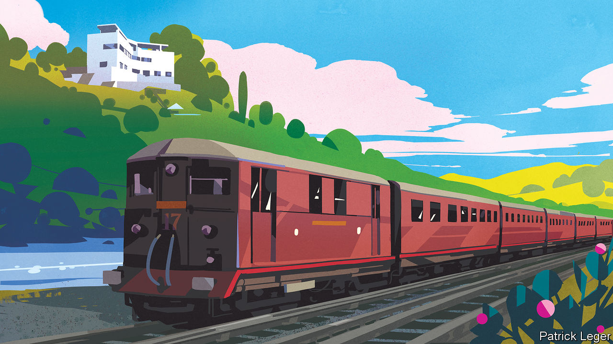
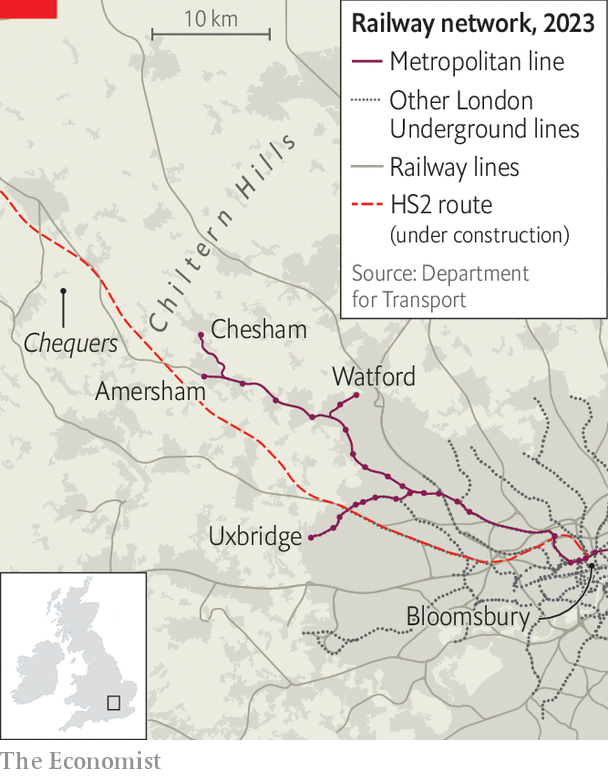

###### Commuters and the Tories

# The Conservative Party faces a mutiny in Metroland 

##### A successful marriage of the City, the country and homeownership is under strain 

 

> Jul 11th 2023 

The roof terrace of High &amp; Over offers a fine view, overlooking the lawns, the round swimming pool and the rolling Chiltern hills beyond. The house was built for the young family of Bernard Ashmole, an archaeologist, in 1931. The aim was a Roman villa in the modernist style—all straight lines and gleaming white—and within an easy train ride, from Amersham station, of an office in Bloomsbury. Locals called it the aeroplane house: the concrete canopies make it look like a biplane coming in to land. , a magazine, declared it exhilarating: a house that “says frankly ‘I am the home of a twentieth century family, that loves air and sunlight and .’” Katherina Harlow, the current owner, threw opera parties at the house, but she is selling up for something smaller (the asking price is £3m, or $3.9m).

High &amp; Over also offers the perfect vantage point to survey the fortunes of the Conservative Party. The house was a particularly stylish expression of : to live in Metroland. This was an advertising slogan for a real-estate gambit. At the turn of the 20th century, the owners of the Metropolitan railway, which today is part of the London Underground network, turned surplus land in Middlesex, Hertfordshire and Buckinghamshire into housing developments. Metroland became a synonym for a middle-class dream across southern England: a modern home in the countryside, linked by rail to office work in London.

It offered a trinity: the City, the rural, the domestic. Whereas France’s elites tended to live in apartments, Britain’s often opted for meadows and the 7.34 to Marylebone. In 1973 John Betjeman, the poet laureate, celebrated Metroland in a documentary. “Lured by the lush brochure, down byways beckoned, to build at last the cottage of our dreams,” he said. “A city clerk turned countryman again, and linked to the metropolis by train.”

Metroland was conservative, dispatching Tory mps to Parliament. But the Conservatives’ relationship with the area is now fraught. The party’s old heartlands are not yet lost, but they are becoming contested battlegrounds.

In 2021, in a by-election, Sarah Green, a Liberal Democrat, was elected mp for Chesham and Amersham, the constituency in which High &amp; Over sits, with a 25% swing. It was the first sign that Boris Johnson’s premiership was in trouble. Whether the Tories can reclaim it at the next general election, or whether, as Ms Green claims, her victory was the start of a bigger shift, is not yet clear. Yet there is increasing evidence that it was the latter.

 


Earlier this year, the Liberal Democrats took control of councils in commuter towns surrounding London, including Dacorum, West Berkshire, Windsor and Maidenhead and Guildford. On July 20th Labour is hoping to win a by-election in Uxbridge and South Ruislip, Mr Johnson’s old seat on the (rather poorer) southern spur of the Metropolitan line. A further contest is possible in Mid Bedfordshire, a commuter seat north of London, where Nadine Dorries, an ally of Mr Johnson, has said she intends to step down. If the Lib Dems can muster the money and campaigners, current polling suggests they could surge from 14 seats to 40 or 50 in the next general election, reckons Ben Ansell of Nuffield College, Oxford. 

Amersham, the last stop on the line, is as comfortable as it was when Ashmole laid his foundations. City workers are still drawn by large houses and grammar schools, a form of selective state education long abolished in much of England. The pandemic sent a new wave of city-dwellers in search of fresh air and space. Some 47% of the workforce in Chesham and Amersham are in management, administration or the professions, the 19th-highest such concentration in England’s 533 parliamentary constituencies. Sorted by deprivation, a metric that includes income, health and crime, it comes 531st. The high street is lined with bunting, and, during the Ashes, dotted with old men in Marylebone Cricket Club ties and schoolboys in whites. 

Yet it is unhappy. Begin with the first element of that trinity, the City. A majority in many Metroland constituencies voted against Brexit, which left a widespread impression that banking and the professions were a low priority for the new Conservative Party. Ms Green says that although the “rage” has subsided, it has left dismay. Liz Truss’s calamitous mini-budget, an amateurish move deplored by a town of professionals, made things worse.

There has been a subtler cultural estrangement, too. “Catch the early train to London and be home just after tea,” said Betjeman. But since the pandemic, home working has taken off: rush-hour traffic on a typical Friday morning at Amersham station is just half what it was before, and smart offices have emerged in back gardens. “The dads would walk to the station,” says Ms Harlow. “I don’t know what people do now.” Yet Mr Johnson and his circle mocked this new life as woke and idle. The drinking, bullying and sleaze of his administration seemed divorced from a modern corporate culture which is increasingly strict, progressive and teetotal. (It is possible to trace this rupture to another grand Chilterns house, ten miles away: Chequers, the prime minister’s country retreat, where the Brexit civil war began in earnest at a summit in 2018, and which Mr Johnson would turn into a party pad.)

As for the countryside, “the lure of Metroland was remoteness and quiet,” said Betjeman. “Back to the simple life. Back to nature.” Working from home means more time for walking the dog, notes a Liberal Democrat strategist, and the party has become a ruthless defender of fields and rivers against predatory outsiders. The causes of sewage spills are complex, but the Lib Dems have used them to signal that politics itself is now fetid. High Speed 2, a railway that will cut through the Chilterns to connect London with the north, is another long-running grievance. “A nightmare. Such a waste,” says Ms Harlow. Ms Green leads your correspondent to a field behind the cricket club, where tunnelling has caused a sinkhole. It is a physical manifestation, she says, of voters being overlooked and taken for granted by their government. That is a sentiment normally associated with Britain’s poorest constituencies. 


Metroland has long harboured a tension. It opposes the development of fields as it had once developed: diggers this far and no farther. Betjeman, a conservationist, found High &amp; Over in a sad way: the gardens had been sold to developers, and the house hemmed in by a new estate. “Goodbye, high hopes and over-confidence,” he said. “In fact, it’s probably goodbye, England.” The debate today is often as melodramatic. Opposition to Mr Johnson’s planning liberalisations helped propel Ms Green to victory. Gareth Williams, Tory candidate at the next election, in turn promises to “protect our green spaces”. 

All of which means that abundant, modern homeownership—the third, most essential element of Metroland’s old success—is more elusive too. (“No maid would grumble at this kitchen,” declared a Pathé News film about High &amp; Over, revealing its electric refrigerator and service lift.) The number of homeowners in Chesham and Amersham grew by just 1.7% in the decade to 2021; the population of renters increased by 43%. Ms Green is one of them. Thus the Tories are trapped: building too many houses for their old voters to bear, and far too few for the future ones. 

Mortgage-holders face a squeeze. Persistent inflation has led the Bank of England to raise interest rates to 5%, which will mean higher repayments as fixed deals expire. London’s commuter ring is particularly exposed. These are the areas with the highest proportion of mortgage-holders and, notes Neal Hudson, a residential-property analyst, where the loans are biggest as a share of income. “They’re the markets where you really have to stretch yourself if you don’t have significant support from family,” he says. The Lib Dems propose state handouts. Though locals don’t like to talk about their finances, holidays will be shorter this year, says Ms Green. Add to all that the fact that competition for grammar schools is becoming tougher, increasingly depending upon parents’ addresses as well as children’s abilities, and the promise of Metroland is harder to attain, and harder to hold on to. 

The result is that Rishi Sunak is struggling to reverse his party’s fortunes. He is every inch a Metroman: a mild-mannered son of a gp, who worked in the City and loves cricket. “They can see that he is one of us,” says Mr Williams, a former banker. 

The prime minister’s agenda sits well with his party’s southern heartlands: he has patched up relations with Brussels, unwound housebuilding targets, increased subsidies for child care and reduced tax on the largest pension pots. Yet he has also promoted illiberal figures in the tradition of Mr Johnson, such as Suella Braverman, the hardline home secretary. “The Conservative Party needs to make a decision as to whether it wants to continue to be the dominant party of the Home Counties,” says David Gauke, a former Tory mp for the next constituency down the train line. 

The Lib Dems’ prospects depend on how far Tory waverers stick with Mr Sunak because they fear Sir Keir Starmer, the Labour leader, says Mr Ansell. Mr Williams says locals worry about Labour’s plans to impose levies on private schools and to liberalise planning laws, and whether it will increase inheritance taxes. Although the Lib Dems are opportunistic local campaigners, they have rather less to say about the national picture. 

Yet the estrangement may be too far gone to prevent a Tory rout. The ideal of Metroland—a modern, comfortable house in the country, and a steady job in the City—may be as appealing as ever. On a hot summer’s day, the round pool at High &amp; Over is as still and cool as when Bernard Ashmole dug it 90 years ago. But in the hills around, the earth is shifting. ■


