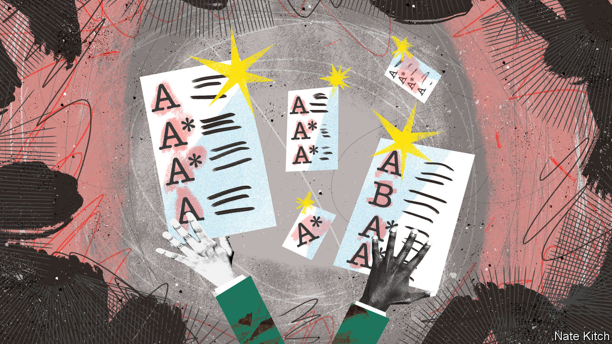

###### Bagehot

# The strange success of the Tories’ schools policy 

##### Standards are through the roof (which is falling down) 

 

> Jul 13th 2023 

Each chart in British public policy looks roughly the same, runs a joke among the country’s wonk-class. There is gradual improvement from the early 1990s until 2010, and then things become worse. It is a rough-and-ready rule that holds for everything from rough sleeping to real wages to waiting lists at hospitals. After 13 years of Conservative government, the country’s public services are not in fine fettle. 

There is an exception. Under the Conservatives, England’s schools have improved. England is now the best in the West when it comes to reading at primary-school age, according to one ranking. When it comes to maths, English students of the same age have improved compared with their European peers (even if they lag Asian ones). Scotland, whose progressive education system is loathed by Tories, has dribbled down the table. Historically, England was a laggard; now it is ahead. 

Smaller targets have been met, too. More students study sciences and maths, as the Tories wanted. Maths has become the most popular subject at A-level, the exams English students sit at 18. Watered-down gcses, the exams children sit at 16, have been replaced by more rigorous versions. In 2010, 68% of schools were rated good or outstanding by inspectors. Now the figure is 88%. In a stint of government in which achievements are few, schools stand out. What went right? 

For starters, the Conservatives had a plan. Before winning the 2010 general election, they had spent five years in opposition mulling school reforms, diagnosing the problems the system faced. The original sin, according to Nick Gibb, the then-shadow and now current schools minister, was progressive education, which focused too much on teaching children how to think rather than teaching them what they should know. Then they worked out how they wanted to fix it. Curriculums would be overhauled. Reading, writing and maths would trump other topics. Policies such as “phonics”, which teaches children to read sounds rather than whole words, were expanded; schools would be tested on how well they taught it. 

When opposition to the proposals emerged, ministers did not wilt. Teachers and their unions loathed them. Michael Gove, the secretary of state, became unpopular. He welcomed the hatred and nicknamed opponents “the blob”, which has become a catch-all term to describe any official or institution that opposes Conservative policy. In other areas, the Tories have been more cowardly. They have pledged to reform human-rights law in each of the last four elections, yet always balked at opposition from the legal sector. Planning reform was kiboshed after a backlash from nimby voters and mps. Rather than make an effort to convince them, ministers surrendered. 

Schools also avoided another common problem in the British government: ever-changing ministers. Once a minister learns a brief, he or she tends to be moved on to another, starting from total ignorance. Mr Gibb has been in situ for ten of its 13 years in power. By contrast, the Conservatives have had 15 housing ministers in the same period. It is no coincidence that housing policy has been chaotic in that time. 

When it comes to standards in schools, the Conservatives decided what they wanted to do and how they wanted to do it, and then stuck with it. It is a rare example of consistency. The reason why Britain has been poorly governed for 13 years is that the government has reversed course on fundamental questions so often. From 2010 to 2016, the Tories offered a vision of a small-state country inside the eu. After 2016, the party offered a flabby big-state vision with Britain out of the eu. In schools, however, the Conservatives have stuck to a course set decades ago. 

Outside the classroom, education policy has not been a triumph. Structural reforms ground to a halt, as secretaries of state came and went due to political chaos rather than questions of competence. (None of Mr Gove’s successors managed more than two years; near the end of Boris Johnson’s reign, one managed only two days.) Rather than turn all schools into academies as intended, with schools outside local-authority control, the government managed only half. The result is a bureaucratic mess. 

Although education was spared the brunt of cuts, it still suffered a small real-terms cut of 3% compared with 2010. Other departments fared far worse. As a result schools, like hospitals, became the state of last resort. Problems once solved elsewhere in the system now fall at their door. Likewise, schools are struggling to recruit and retain teachers. After a decade of pay restraint, salaries within the sector are poor. Someone with a maths degree can earn far more than the £36,000 a maths teacher is paid. Skimping on capital spending for years means that one in ten children attend a school that is, sometimes literally, falling down. 

The soft bigotry of low expectations

Problems outside schools mean that hard-earned progress within them is fragile. Teachers did not sign up to be auxiliary social workers, yet they often must be due to government failure elsewhere. Experienced teachers leaving the profession, and talented potential ones never joining it, will eventually weigh down standards. pisa scores from 2022 will be published later this year, which will show whether English schools have maintained their progress, or if the pandemic undercut it. Good work in one area of government can be undone by failures in others. 

Compared with the rest of the government’s record, England’s schools are a relative success. The Conservatives decided what was wrong and how they wanted to fix it. Dedicated ministers ensured that progress continued, in the face of opposition and when political attention moved elsewhere. It was a simple formula that the Conservatives could have replicated. Britain would be much better off if they had. ■ 


