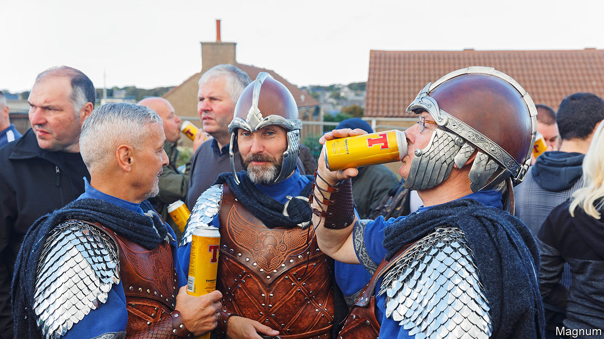

###### Orkxit

# Why the Orkney Islands are considering joining Norway 

##### They are unlikely to succeed at seceding from Scotland. But that was never really the point 

 

> Jul 13th 2023 

Thorfinn Skull-Splitter is, as usual, a problem. The Orkney Islands off north-east Scotland are currently keen to highlight their long and fruitful relationship with Norway. But if you read the ancient saga that chronicles that relationship, it offers hints that those relations have at times been a trifle strained. 

The Orkneyinga Saga is rich in characters with names like Eirik Blood-Axe and in phrases and passages such as “wolves dined on the dead” and “Einar had his ribs cut from the spine with a sword and the lungs pulled out through the slits in his back” and—a favourite refrain—“many men were killed.” There are milder moments and milder-sounding men: there is, for example, a character called Einar Buttered-Bread. Naturally, alas, he is toast. 

This matters because after the tragicomedies of Brexit and Grexit, the world has been enjoying the spectacle of “Orkxit”. This month it was suggested that the Orkney Islands might like to  and become a self-governing territory of Norway. This is an understandable sentiment: so too would many countries.  has a GDP per person of £33,000; falling life expectancy rates; and its former leader was recently arrested over an investigation into her party’s finances. Norway, by contrast, has a GDP of some £80,000 per head; rising life expectancy; and its handsome, wholesome, irksomely polyglot population are regularly found by OECD surveys to be among the most satisfied in the world. London would probably vote to secede to Norway if it could.

Orkney however has the better case: until 1472, the archipelago belonged to Norway; the islands were under Norwegian control for considerably longer than they have been British. As the crow flies (or the longship sails), Orkney is far closer to Norway (300-odd miles away) than it is to London (530-odd miles). There are other links too: the Norn language, spoken here until the 18th century, was a Norse one. Today Norse names—Egilsay, Eynhallow—still dot the landscape, twisty and Tolkienish to an English tongue.

The similarly Tolkienish-sounding Orkxit attempt began on July 4th in a meeting of the Orkney Islands Council, when a motion to explore “alternative models of governance”, including looking at “Nordic connections”, was passed by 15 votes to six. Norway was not explicitly mentioned as a favourite alternative, but was implicitly understood by all to be one. Although James Stockan, the councillor who proposed the motion, is not dogmatic about this. As he puts it, in the sort of statement that sounds as though it has not yet received final approval from the constitutional lawyers: “There is no reason why we couldn’t be part of Norway, or Denmark…Or have some other kind of jurisdiction…We could be part of Iceland.” 

Not all islanders are convinced. In the hamlet of Twatt (another Orcadian name that would arguably work less well on the mainland), locals are sceptical. “I don’t think Norway would want us,” says one woman. Mr Stockan’s fellow councillor David Dawson considers the plan to be “flawed from beginning to end” and a Brexit-style “fantasy.” However, many other islanders are keener: in the nearby Orkney Brewery, Luke Gardner, a brewer, says he would “welcome our Norwegian overlords”. Modern Orcadians tend to be sanguine about the nations’ gory past: in the brewery, the 8.5% “Skull Splitter” beer (“Rich; fruity; silky”) is a bestseller. 

To understand what is really happening in Orkney, it is more useful to turn from Norway to another Norse nation that was mentioned by Mr Stockan: Denmark. It shares many modern parallels with Norway: a healthy, wealthy Viking state that is happy with its lot—so much so that in 2006, scientists published a paper titled “Why Danes are smug: comparative study of life satisfaction in the European Union.” (The paper considered various hypotheses for why this might be so, including hair colour, since “blondes have more fun”; but concluded that Denmark’s generous welfare state was a more probable cause.) 

The Danes also share a similarly fraught history with their western neighbours. While the Norwegians were energetically pursuing closer ties with Orkney in the tenth century, the Danes were threatening to do similar farther south, unless England paid them the tax known as “Danegeld”. What is happening in Orkney now is, arguably, a modern version of that. Granted, the threats have changed—today people threaten not to invade but to secede. But the general principle, of money for menaces, remains the same. 

There is little sense from anyone on the island that this is a serious proposal. Even the councillor who first suggested the idea of rejoining Norway says that she made the suggestion as “a flippant comment”. Mr Stockan admits that he did not propose the motion from a sudden passion for Nordic nations but out of “absolute frustration” from being paid neither enough money nor attention by the Scottish government. Mr Dawson, however, puts it more bluntly. This, he says, is making “threats”. 

Whatever it is, it is, so far, working—at least in getting attention. A few weeks ago, says Mr Stockan, he was unable to get the challenges facing Orkney to be heard across the sea in Scotland. “Now we’ve managed to get it across the planet.” As Thorfinn Skull-Splitter and his colleagues knew, the odd threat can be splendidly effective; though the Vikings tended to team threats with the pulling of people’s lungs out through their ribcages. Whether threats alone will succeed in bringing about real change remains to be seen. ■


