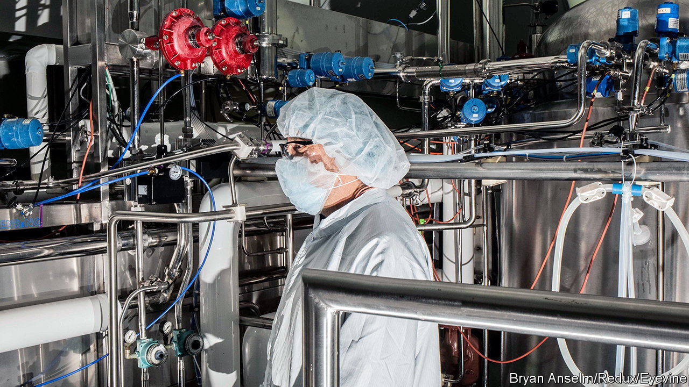

###### Wonder drugs

# Big pharma is warming to the potential of AI 

##### But some worry the Terminator is coming 

 

> Jul 13th 2023 

PAUL HUDSON, boss of Sanofi, is brandishing an iPhone. He is keen to show off the French drugmaker’s new artificial-intelligence (AI) app, plai. It draws on more than 1bn data points to provide “snackable” information, from warnings about low stocks of a drug to questions for a meeting with an ad agency or suggestions to set up clinical-trial sites that could expedite drug approvals. Like Netflix recommendations, plai delivers “nudges”, as Mr Hudson calls them, that are useful at that moment in time. He jokes that plai broke even in about four hours, and says the cost is “peanuts” compared with the $300m-400m that big consultancies charge for a project to curate a big company’s data. One in ten of Sanofi’s 80,000 staff uses it every day. 

AI is not new in drugmaking. Biotech firms have been tinkering with it for years. Now interest from big pharma is growing. Last year Emma Walmsley, chief executive of GSK, said it could improve the productivity of research and development, the industry’s most profound challenge. Moderna recently described itself as “laser-focused” on AI. Sanofi is “all in”. Morgan Stanley, an investment bank, reckons that within a decade the pharmaceutical industry may be spending $50bn a year on AI to speed up drug development.

Most of the buzz revolves around AIs trained on biological data that could improve the hit-and-miss process of drug discovery. Drugs can take a decade to emerge, cost billions of dollars and succeed only 10% of the time. Even a small improvement in speed and efficiency would be hugely valuable. But scientists have struggled to tame biological big data with conventional statistical tools. Machine learning makes it possible to sift through piles of information, from clinical patient data and genome sequences to images of body scans. Last year DeepMind, an AI lab that is part of Google, made a breakthrough using its AlphaFold system to predict the structure of almost all proteins, which may one day help identify which molecules have therapeutic potential. 

Though only around a dozen drugs in development have so far involved the use of AI, the list may grow rapidly—especially for simple molecules with properties that are relatively easy to predict. In the case of these more straightforward chemistries, the future of medicine is looking ever more like a computational problem. 

Jim Weatherall, who oversees data science and AI at AstraZeneca, says the technology is used in 70% of the British firm’s small molecules in development. Using a technique called “reinforcement learning”, AstraZeneca’s AI is constantly tweaking its molecular suggestions and playing out how a tweaked molecule might react. Ali Mortazavi, boss of E-therapeutics, a biotech startup in London, says that knowing the sequences of all the genes in, say, the liver, lets his firm use software to design RNA molecules (which are more complex but, owing to their links to DNA, predictably so). AI algorithms then predict the activity of the molecules, which can stop the function of any disease-causing gene. 

Euan Ashley of Stanford University points to another AI application. “Knowledge graphs” are a kind of database that stores data about genes, proteins, diseases and drugs, as well as the biological pathways that connect them. They, too, can help identify new targets for drug development. “Generative” AI, meanwhile, is being trialled for suggesting entirely new chemical and biological structures for testing, just as ChatGPT can ingest text on the internet and spit out a new poem or essay. Beyond drug discovery, AIs like plai could help with the perennial problem of efficiency in a heavily regulated and labour-intensive sector. 

Some pharma bosses worry that generative AIs’ tendency to make stuff up could send researchers down blind alleys. More apocalyptically, Mr Hudson says half of the pharma CEOs he talks to about AI fear, like many people, the  it poses. For his part, he foresees the next industrial revolution, not a robot uprising. ■


