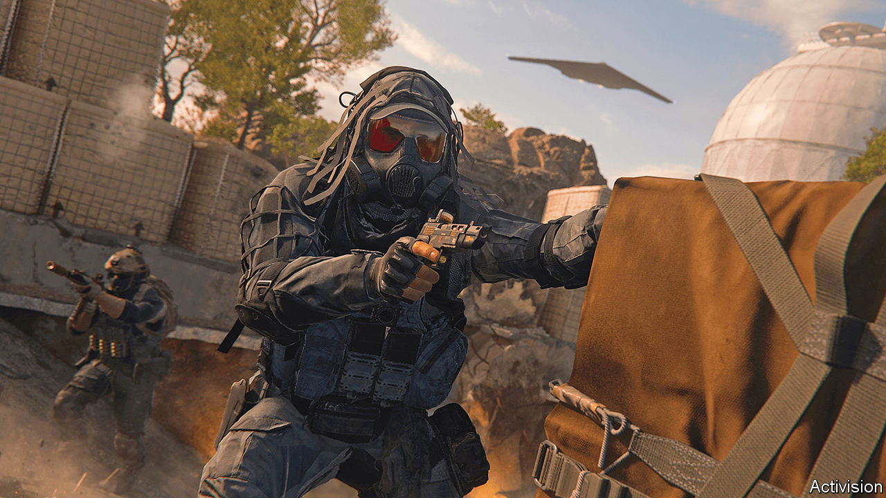

###### A $69bn boss fight

# Britain hands Microsoft’s Activision deal an extra life 

##### The world’s most zealous regulator has second thoughts 

 

> Jul 13th 2023 

Merging companies have long seen Britain’s Competition and Markets Authority as something of an end-of-level boss. For two years running the CMA has blocked more deals than any other regulator, scotching ones like Meta’s acquisition of Giphy, a blameless meme-generator. This year it has been busy again, in April blocking Microsoft’s $69bn acquisition of Activision Blizzard, a video-game maker, which had looked on track for approval elsewhere.

Is the fearsome trustbuster preparing to fold? On July 11th an American court cleared the Microsoft-Activision transaction, leaving Britain as the holdout. Within hours the CMA said it was prepared to examine a “modified” version of the transaction. Activision’s share price shot up: investors think it is game on. 

Some see the CMA’s recent activism as a show of post-Brexit independence. A blander explanation is that companies are unused to British antitrust regulators (who before Brexit took a back seat to Brussels), increasing the risk of confusion and surprises. Tech firms find the CMA’s processes rigid, with little scope for negotiation. Microsoft was blindsided by its April ruling on Activision.

Another reason for Britain’s new vim lies in America. The Federal Trade Commission (FTC) used to approve more vertical mergers, like Microsoft and Activision, with strings attached. But these conditions proved hard to enforce, so regulators now prefer to block vertical deals outright. In America, where the legal basis for doing so is thin, courts overturn such decisions. In Britain, where trustbusters have wide discretion, the CMA’s veto stands. Britain thus finds itself in lonely opposition to global deals.

That is uncomfortable, especially when the parties are not British. In May Britain’s government urged its regulators to “understand their wider responsibilities for economic growth”. As the FTC continues its unsuccessful opposition to any big deal, the responsibility to compromise increasingly falls elsewhere.■


