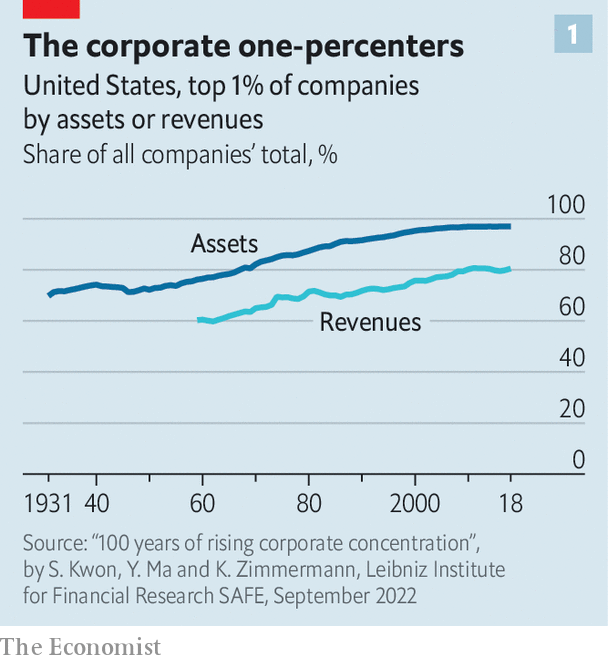
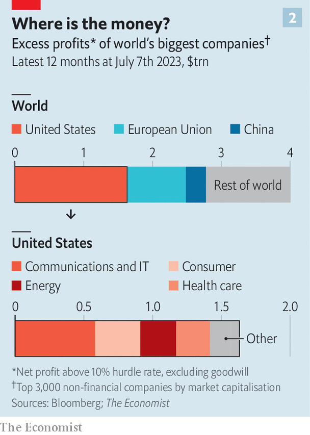
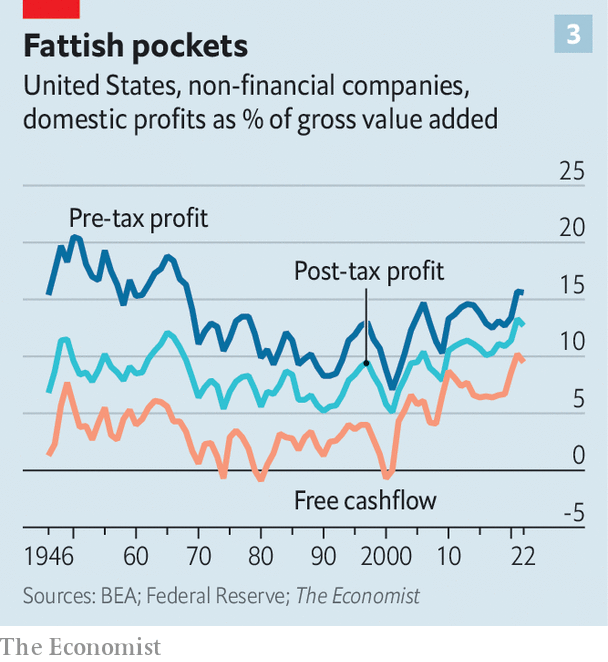
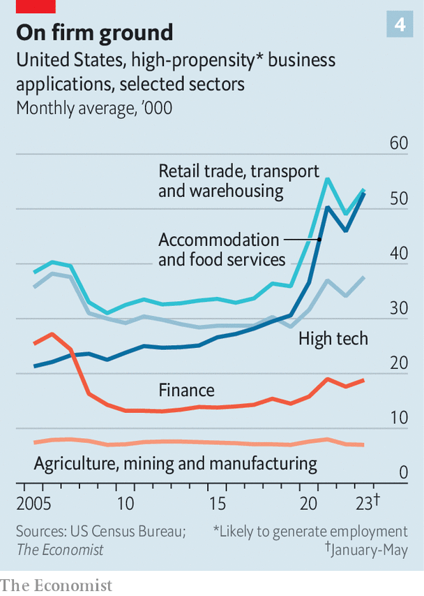

###### Size wars

# Is big business really getting too big? 

##### In a few sectors, corporate concentration is a problem. In most, it needn’t be 

 

> Jul 12th 2023 

GOVERNMENTS ARE at war with big business. In June , America’s president, spoke for many politicians the world over when he blamed it for greed-fuelled price rises, sluggish wage growth, forgone innovation and fragile supply chains.  at the Federal Trade Commission (FTC) have been going after large deals merely because they are large—or that is how it feels. Courtroom defeats do not dampen the agency’s zeal. The latest came on July 11th, when a judge rejected its request to block Microsoft’s $69bn acquisition of Activision Blizzard, a developer of video games. The ftc said it would appeal against the ruling. The EU’s competition authorities are making noises about breaking up Google. Last year Britain’s Competition and Markets Authority (CMA) derailed the $40bn purchase by Nvidia, a semiconductor giant, of Arm, a chip designer.

Trustbusters invoke three justifications for their renewed vigour: greater market concentration, reduced churn among the world’s biggest firms and exploding profits. On the surface all three point to rising corporate power. Look closely, though, and the trends may be the result of benign factors such as technological progress and globalisation. In certain local markets, greater concentration may, paradoxically, have led to more competition, not less. And the covid-19 pandemic may have planted the seeds of a further competitive revival. Some big firms, it is true, have been collecting rents, including in big sectors such as health care. But trustbusters’ strategy—to reflexively question any deal involving a big firm—is wrongheaded.

 


That concentration has been rising is not in question. Across America’s economy it is higher today than at any point in at least the past century (see chart 1). Out of some 900 sectors in America tracked by , the number where the four biggest firms have a market share above two-thirds grew from 65 in 1997 to 97 by 2017. In Europe, where the data are less comprehensive, concentration has been increasing for at least 20 years. Using data on western Europe’s largest economies—Britain, Germany, France, Italy and Spain—Gabor Koltay, Szabolcs Lorincz and Tommaso Valletti, three economists, find that the market share of the four largest firms grew in 73% of some 700-odd industries from 1998 to 2019. The average increase was about seven percentage points. The proportion of industries where the top four firms’ share exceeded half increased from 16% to 27%. Britain and France saw the biggest jumps. 

At the same time, incumbent firms look more entrenched. In Britain, the average number of firms that stick in the top ten of their industries by market share three years later was five before the financial crisis. It is now closer to eight. Thomas Philippon of New York University’s Stern School of Business finds a similar reduction in churn among top American firms. 

 


Most telling, firms are raking in higher profits.  has come up with a crude estimate of “excess” profits for the world’s 3,000 largest listed companies by market value (excluding financial firms). Using reported figures from Bloomberg we calculate a firm’s return on invested capital above a hurdle rate of 10% (excluding goodwill and treating research and development, R&amp;D, as an asset with a ten-year lifespan). This is the rate of return one might expect in a competitive market. In the past year excess profits reached $4trn, or nearly 4% of global GDP (see chart 2). They are highly concentrated in the West, especially America. American firms collect 41% of the total, with European ones taking 21%. The energy, technology and, in America, health-care industries stand out as excess-profit pools relative to their size.

All this looks troubling. And in certain sectors, it is. Four decades ago more than eight in ten hospitals were non-profits with a single location. Now more than six in ten are owned by sprawling for-profit hospital chains or academic networks such as Steward Health Care or Indiana University Health. At first this was a perfectly healthy process of big and efficient chains expanding across America. Two decades—and nearly 2,000 hospital mergers—later, things look ropey. An analysis from 2019 by Martin Gaynor of Carnegie Mellon University and colleagues suggests that many such mergers have tended to raise prices without improving quality. 

Still, high concentration, low churn and rich profits need not necessarily make consumers worse off. That concentration has been rising for 100 years, during which life has improved for virtually everyone, is the first clue that it may be the result of benign forces. Increases in industry concentration in America over the past century are correlated with greater technological intensity, higher fixed costs and higher output growth, according to Yueran Ma of the University of Chicago Booth School of Business and colleagues. None of these seems particularly nefarious. 

That concentration has also risen in Europe, where competition authorities have not been as sleepy as in America, likewise suggests that powerful structural forces are at play. John Van Reenen of the London School of Economics points to technology and globalisation. The internet has reduced the cost of shopping around, even as software and other technology allow the best firms to scale up their operations around the world. Figures collected by McKinsey, a consultancy, show that the return on invested capital for a firm in the 75th percentile by this measure is 20 percentage points higher than for a median firm. “There are just huge economies of scale with software,” says Sterling Auty of MoffettNathanson, a research firm.

Local anti-heroes

Moreover, higher concentration at the country level may increase competition locally. Service industries in particular, which make up about half the 900-odd sectors in America’s census, are better examined at the local level. Fiona Scott Morton, a former deputy assistant attorney-general now at Yale School of Management, uses the example of coffee shops. With just one café in each neighbourhood, the national market would be hyperfragmented. But every consumer would face a local monopoly. “If I’m looking for a coffee, I’m not going to drive three hours,” she says. 

Academics debate what exactly has happened to concentration in local markets. What seems increasingly clear is that the best firms have expanded into more and more of them. Walmarts, with their “everyday low prices”, cater to shoppers across America, thanks to the retail behemoth’s unrivalled logistics operation. Cheesecake Factory uses a laboratory in California to taste-test dishes that it quickly rolls out to its 200 or so locations around America. A recent paper titled “The Industrial Revolution in Services’‘, by Esteban Rossi-Hansberg at the University of Chicago and his co-author, shows that the geographic expansion of big firms increases competition for local incumbents, whose local market share falls.

As for low churn, it is not so bad if the incumbents keep innovating—which is what many are doing. Despite central banks pushing interest rates up at the fastest pace in decades in an attempt to quash inflation, American private investment in the first quarter of 2023 was 17.2% of GDP, similar to pre-pandemic highs. Many corporate behemoths are ploughing billions into innovation, including in areas that most worry trustbusters, such as technology. American tech’s big five—Alphabet, Amazon, Apple, Meta and Microsoft—collectively invested around $200bn in R&amp;D last year, equivalent to a quarter of America’s total in 2021. Microsoft and Alphabet are at the forefront of the AI race. 

 


Profits have, it is true, been higher in America since the financial crisis of 2007-09 than in previous decades, especially if you consider free cashflows, which account for the changing way companies depreciate assets (see chart 3). But they look somewhat less unusual if you adjust for lower tax rates and firms’ larger global footprint. And they may have peaked: analysts estimate that earnings for the S&amp;P 500 index of American blue chips dipped in the three months to June, year on year, for the third quarter in a row.

 


Most heartening, far from being subdued, dynamism may be on the rise. John Haltiwanger of the University of Maryland notes that business formation, which had been “quite anaemic” since the mid-2010s, has surged since the pandemic (see chart 4). In the past few years many more new firms have been created than old ones have been shut down. Whether these startups will dislodge incumbents is still unclear. But venture-capital investment suggests investors see scope for healthy returns. Although it is half what it was at its frothy peak of over $130bn in the fourth quarter of 2021, that has only brought it back to the levels of 2019 and 2020.

One hypothesis is that the remote-friendliness of the post-covid economy reduces startup costs. Young firms no longer need to rent a big office. They can hire from a less local talent pool. By our rough count, around 125 of the Census Bureau’s 900 or so industries benefit from the growth of e-commerce or can provide their services remotely. Consumers’ growing comfort with such options could inspire more new businesses to set up shop. Mr Haltiwanger already observes a small shift in the size distribution of firms towards smaller fry. 

Concentration may also be levelling off as a result of subdued dealmaking, especially in tech. The big five tech firms’ share of all acquisitions by listed firms in America has fallen from nearly 1% in the 2010s to less than 0.5% since the start of Mr Biden’s tenure. Some of the slowdown in mergers and acquisitions (M&amp;A) is caused by the rising cost of capital and risk of recession. Renewed antitrust zeal probably plays a role, too. On June 27th American authorities updated their merger guidelines for the first time in 45 years, requiring firms to report far more details on deals worth over $110m, half the average deal size in 2022. 

The biggest transactions are almost sure to be subject to a deep probe, which can add months to a filing process that now takes weeks. Regulators everywhere are throwing “sand in the gears of the M&amp;A machine”, sighs a lawyer. “The FTC has stopped being discerning,” says another. Britain’s CMA “has probably overreached”, echoes a British one (see box). 

Zealous trustbusting carries its own risks, though. It may distract attention from more immediate threats to economic dynamism from bureaucratic restraints on land use or occupational licensing. Acquisitions can be useful for preserving the value of startups when weak markets make it hard for founders to raise capital. And some big deals may benefit consumers, as when a biotech startup joins forces with an established drugmaker to test and distribute a new therapy. Competition authorities were probably asleep for too long. Now they may be getting up too quickly. ■


