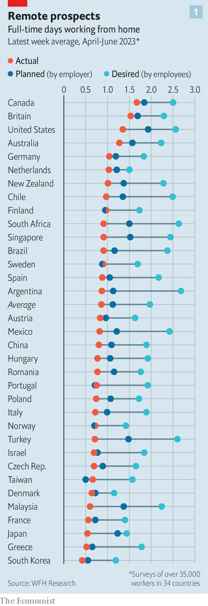

###### The WFH showdown

# The fight over working from home goes global 

##### Employees want to toil in the kitchen. Bosses want them back in the office 

 

> Jul 10th 2023 

REMOTE WORK has a target on its back. Banking CEOs, like Jamie Dimon of JPMorgan Chase, are intent on making working from home a relic of the pandemic. For staff at America’s biggest lender and other Wall Street stalwarts like Goldman Sachs, five-day weeks are back for good. Big tech firms are also cracking the whip. Google’s return-to-work mandate threatens to track attendance and factor it in performance reviews. Meta and Lyft want staff back at their desks, demanding at least three days of the week in the office by the end of the summer. With bosses clamping down on the practice, the pandemic-era days of mutual agreement on the desirability of remote work seem to be over. 

Fresh data from a global survey shows how far this consensus has broken down. Across the world, employers’ plans for remote work fall short of what employees want, according to WFH Research, a group that includes Stanford University and Ifo Institute, a German think-tank, which tracks the sentiment of full-time workers with at least a secondary education in 34 countries. Bosses fear that fully remote work dents productivity, a concern reinforced by recent research. A study of data-entry workers in India found those toiling from home to be 18% less productive than office-frequenting peers; another found that employees at a big Asian IT firm were 19% less productive at home than they had been in the office. Communication records of nearly 62,000 employees at Microsoft showed that professional networks within the company ossified and became more isolated as remote work took hold. 

 


Yet all the pressure from above has done little to dent employees’ appetite for remote working. They want to be able to work more days from the comfort of their living rooms than they currently do, according to WFH Research. On average, workers across the world want two days at home, a full day more than they get. In English-speaking countries, which have the highest levels of home-working, there is an appetite for more. And the trend is spreading to places where remote work has been less common (see chart). Japanese and South Korean employees, some of the most office-bound anywhere, want more than a quarter of the week to themselves. Europeans and Latin American crave a third and half, respectively.

Desire for more remote work is not surprising. The time saved not having to battle public transport or congested roads allows for a better work-life balance. On average, 72 minutes each day is saved when working remotely, which adds up to two weeks over a year, according to a paper by Nicholas Bloom of Stanford, who helps run WFH Research, and colleagues. Employees also report that they feel most engaged when working remotely, according to a poll last year by Gallup. On average globally, workers value all these benefits to the tune of an 8% pay rise, implying that some would take a pay cut to keep the privileges.

 


Until recently, as firms desperately sought workers amid the post-pandemic hiring bonanza, employees’ demands and employers’ plans seemed to be converging in America, the best-studied market. This convergence is tailing off. At the same time, the pandemic has entrenched work-from-home patterns. At the moment, a third of workers surveyed by WFH Research have a hybrid or fully remote arrangement. Those practices will not be easy to unwind.

It is no coincidence that the crackdown on remote work is happening as some industries cool. Job cuts across Wall Street and Silicon Valley have handed power back to businesses. However, even in tech and finance some employees are standing their ground. In May Amazon said that 300 employees staged walkouts over the e-empire’s return-to-work policies (the organisers said it was closer to 2,000).

Other firms are quietly adapting with the times. HSBC, a British bank, is planning to relocate from its 45-storey tower in Canary Wharf to smaller digs in the City of London. Deloitte and KPMG, two professional-services giants, want to reduce their office footprint in favour of more remote work. The gap between the two sides of the work-from-home battle may yet narrow. The question is whether the bosses or the bossed will yield the most. ■


