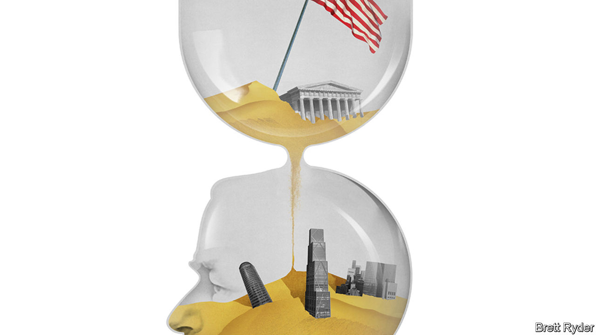

###### Schumpeter

# The last, unfulfilled dream of Jamie Dimon, king of Wall Street 

##### The boss of JPMorgan talks to The Economist about recession, China and what he does next 

 

> Jul 11th 2023 

JAMIE DIMON is restless. The boss of JPMorgan Chase has just returned from a long July 4th holiday weekend with his large and growing family: his wife, three daughters, a gaggle of grandchildren. He has little patience for the faff that accompanies —the reason that he, his handlers, a film crew, your columnist and ’s editor-in-chief have gathered at the New York headquarters of America’s biggest bank. Mr Dimon does not want to loiter in the hallway for his “walking-in” shot; nor is he going to wait to be properly miked up and seated in his chair before launching into conversation about public policy. “So, should we do this?” he urges.

Doing things is the Dimon way. He is impatient, opportunistic, pragmatic: the type of person to just get on with it. When his 12th-grade calculus teacher left, he taught himself. Fresh out of business school he took a job at American Express, because he wanted to build something rather than merely move money around. 

What he has crafted over nearly 18 years at the helm of JPMorgan Chase is the banking equivalent of the Palace of Versailles or the Taj Mahal. It is America’s most successful bank—and, with a market capitalisation of $435bn, by far the most valuable in the world. Under Mr Dimon’s stewardship its shareholders have earned a handsome annual return of 10.6%—double that of most other big lenders. Its investment bank ranks in the top three in almost all businesses it cares to compete in. Its commercial bank is the biggest in America. Because it is so large—and because banks in America with more than 10% of all deposits are barred from acquiring more (unless they rescue a failing bank, as JPMorgan did with First Republic in April)—it can grow only slowly. 

Not much left to do, then, for a man prone to doing. (A literal construction project, his bank’s new headquarters on Park Avenue, probably barely scratches Mr Dimon’s itch.) Instead, he has turned his seemingly inexhaustible energies to other problems. He skips over the banking mini-crisis (mostly resolved) or the risk of recession (it could be mild, or maybe not; either way, he worries more about Ukraine and food security in Africa). He is most animated about other topics: social mobility, de-escalating global conflicts and defending capitalism, which he suggests is unfairly maligned. His annual letters to shareholders, once limited to thoughts on management and banking, now contain more policy ruminations than the typical American political campaign.

He offers solutions for the problems he most wishes America could solve. For social mobility he would expand earned-income tax credits and returns repeatedly to griping about the cost of education. “We need to do a better job with our community colleges,” he argues. “We should be making it cheaper, not more expensive.” 

Mr Dimon craves an open dialogue with China, which he does not think America, as by far the more prosperous country, should fear. The Chinese are not “ten feet tall”. They import oil, lack food security, are poorer and have weaker armed forces. “Maybe they have caught up in a couple of areas, but the notion that somehow America has to be that afraid of China: we don’t.” He sees the shift towards industrial policy to protect national security as wise. But America must be careful with tools such as export controls. “If it relates to supersonic missiles, I think we should do it. If it relates to holding down the Chinese people, I think we shouldn’t do it.” 

Despite his early support for the idea of “stakeholder value”, which considers how companies treat their workers, suppliers, the society at large or the environment, he is no woke capitalist. Rather, he is a pragmatist. All chief executives try to have the best products or services, they need great employees and to keep their customers happy, he argues. “This was just humanising business, that we take care of our customers, or employees or crews or whatever.” That doesn’t make him anything but a “red-blooded, full-throated, free-enterprise, patriotic American”.

Mr Dimon’s interest in public policy, resolve, resources and ambition all point in one direction: political office. Speculation about a presidential run has bubbled up over the years. But it is an idea he quickly shoots down. “I have never really believed I am particularly suited for it,” he says. “There may be common skills… in terms of administration, management, leadership, but those are not uncommon.” Knowing how to navigate political arenas or how to campaign is harder. Mr Dimon thinks switching from business to politics is tricky. “I think it’s very hard to do. And in fact, if we just look at history, it’s almost impossible.” President Donald Trump was the exception, not the rule. And that is not intended as a compliment. “I would worry about another Trump presidency,” he says. For America to turn inwards and abdicate its position in the world would be a huge mistake. 

Dimon is for ever?

If not the leader of the free world, perhaps a cabinet secretary? “Maybe one day that will be on the cards,” Mr Dimon muses. “I love my country. To me, my family comes first. But my country is right next,” he explains. “JPMorgan is down here,” he adds, gesturing lower down. The realist in him probably knows an appointment to the Treasury, the most obvious post, is unlikely. The path from Wall Street to government is not as well-trodden as it used to be. Democrats have long been suspicious of high finance, and Republicans have grown more so under the populist Mr Trump. “JPMorgan is the best contribution I can do,” Mr Dimon insists. “We have 300,000 employees. We take care of them well and we give them opportunities.” A politician couldn’t have said it better. ■


