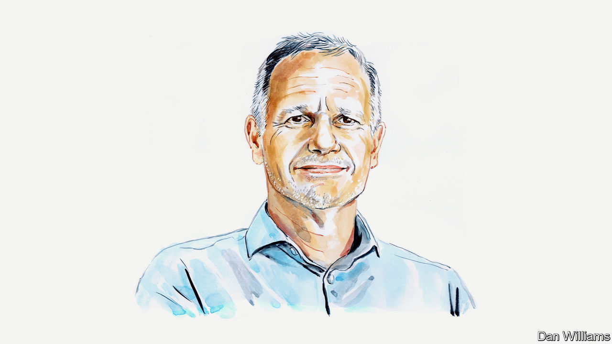

###### Weight-loss drugs

# John Schoonbee on why new drugs, while helpful, are no panacea for obesity 

##### Nutrition and lifestyle changes should remain the focus, says Swiss Re’s chief medical officer 

 

> Jul 12th 2023 

A PILL OR shot to lose weight has a powerful allure for those struggling to shed excess kilos. It has also been a dream of drugmakers, whose past efforts against obesity often faced safety or efficacy issues. . Since American approval of a once-a-week injection in 2021, followed by European authorisation, several  have come on the market or are likely to be approved soon. From Big Pharma to biotechs, a bevy of firms are either selling such medicines or running trials. 

Reinsurers such as Swiss Re also have a strong interest in medicines for obesity and other chronic conditions that have slowed improvements in life expectancy. The fewer people who get sick and die before their time, the better the performance of our portfolios.

The new drugs, known as GLP-1 receptor agonists, . In clinical trials GLP-1 agonists have led to weight loss and better blood-glucose control, helping people manage their diabetes, the disease these drugs were originally developed to treat. They have also been shown to reduce the risk of heart problems. These findings make them a potentially potent asset in efforts to tackle a huge and growing medical problem: the Centres for Disease Control and Prevention estimates that over 40% of American adults are technically obese (with a body mass index, or BMI, of 30 or higher). Worldwide, the economic costs associated with people being overweight or obese—including lost productivity owing to absenteeism—could top $4trn annually by 2035, according to one study. 

Still, as we grapple with the obesity epidemic we must adhere to a guiding principle: decisions about how best to deploy these medicines should be informed by science, not social media. Obesity is a complex issue, with societal, behavioural and nutritional drivers. A pill or injection alone won’t be enough to turn the tide towards better metabolic health.

Anyone thinking of taking these medicines needs to consider some important caveats. GLP-1 drugs come with side-effects that include nausea, dyspepsia, abdominal distension and reflux, though these often diminish over time. About 7% of people in one trial ended treatment because of side-effects, compared with 3.1% in the placebo group. 

Assessing longer-term side-effects is more challenging. Although most of the weight loss in the trial for the approved injection was from fat, muscle also was affected. Those who got the injection experienced 6.9 kilograms of muscle loss, nearly five times that of the placebo group. This is important: muscle mass is a key measure of health and resilience, particularly as people age.

Many medical experts also believe that once a person starts treatment, these drugs become a lifelong proposition. If somebody stops taking the medicine, its benefits may vanish. In one trial the mean BMI of participants fell from 37.6 to 31.2 over 16 months, only for them to regain much of the lost weight within a year of halting treatment. Blood-pressure improvements were lost, too.

If these drugs are destined to be used by individuals for decades, side-effects are also likelier to accumulate. Lifelong treatments have big financial implications, too. The annual price of injections has been pegged at as much as $13,600 in AmericaEven if the price falls as competition intensifies, anti-obesity drugs could prove very costly for public insurance programmes, should they be required to cover them. 

It would be rash to discount the potential for these drugs to slow the obesity and diabetes epidemics and improve quality of life for those who take them. Nonetheless, the potential side-effects and the high cost of using the drugs in perpetuity mean those who prescribe and consume them need to think carefully about what part they should play in a sustainable weight-loss-treatment regimen. This is all the more urgent given their rapid take-up: one manufacturer has already warned that demand could soon exceed its production capacity.

Thought also needs to be given to breadth of usage. People who are only slightly overweight are still likely to want to lose a few kilos, and many of them may reach for these drugs for largely cosmetic purposes. This makes it even more important that people are informed about all their options, especially since we know that non-pharmaceutical interventions can also help those struggling with their weight.

Two of the most important such interventions relate to what we eat and how much we exercise. Much of what we consume today looks nothing like what our ancestors put on their plates, skewed as it is towards processed food. Life is also growing more automated, meaning less physical labour and more sedentary lifestyles.

Despite these challenges, well-structured programmes promoting healthy food and physical activity are effective for many people aiming to lose weight and tackle associated diseases. More work is needed to reassess the dietary guidelines that national health authorities put out, many of which are outdated. While nearly all recommendations call for eating less and exercising more, many have failed owing to a narrow focus on “calories-in, calories-out”, the idea that as long as you eat fewer calories than you burn, you will lose weight. The nutritional paradigm of the past 50 years that focused on calories while demonising fat, particularly saturated fat, is now being challenged.

We need to improve our understanding of how the body turns fats, carbohydrates and protein into energy, and use the findings to adjust nutritional guidelines and our broader approach to weight loss. It is already clear that reducing insulin secretion, including by limiting sugar and carbohydrate consumption, offers benefits similar to those promised by pharmaceuticals.

The dream-turned-reality of a weight-control pill or shot expands the anti-obesity arsenal. Lives will be changed. But it is not the only weapon we have, and it comes with strings attached. A more sustainable way forward may be to consider GLP-1 drugs a second- or third-line option, much as bariatric surgery—gastric bands, bypasses and the like—is often viewed as a last resort to tackle obesity, to be turned to only when lifestyle changes fail.■


