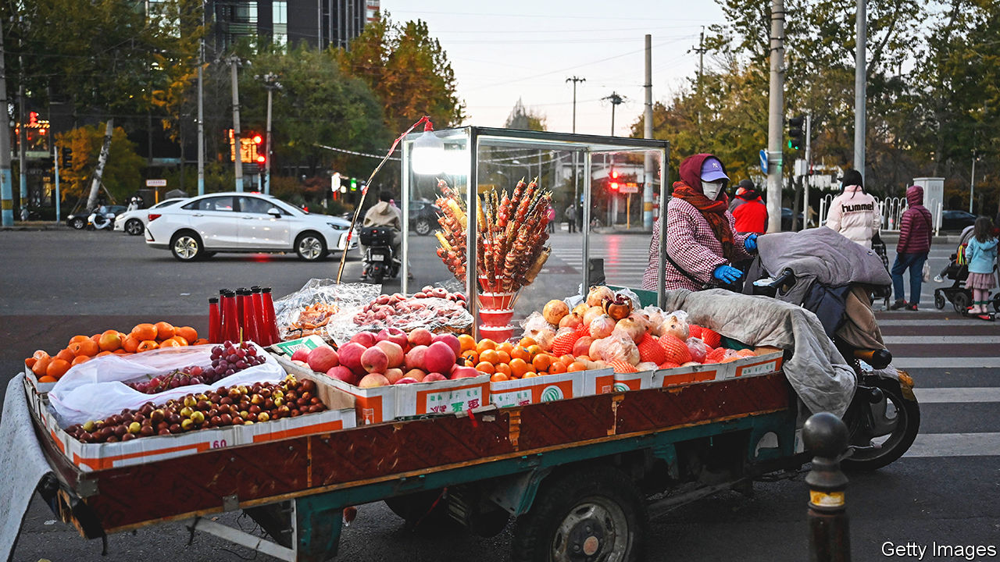

###### Setting out their stalls

# Another comeback for China’s street merchants 

##### Faced with a sluggish economy, some cities are re-embracing them 

 

> Jul 13th 2023 

One of China’s most widely revered works of art is called “Along The River During The Qingming Festival”. The painted scroll, five metres long, portrays bustling scenes of life in Kaifeng, the imperial capital, during the Song dynasty (960-1279). Prominent among the people and activities depicted are peddlers, merchants and craftsmen working out of street stalls. But today in China—and especially in the capital, Beijing—these tiny trading posts are often frowned upon by officials.

China’s supreme leader, Xi Jinping, made himself crystal clear on the matter in May. “The capital is first and foremost a political centre, not a ‘hotchpotch’,” he said, according to state media. It is no place, he went on, for factories run in alleyways or the so-called “street-stall economy”. That phrase ( in Mandarin) has become something of a buzzword in recent years, with many cities taking a similarly dim view of the phenomenon. Instead of colourful, hectic street markets, local governments have favoured antiseptic shopping centres. But now, amid worrisome levels of unemployment and , officials are turning back to street markets in the hope that they will boost commerce. 

Chengdu, Hangzhou, Kunming and Shanghai are among the big cities that have announced plans to loosen restrictions on street markets. The business hub of Shenzhen, in the south, is indicative. It will end its ban on September 1st, when new regulations take effect. They include requirements aimed at ensuring cleanliness and preventing traffic problems. 

All this marks the latest shift in an odd debate that has featured rare public squabbling at the highest levels of government. In 2020 the prime minister at the time, Li Keqiang, spoke out repeatedly and enthusiastically in favour of the stalls. During a tour of street merchants in the coastal city of Yantai, he called them an important source of jobs and economic vitality. But within days some of China’s most influential state-media outlets published scathing criticisms of .

The , the main propaganda organ of the city government, derided street markets as “unhygienic and uncivilised”, full of shoddy, counterfeit goods. They cause traffic jams, increase street noise and create a mess, the paper said. The screed was targeted at stalls in the all-important capital, but it gave few reasons for tolerating them elsewhere.

Many of the street vendors that remain in Beijing operate in a handful of locations on the edge of the city, where markets of 100 or more stalls have been set up. Most of these outdoor bazaars are open at night, selling food and snacks. They are more of an entertainment venue than a shopping destination. Some boast games for children and lawns for picnicking—good fun, to be sure, but a far cry from the bustling commerce of traditional markets. 

There are still remnants of the old  in the capital, though. One fruit vendor, a migrant from Henan province, sets up at a crossroads in north-eastern Beijing that has a favourable combination of heavy traffic and places to park. He plays a constant game of cat and mouse with the , city-management officers who enforce local regulations. Sometimes they force him to leave. Other times, he says, they “find a way to reach an agreement”. Asked if this means paying a bribe, he smiles broadly and declines to answer. ■


