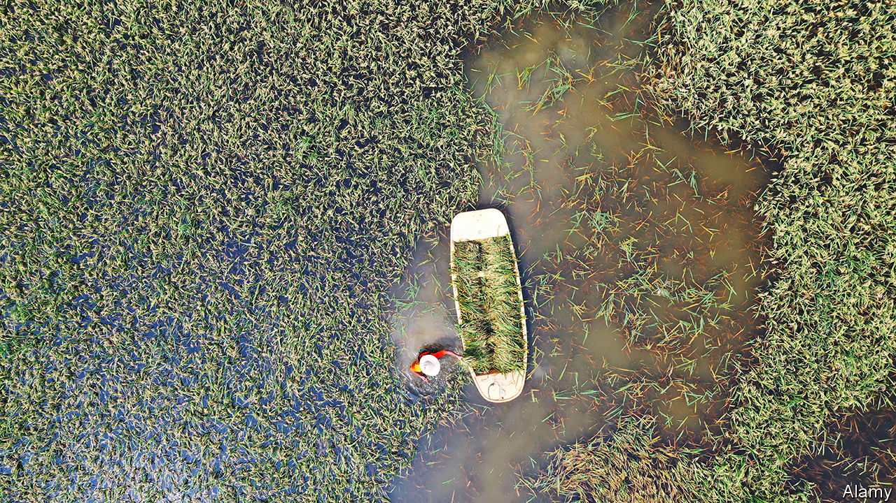
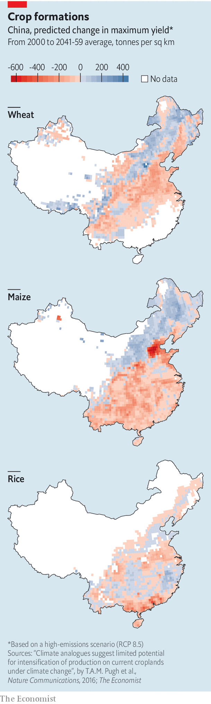
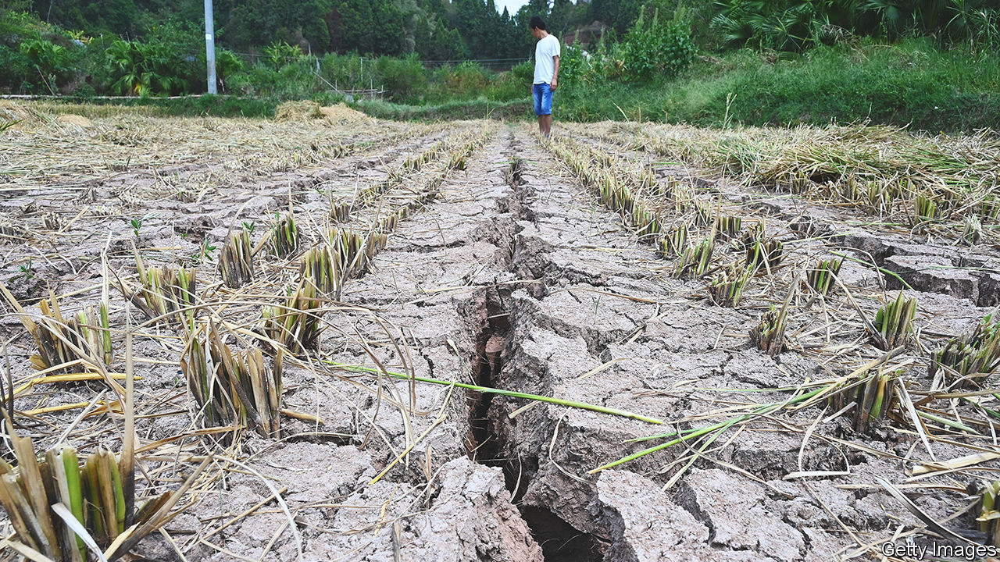

###### A growing problem

# Can China’s farmers cope with the effects of climate change? 

##### Extreme weather in China is a harbinger of challenges to come 

 

> Jul 13th 2023 

In the maize-producing areas around the city of Chengde, in northern China, the heat arrived early this year. With it came drought, the worst in decades. The needle-shaped leaves on the region’s pine trees are turning brown. Worse, much of its maize is now stunted.

The central province of Henan faces the opposite problem. There it was the rain that came early, causing floods and drowning fields. The region produces a quarter of China’s wheat. But much of it is now unfit for human consumption.

Heavy rains elsewhere in China threaten the rice harvest. Heatwaves across the country have killed fish, pigs and rabbits. Extreme weather is hitting Chinese farmers from all sides this year.

Attributing a single drought, flood or heatwave to climate change is complicated. But scientists believe the phenomenon is playing a role in increasing the frequency and severity of extreme-weather events. That should concern all countries. China, though, may be more worried than most.

Officials in Beijing are obsessed with food security. Many Chinese are old enough to remember the famine caused by Mao Zedong’s policies in the late 1950s. That catastrophe killed tens of millions of people. Today the legitimacy of the Communist Party rests in part on its ability to provide affordable food to the people, who are eating an increasingly rich diet. China’s leader, Xi Jinping, has therefore pushed for more self-sufficiency in the food supply. 

That was always going to be a challenge. China accounts for about 20% of the world’s population, but it has less than 10% of its arable land. In recent decades, as the country developed and urbanised, its farmland shrank. Imports still play an important role in the food supply. But they risk being affected by testy relations with countries such as America and Australia, or by conflicts like the war in Ukraine.

Weather-related shocks will make life even harder for Mr Xi and the farmers on which he depends. Take the staple grains that supply about half of the average Chinese person’s calories. More droughts could reduce yields of maize, wheat and rice by 8% by 2030, according to research funded by the agriculture ministry. Heavy rainfall could have a similar effect on some crops. Vegetables and fruits are just as vulnerable to extreme weather—and harder to store for long periods, making it difficult for the government to stockpile reserves. One big effect of a severe drought last year in southern China was a spike in the price of cucumbers and lettuce.

The geography of Chinese farming is likely to change in ways that cannot be fully foreseen. Our maps show how the maximum yields of wheat, maize and rice might be affected in a high-emissions scenario. (Emissions at these levels look highly unlikely, but similar effects might well be seen in less extreme scenarios.) If, as expected, northern China grows warmer, it would make sense to move more grain cultivation there. 

 


Another response would be to bring more of China’s food production indoors, where temperature and humidity can be controlled and output increased. This year the state called for 40% of vegetables to be grown inside facilities such as greenhouses by 2030 (the current number is 30%). Fertiliser and water can be used more efficiently in these settings. A report on the plan in state media spoke of farms “freed from a dependence on nature” and boasted of an enormous greenhouse already growing dragon fruit and figs in the Gobi desert. 

Out in the extreme heat, pigs fatten up more slowly, cows produce less milk and chickens lay fewer eggs. All of them are also at greater risk of dying. So livestock is moving indoors, too. A 26-storey pig farm in central China is the biggest in the world. It can slaughter 1.2m pigs a year (pork is China’s favourite meat). 

With cows, it is harder. But many now spend their days in sheds being cooled down. At a farm in the northern province of Hebei, cows are periodically doused with water and blasted with air from giant fans hung from the roof. Each cow’s location is monitored by a computer and the sprays automatically adjusted to avoid waste. Such practices have spread rapidly through the dairy industry, says James Su, whose company supplies the cooling equipment. “Everyone is praying before each summer starts,” he says. 

Magic seeds

Grains are a tougher challenge still. Most need to be grown at scale, so an open field is the best option. China has been developing drought- and heat-resistant varieties of rice, wheat and other crops. The planting of genetically modified (GM) maize has been allowed in some areas (Mr Xi visited one in May). But, in general, the government takes a cautious approach to such technology. For the moment it is still reliant on GM seeds from countries such as Argentina. (America, which supplies China with some GM crops, has accused it of intellectual-property theft.) In the future, “the hope is that China’s seed companies will be able to develop varieties at pace with the changing climate,” says Even Pay of Trivium China, a consultancy.

China is also banking on better irrigation techniques to offset the impact of droughts. Public spending on water infrastructure topped 1trn yuan ($129bn) in 2022, 44% more than the year before. The main goal is to improve the “capillaries” of China’s irrigation systems, says Xu Yinlong of the Chinese Academy of Agricultural Sciences. That means building a denser network of pipes and storage tanks, and reducing waste from evaporation and leaks. The infrastructure that pumps millions of gallons of water from the lush south to elsewhere is also set to be expanded. 

 


If that doesn’t work, perhaps China can try to create more rain where it is needed. The country is the world’s foremost user of cloud-seeding technology, where chemicals are shot into existing clouds to try to encourage water vapour to condense and fall as rain. Last summer, the hottest and driest since the government began recording temperature and rainfall 61 years ago, cloud-seeding planes were especially active. But there is little evidence to show that China’s efforts are effective at causing much more water to fall than would have been the case otherwise. 

With so much attention paid to China’s food supply, it easy to forget about the toll extreme weather takes on farmers themselves. Most are elderly. If emissions stay high, dangerous heatwaves are likely to become more common across the north China plain, an important agricultural base. Irrigation channels cool the air, but also make it more humid, increasing the risk of deadly “wet-bulb” conditions, when sweat can no longer cool the body down. A survey of Chinese smallholders found that labourers were increasingly unwilling to work in the summer. 

Li Man, a 76-year-old maize farmer near Chengde, is putting in the time. But China’s efforts to prepare for weather-related shocks have been of little help to him. He planted drought-resistant seeds. The local government tried cloud seeding. Neither worked. Mr Li, who saves his money to help put his grandson through university, expects to lose 60-70% of his crop this year. That would be the case even if the weather improves. The crucial growing period has already passed. “If it rained now, it wouldn’t help much,” he says. ■


