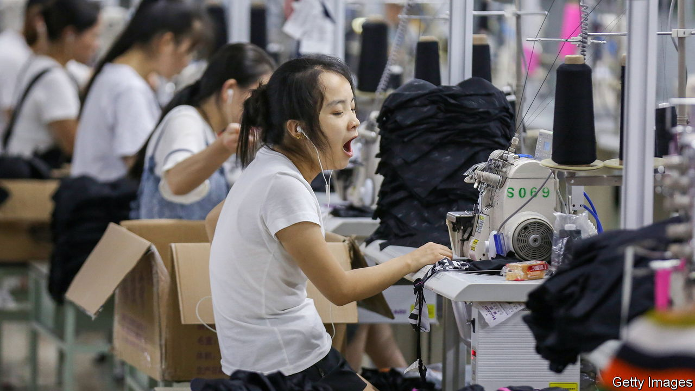
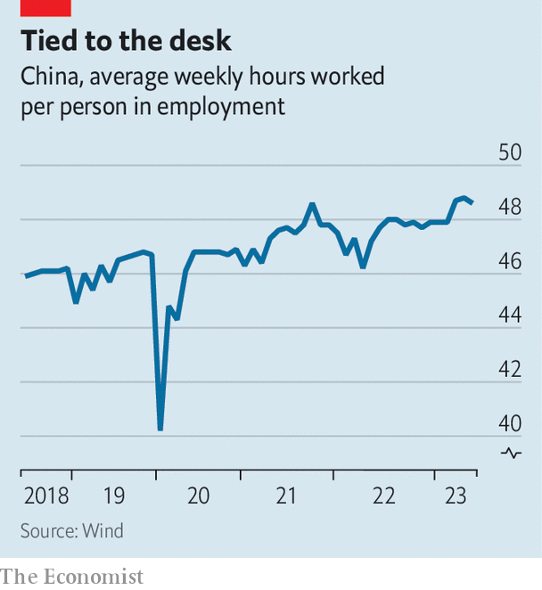

###### Peak toil

# The Chinese are working more hours than ever 

##### A shrinking labour force means things could get even worse 

 

> Jul 13th 2023 

When the National Bureau of Statistics announced that in April workers across China toiled an average of 48.8 hours a week, the agency was ridiculed. That number includes government workers, wrote a commenter on Weibo, a Twitter-like platform. “Try counting only in private companies.” There is no need to count, wrote another, “just look at the lights of office buildings at night.”

 


Low as it may seem to netizens, the average weekly number of hours worked is the highest it has been since the statistics bureau began including the data in its annual round-up more than 20 years ago. In 2018 it started including the number in its monthly round-up, too. There was a big dip at the start of the pandemic. But for most of the past five years, the number has been increasing (see chart ).

Comparing working hours across countries is difficult, as they are often counted in different ways (for example, part-time workers may or may not be included in an average). Even so, the Chinese appear to be labouring longer than most. When the UN’s International Labour Organisation updated its ranking of countries by weekly working hours, China was in the top decile.

Young Chinese workers have long complained of the “996” regime, which refers to a work schedule of 9am to 9pm, six days a week, usually without extra pay. They have adopted an academic term,  or “involution”, that is used to describe a situation when greater input does not yield more output. Many feel pressure to work ever harder, while experiencing no improvement in quality of life. Unlike their parents, who enjoyed rising material prosperity, they feel like they are stagnating.

China’s labour laws stipulate that people should work no more than eight hours a day or 44 hours a week. But lots of overtime work has become the norm. , a state-owned newspaper, suggests two reasons: a lack of government enforcement and corporate ignorance of the law. Trade unions wield little clout in China. They are required to be affiliated with the state-controlled All-China Federation of Trade Unions, which typically sides with bosses and officials, rather than workers.

Lately, workers have been given some cause for hope. Last year a court in Beijing ruled that checking and replying to work-related messages on WeChat, a messaging app, outside normal working hours counted as “invisible overtime”. The court ordered the employer to pay the plaintiff 30,000 yuan ($4,160). Last month, an article in , the Communist Party’s English-language mouthpiece, called for invisible overtime to be regulated, saying that it encroached on workers’ right to rest.

But a shrinking labour force means China must figure out how to squeeze even more from the workers it has. Xi Jinping, the supreme leader, could try to increase productivity by putting more faith in the private sector and giving his people more freedom of movement. There is little sign of that happening, though. ■


