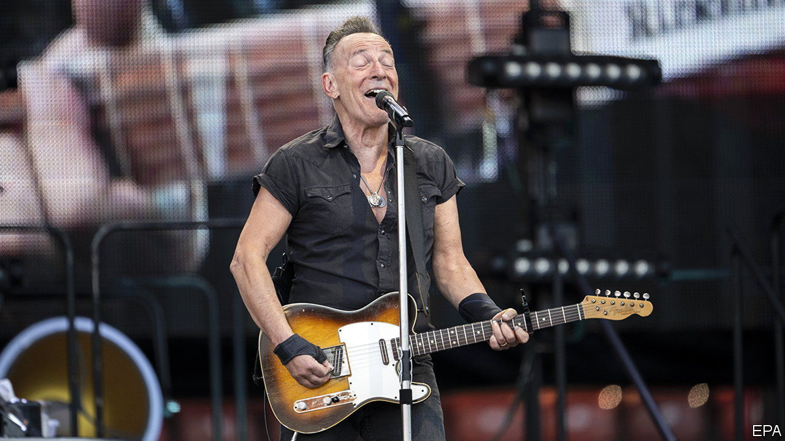

###### Back Story

# Bruce Springsteen turns back the clock—and stops it 

##### On his epic tour, the Boss pulls off one of music’s best tricks: to meddle with time 

 

> Jul 11th 2023 

Just a “One, two, three, four” and he was off, barely pausing for breath and gathering energy over the three electric hours of his show. On stage in Hyde Park in London on July 6th, Bruce Springsteen tossed guitars to roadies, traded licks with members of his , ripped open his shirt and bestowed plectrums and selfies on ecstatic fans. Or he stood still, his Fender dangling at his back, a pose that is a sort of benign American cousin to a gunslinger’s silhouette. 

Mr Springsteen is 73. Yet halfway through a ten-month tour of Europe and North America, he is still performing as if his life depended on it—just as it did when, as a teenage frontman in the late 1960s, he eked out a living in the bars of the New Jersey shore. The fight against time, and its remorselessness, are among the main themes of his songs. The ability of music to twist and resist time may be their deepest meaning.

His first number on this tour is “No Surrender”. “I’m alive!” he chants in the refrain of the second, “Ghosts”. Next comes “Prove It All Night” (he does). His show is part knee-slide in the face of old age, part séance for lost friends—both parts rocking to the drumbeat of mortality. Recent lyrics are crowded with the shades of dead bandmates: “You count the names of the missing as you count off time,” Mr Springsteen sings in “Last Man Standing”. Images of departed musicians loom on the screens behind him.

The genius of many of these songs, though, is that they were born old. The friendship and ambitions commemorated in “Backstreets” have long since withered (“And after all this time”, laments the most poignant line, “to find we’re just like all the rest”). In the story told in “Bobby Jean” it is too late even to say goodbye. In “The River”, which these days Mr Springsteen concludes in an eerie falsetto, the high-school infatuation, shotgun marriage and thwarted dreams are all ancient history. 

The wellspring of poetry, thought William Wordsworth, is “emotion recollected in tranquillity”. The same goes for lots of these songs: they are about the aftermath rather than the action, the memory of youth, , rather than the thing itself. This soulful past tense helps explain the appeal of Mr Springsteen’s hymns to small-town America, threnodies for midwestern deindustrialisation and ballads of blue-collar longing to his fans in London or Barcelona. They may never have navigated the swamps of Jersey, driven 800 miles to Darlington County or worked at the rug mill across the railroad tracks. But they have all looked back with fondness or regret. They have all grown up.

It also helps explain why his hits, many of them written in the 1970s, endure as they do. Since their major key is eulogy, they never go out of date. The older the singer, the songs and his audience, the more moving they become.

These tunes pull off one of music’s most precious tricks: they meddle with time. More powerfully than any madeleine, music can open a portal to bygone gigs or evenings spent listening to cassettes or LPs. “Tonight”, Mr Springsteen sings, “I’m ready to grow young again,” and the greying devotees in T-shirts from tours of yore feel the same way. More than that, music can set its own time, seeming to speed up the clock  or slow it down in a serenade—even, sometimes, seeming to stop it.

Mr Springsteen’s is an art of opposites, which, as he put it in a , has “one foot in the light, one foot in the darkness”. Youth is an idyll and a prison, America an open road and a broken promise, hope a lie and all you have. Home is a town full of losers that you yearn to leave but never will entirely. Likewise, even as they mourn the passage of time, his songs seize a present moment and stretch it out, rapturously, as the best music somehow can. 

“Born to Run” and “Thunder Road” are poised for eternity on the threshold of escape, vowing that, at least until the final chord, you can live with the sadness and find magic in the night. “Kitty’s Back” and “Mary’s Place” invite you to a party rather than a wake. The  that Mr Springsteen projects can be transfixing on its own. On their podcast “Renegades”, he told Barack Obama that all his work was inspired by his troubled father, and it still shows.

“Death is not the end,” he sings at the close, alone on stage with guitar and harmonica. On this tour he revives the past, eyeballs the certain future and—like a rock’n’roll Sisyphus bestriding a mountaintop—glories in the urgent instant between them. ■


