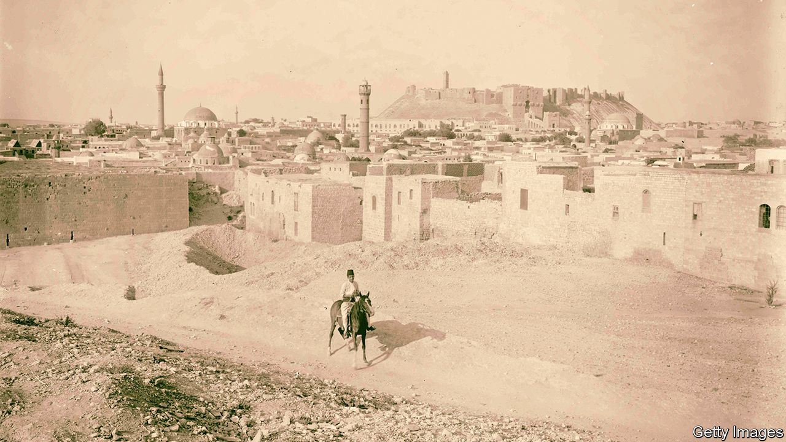

###### Tales of the city

# Khaled Khalifa’s new novel tells the story of two families in Aleppo 

##### “No One Prayed Over Their Graves” is an ode to the Syrian city that has been ruined by conflict 

 

> Jul 13th 2023 

 By Khaled Khalifa. Translated by Leri Price. 

Khaled Khalifa, a Syrian writer, lives in Damascus even though state authorities have banned his books and, on one occasion, beaten him up. His previous novel, “Death Is Hard Work”, dealt with the carnage of his , which began in 2011. “No One Prayed Over Their Graves”, a family saga, takes place in and around Aleppo, a historic city ruined by that conflict. The novel, which covers the period between 1881 and 1951, tells the multigenerational story of two Aleppo families “intricately entwined” despite differences of creed, class and character. 

The landowning Bayazidis are Muslim, the trading Gregoroses, Christian. Their family friends, notably Azar, an architect, are Jews. In 1907 a deadly flood inflicts deep “scars of loss” on these close-knit clans. The waters engulf a village on the city’s outskirts where Zakariya Bayazidi and Hanna Gregoros, pals since childhood, have built houses. The catastrophe anchors an intricate plot that ranges from late 19th-century  imperial rule to Syrian independence after 1946.

In this Aleppo, faith seldom dictates actions and affections: as children, Hanna and Zakariya “couldn’t care less about their religions”. Yet external events—from the slaughter of much of the Gregoros family to the —sometimes force it centre-stage. Although this strife-torn “magical city” is no multicultural idyll, passion or friendship breaches sectarian barriers. Maryam, an Armenian survivor who works with Zakariya’s sister, Souad, reflects that “walls portrayed our identity.” In this novel, characters find joy, and take risks, by jumping over them. 

Characters do not hold fast to dogma. In later life, Hanna acquires a reputation for being especially devout but privately thinks of Jesus simply as “a luminous idea held up for all humanity”. Yvonne, lover of the married Zakariya, “believed nothing and lived in doubt”. Even the holy Father Ibrahim nurses sceptical ideas.

Love stories—thwarted, tragic or ecstatic—help bring a many-stranded plot together. At its symbolic heart lies the scandalous affair, “almost a fairy-tale”, of William Eisa—a Christian school friend of Hanna’s and Zakariya’s—and Aisha Mufti, a Muslim girl. They elope, and her enraged Ottoman fiancé murders both of them. Such disasters leave unhealed wounds. Maryam, who marries a Turkish banker but nurtures a “silent love” for Zakariya’s photographer son, reflects that “survival is a journey through a trackless wilderness.” 

Maryam also frets that in venerable Aleppo, with its souks, mosques, churches and citadels, “All inanimate objects were immortal.” For her, these hallowed edifices “conspired to erase the great stories” of the citizens themselves. After the violence and horrors of recent years, such passages have a bitterly ironic taste. 

Mr Khalifa’s story is richly embroidered, if sometimes tangled: a family tree would have helped. Yet his galloping narration restores life and soul to a city that has become a byword for devastation. Leri Price, who also translated “Death Is Hard Work” from Arabic, has produced an English text of grace, pace and gusto. Aleppo’s “immortal” monuments may have been , but, thanks to Mr Khalifa, those “great stories” endure. ■


