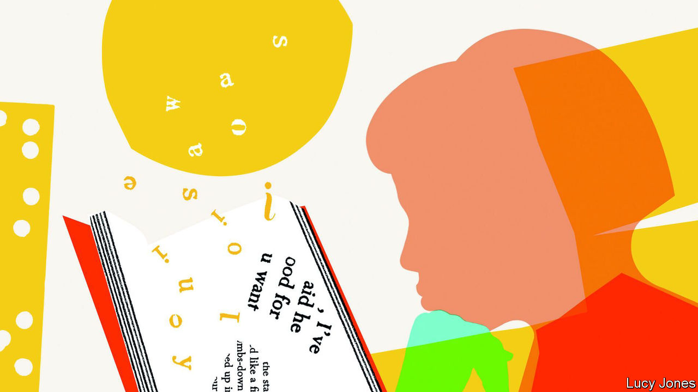
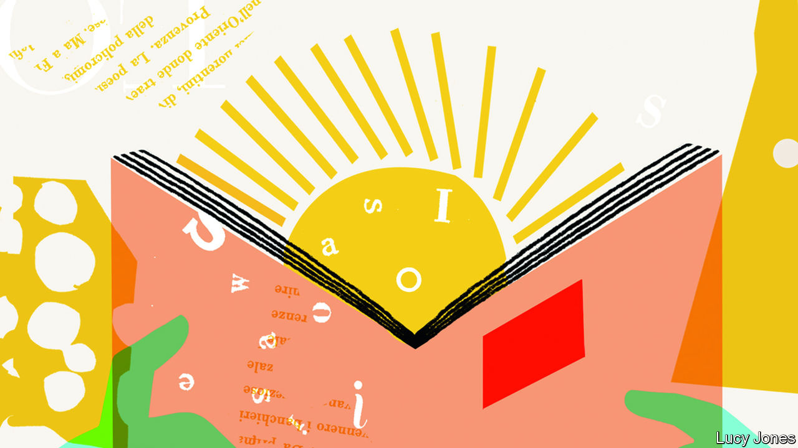

###### Shelf-made

# Try these books on your summer holiday 

##### Our correspondents recommend the finest books, old and new, in their areas of interest 

 

> Jul 13th 2023 

Artificial intelligence

  By Henry Kissinger, Eric Schmidt and Daniel Huttenlocher. 

 is a big idea: AI marks “a new epoch”. The Enlightenment, which placed humans at the centre of all that is knowable, has come to an end. Co-written by America’s pre-eminent living statesman, a former boss of Google and an expert on AI at the Massachusetts Institute of Technology, this book is a muscular contribution to one of the 21st century’s most pressing debates.

 By Kai-Fu Lee.

Born in Taiwan, the author studied AI in America, became an executive at Apple, Google and Microsoft and now runs a venture-capital firm in China—so is well placed to . America may dominate AI now, but China will overtake it, he believes, because the Chinese work harder and have more data (in part because of looser standards on privacy). 

 Edited by John Brockman.

This compilation of essays written by an all-star cast of experts from across scientific fields draws together smart thinking about the technology. The topics covered include AI’s blind spots and the differences between human and AI cognition. A tasting menu of intriguing ideas.

By Ajay Agrawal, Joshua Gans and Avi Goldfarb. 

Three economists observe that AI lowers the cost of making predictions, just as computers lowered the cost of doing maths. AI will replace humans, from automation to . But all is not lost: as the cost of predictions goes down, the value of human judgment will increase, the authors argue. 

The history of money

 By Barry Eichengreen

An  for anyone who wants to understand money. The book starts in the era of the gold standard, when leading economies pegged their currencies to gold, before explaining how that standard collapsed between the first and second world wars. It describes the attempt at Bretton Woods to create a new monetary order and how it fell apart. It then examines the era of globalisation and relatively free capital flows. 

By William Goetzmann. 

Before he became a finance professor at Yale, the author was an archaeologist and museum curator. In this book he combines his talents. Starting in Iraqi dig sites and ending in post-war America, he demonstrates how financial innovation was the handmaiden of civilisational change. Published in 2016, Mr Goetzmann’s book provides a comprehensive overview of monetary history.

 By Jan Hogendorn and Marion Johnson. 

Cowrie shells have a claim to be the world’s first global money: harvested in the Maldives, sold in Bengal, shipped to Europe (mostly to the Netherlands and Britain) and used to buy slaves in west Africa. The shells would also make the journey across the Atlantic: large quantities were discovered near slave markets in Virginia. The cowrie’s role in human trafficking makes it one of the most significant currencies in history. 

By Viviana Zelizer. 

The author, a professor of sociology at Princeton University, homes in on America between 1870 and 1930 to tell a social history of money. Examining magazine articles, court cases and much else, she shows how money assumes many different meanings. (In 1908 one judge decided that “A wife has a perfect right to go through her husband’s pockets at night.”) The book is a rare example of a monetary history told from below.

Photography

 By Susan Sontag. 

In these essays Sontag, who died in 2004, broaches topics such as truth, beauty and pathos with wit. She also provides an often scathing critique of the medium. She is frequently philosophical, exploring how the camera limits, shapes or perhaps even controls how many people apprehend the world. A foundation of any .

By John Szarkowski. 

A masterclass in visual analysis from a champion of 20th-century photography. Szarkowski began his career as a photographer but won fame after he became an early director of photography at the Museum of Modern Art in New York. This book is essential for readers who want to improve their photography skills while learning about visual theory and the elements of composition.

 By Nathan Jurgenson. 

A fine survey of social-media photography. It is a book of sociology—in part an analysis of how and why people take selfies—but not one crammed with statistics. The author is interested in social pressure and in the way people manage the images of themselves that they present to others. The snaps shared on social media might seem trivial, but this study argues that they are not. 

Books by foreign correspondents

 By Katherine Boo. 

An exploration of the faultline between the old India and the new , published in 2012. In Annawadi, a marshy slum at the end of the main runway of Mumbai’s international airport, migrants from all over the country grapple with poverty, hunger, illness and corruption as they try to make a living in the big smoke. Taken together the stories are a searing description of India’s growing pains—and a masterclass in narrative non-fiction.

. By John Hersey. 

The people of Hiroshima were doing ordinary things when the atom bomb dropped on August 6th 1945. Perhaps 100,000 of them died; the author talked to six who survived. In sparse, clinical prose,  the sudden destruction of a city, the fires that followed and the “strange, capricious disease which came later to be known as radiation sickness”. One of the greatest pieces of journalism ever written—and you can read it in a single sitting.

 By Michela Wrong. 

Congo has long drawn intrepid foreign writers, including  But few are as funny as Michela Wrong who, in the 1990s, reported on the downfall of Mobutu Sese Seko, the dictator of what he called Zaire, and the start of the great Congo war. This book guides the reader diligently through the history, but it is the reported details that make it joyous to read. The author brings out the excitement of Congo even as she explains the tragedy. 

 By Barbara Demick. 

Few countries are trickier to report on than ; almost all information comes from North Koreans who have fled. Published in 2009, this book is based on interviews with about 100 defectors. The title refers to the regime’s claim, incessantly repeated, that North Koreans have “nothing to envy in the world”. That is the opposite of the truth, as these testimonies of suffering and starvation make plain. 

 


Female travel writers

 By Noo Saro-Wiwa. 

After moving to Britain as a child, the author viewed Nigeria, her birth country, with embarrassment and dread. A four-and-a-half-month trip made in 2007-08, more than a decade after the execution of her activist father, Ken Saro-Wiwa, changed her perspective. Published in 2012,  is a rollicking read and offers incisive analysis of the problems and power of modern Nigeria. 

 By Martha Gellhorn

Published in 1978, this is  “best horror journeys”. She tells her tales with wit and vivacity, whether of traversing China via sampan with her husband Ernest Hemingway, trailing elephants in east Africa or searching for submarines in the Caribbean. People everywhere are nasty, brutish and smelly. But the writing is saved from snarkiness by the author’s humour and deep feeling for the natural world.

 By Mary Kingsley. 

For this tome, published in 1897, the author made her way across western and equatorial Africa, becoming the first European to enter parts of Gabon and the first woman to climb Mount Cameroon. Not only a , she was also an eloquent admirer of west Africa. Her writing is direct, practical and remarkably sanguine. After falling 15 feet onto 12-inch spikes in a game pit, she remarks: “It is at these times you realise the blessing of a good thick skirt.” 

Wine

 By Étienne Davodeau. Translated by E. Joe Johnson. 

Étienne Davodeau, a comic-book artist, knows little about winemaking. Richard Leroy, a maker of cult wines, has not read much . For a year the pair exchange jobs and the fruit of their job swap is this graphic novel. It provides an introduction to winemaking, from bud to bottle, through drawings and speech bubbles. It is both touching and technical. 

By Dan Keeling and Mark Andrew. 

Launched in 2013, gives a good kicking to stuffy wine journalism; this book is an extension of the thrice-yearly periodical. Its first half consists of humorous yet useful guides, such as “how to order wine in a restaurant without fear”. The second recounts a trip through Europe’s grapelands, with satirical drawings. Probably the most cheerful  you will ever come across. 

 By Hugh Johnson and Jancis Robinson. 

First published in 1971, this has been the wine world’s bible ever since. That world has changed—drinkers’ tastes and winemakers’ techniques have evolved; winemaking regions are under threat from climate change—but the atlas has kept up. The eighth edition, published in 2019, illustrates why some of the world’s best wines are from tiny regions and why altitude, soil or sun exposure may cause two neighbouring vineyards to produce with very different characteristics. ■


