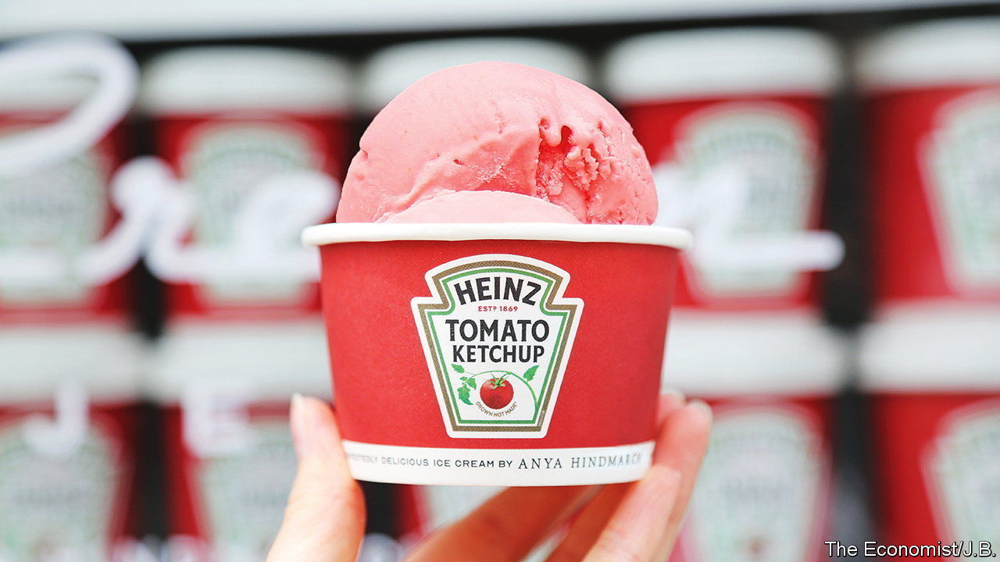

###### World in a dish

# When it comes to ice cream, the instinct to innovate is misguided 

##### Forget flavours like ketchup, pickle and blood. It’s best to keep it vanilla 

 

> Jul 13th 2023 

Does it make more sense to transform a bottle of ketchup into a handbag or a flavour of ice cream? To , a British fashion designer, that is a false dichotomy. She has produced a sequinned bag based on a bottle of Heinz’s finest and an ice cream boasting “the unmistakable taste of sun-ripened ”. (At £3.50, or $4.53, a scoop, the ice cream is marginally more affordable than the £1,195 tote.) 

Those left cold by the frozen ketchup at the couturier’s Ice Cream Project in London can plump for a refreshing pea sorbet or an ice cream featuring “mellow cheddar cheese with the ‘chunky, crunchy, bite of Branston’”, a chutney that has appeared in soggy British sandwiches since 1922. The more avant-garde flavours taste unpleasantly accurate: the Branston-pickle option has a vinegary tang that no one really wants in an ice cream. Far more palatable are the ones based on Coco Pops, a chocolate-flavoured cereal, and lemon curd.

Ms Hindmarch is not alone in experimenting with unusual flavours. , a British chef, has long been known for his bacon-and-egg ice cream. The Alchemist, a two-star Michelin restaurant in Copenhagen, serves pig-blood ice cream (the blood replaces eggs as an emulsifier). Van Leeuwen, an American ice-cream company, has flavoured its products with , ranch dressing and pizza. Nor are such experiments all that new. An ice-cream shop in 18th-century London called The Pineapple was serving Parmesan ice cream. The urge to innovate seems to be insatiable.

This may suggest that ice-cream makers need to keep churning out ever-weirder flavours to persuade people to keep slurping. Yet the charm of ice cream seems to be more fundamental. It has been made around the world, in places with vastly different culinary styles and histories, underlining the universality of its delightfulness. From Turkish to Syrian ,  to Iranian , Filipino to Indian , Japanese , Afghan and Indonesian , some iteration of the dessert is made and loved everywhere.

Vanilla, the classic option—and a derisive synonym for boring—is often touted as having universal appeal, writes Rachel Herz in “The Scent of Desire”. That, she explains, is because  is one of the volatile flavour compounds present in breastmilk, as well as some formulas. 

 


The pleasure of ice cream is indeed childish. The chimes of an ice-cream truck send a ripple of delight through even the iciest heart. Childish is a term usually used pejoratively, to describe things that should be put away at the age of maturity. Perhaps that explains the drive to make ice cream ever more sophisticated. Häagen-Dazs was among the first ice-cream companies to market the product to adults. 

But the best adult desserts are not that far removed from those enjoyed by children. And the joys of childhood are profound. They win out against innovation, however sophisticated the marketing. People may come for the Branston-pickle ice cream, but they stay for the Coco Pops. ■


