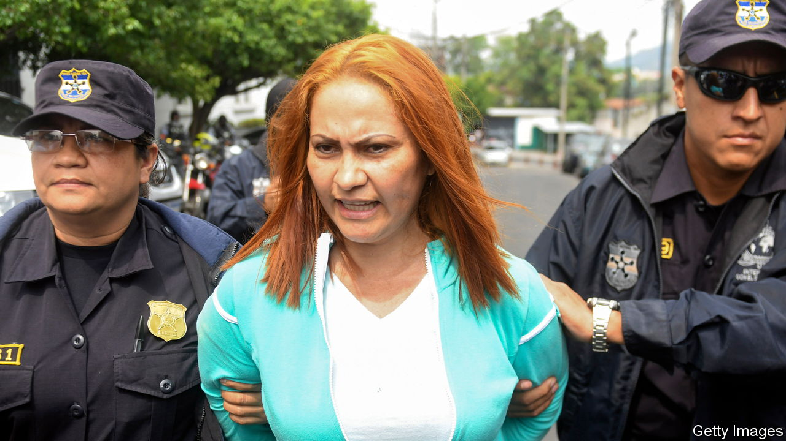

###### Organised crime

# “Narcas” offers a rare glimpse of the women in drug gangs 

##### Deborah Bonello profiles some of them in her intriguing new book 

 

> Jul 13th 2023 

 By Deborah Bonello. 

MUCH IS KNOWN about the kingpins of the drug trade, thanks in part to a recent spate of books,  and . Readers, listeners and viewers are aware of the murderous exploits of Pablo Escobar, Colombia’s most famous drug lord, who was shot dead on a rooftop in 1993. Joaquín Guzmán, a man better known as , is notorious too as the former head of Mexico’s Sinaloa cartel; he is serving a life sentence in America. People may even recognise Emma Coronel, El Chapo’s model wife, who attended his trial in New York in 2019 (and later pleaded guilty to three drugs-related charges).

Yet the women who  often go unnoticed. That is partly because fewer women than men engage in this hyper-violent business. Many are, and indeed aspire to be, accessories, as implied by the  (extravagant girlfriend look) culture of Sinaloa. Deborah Bonello, a longtime journalist in Latin America for Vice News, sets out to show that women have important—sometimes even starring—roles in the gangs. 

 have not always been overlooked in this way. Back in 1945, Mexico’s “public enemy number one” was María Dolores Estévez Zuleta, a female drug-runner. Ms Bonello tracks down some of the women involved in the drug trade in more recent times by travelling across the region to visit their home towns. (Many are now locked up in prison.) 

She writes about Digna Valle, a Honduran as female drug bosses are known—who trafficked  to the Guatemalan border for people including El Chapo. She could earn as much as $800,000 from each shipment. Ms Bonello visits her town and the mansions probably built with the proceeds of Ms Valle’s endeavours. While there she manages to have a brief phone call with Ms Valle, who was arrested in 2014, spent time in prison in America and now lives in Houston.

In Guatemala Ms Bonello reports on the Lemus sisters, who ran trafficking through the country and occasionally were involved in terrible acts of violence. In Culiacán, Mexico, the author writes about the various women who have risen up the ranks of El Chapo’s cartel. One provided information for the drug lord’s trial; some informants are living in America. But most of his are either dead or behind bars. 

Ms Bonello suggests that women are gaining power in drug gangs just as they are in society more generally. Her subjects have a variety of reasons for getting involved in an illicit business, and some were coerced into it. But others found the perilous work thrilling. “I liked the danger,” says one; “I loved the adrenaline,” says another. Sometimes women benefit from their apparent invisibility, “hiding behind the stereotype of the good girl incapable of doing bad to do just that.”

The investigative reporting in this book is impressive. Ms Bonello goes undercover into a prison in Guatemala City to talk to Marixa Lemus. When she goes to Ms Valle’s home town, she brings along a priest for safety. The result is a slim volume that is full of intriguing details and colour. 

Ms Bonello admits her contribution to the field of narco-literature is “modest” thanks to a paucity of information about female bosses and the danger of collecting more. She is rarely able to paint a clear picture of the character: was Ms Valle violent and awful or not? Unfortunately she, and the reader, cannot tell. 

“Narcas” would also benefit from a clearer narrative. Based on a series of essays that Ms Bonello wrote for Vice, the book still reads as a collection of snapshots. Short interspersed sections, such as one on mothers searching for their disappeared relatives, are interesting but feel rather out of place. 

All the same, Ms Bonello’s work enriches the reader’s . This book is a valuable introduction to a subject that deserves more research. ■


