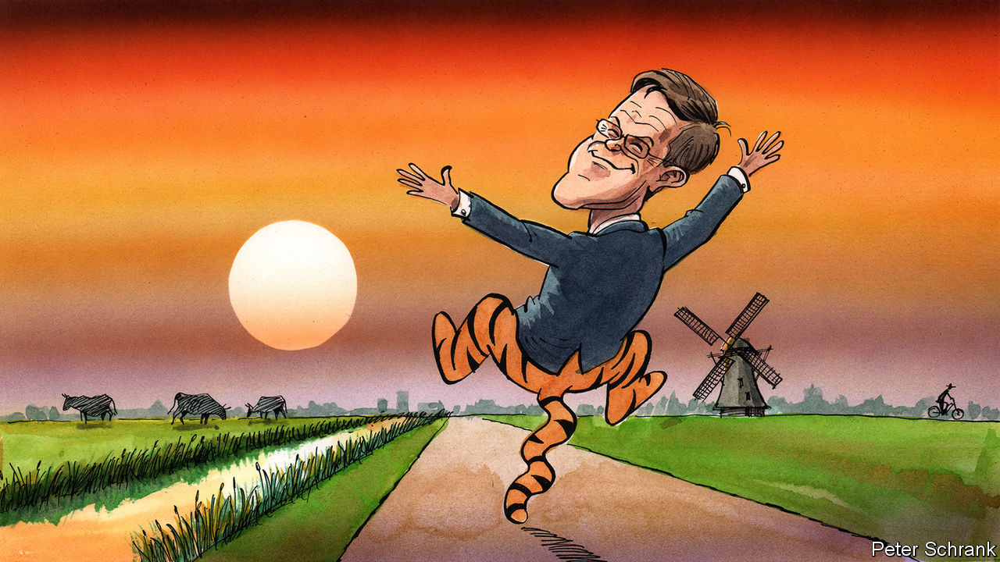

###### Charlemagne

# Farewell Mark Rutte, the Tiggerish Dutch prime minister 

##### Bouncy, endlessly optimistic, devoid of ideology—what’s not to like? 

 

> Jul 13th 2023 

Most politicians like to project an air of sober earnestness. A job prized by bright, sociable people thus ends up looking like hard work. Not for Mark Rutte, the perma-cheerful prime minister of the Netherlands since 2010. In the manner of Tigger, Winnie-the-Pooh’s sidekick, the equally elongated Dutchman has bounced from one political chore to the next with relentless aplomb. Whether riding a bike to the office under The Hague’s leaden skies, or explaining (again!) to an EU crowd why the Dutch would not pay for some new Brussels scheme, then embarking on yet another campaign in a country blessed with over a dozen political parties: all of it could be done with a spring in the step and a smile for the cameras. Now Europe is to lose its chief cheerful-leader. Soon after his fourth coalition collapsed, on July 10th he announced he will leave office after elections due in November. But even the unexpected derailing of Mr Rutte’s political career failed to dent his chirpy demeanour for long. 

Tigger and Mr Rutte share another trait: it is impossible to discern what either might want to achieve as Dutch prime minister. That is no huge problem for a fictional stuffed tiger. But for a man who has held the job for longer than anyone else (and who will probably stay on well into 2024 as caretaker) it does rather raise questions. Other European leaders who have dominated their national polities for over a decade have left behind some form of “-ism”. Thatcherism looked to shrink the state, Blairism to combine the best of the right and left, Merkelism to keep options open for as long as possible. The very idea of Ruttism is no more conceivable than Tigger attending a funeral. 

If Mr Rutte has a guiding principle, it is constant ideological flexibility. Here is a man well versed in the art of listening to other people’s opinions before declaring that they had been his own all along. Perhaps that is inevitable in a country where no fewer than seven parties each at present command 10% or more in the polls. The coalitions needed to engineer workable majorities (the current one has four, including Mr Rutte’s liberal VVD) and then hold them together work better if their central figure doesn’t believe he knows best. The former human-resources man from Unilever, a soap-to-soup conglomerate, mastered the art of ideological self-effacement. A “boring” guy by his own admission, he boasted few hobbies outside teaching social studies once a week at a local school. Why let anything as mundane as political beliefs get in the way of forming a plausible coalition? Much better to slap some backs, flash that smile, find consensus, get on with the job.

Mr Rutte painted his lack of vision as a feature, not a bug. He liked to quote Helmut Schmidt, a no-nonsense German chancellor who advised that politicians with visions should consult a doctor. The upshot has been 13 years of an administration that has plodded through over half the 21st century so far with much pragmatism yet little discernible purpose. This was management-by-committee on a national scale. Problems were dealt with as they arose. Some were handled well: pensions reform got through with rather less  than in France, for example. 

Occasionally the ball was dropped. The clumsy implementation of EU environmental laws has resulted in wide-ranging restrictions on new economic activity. Housing is scarce. From 2017 it emerged that thousands of families had been wrongly accused of benefits fraud, sending some into penury. Last year a child died when migrant-hosting facilities proved inadequate. But overall the Dutch got more of the same. The economy grew steadily under Mr Rutte, albeit at the flaccid rate Europe is used to these days.

Mr Rutte’s amiable demeanour masks a killer political instinct, however: long is the list of former rivals who found themselves facing early retirement. (One discarded justice minister was later found working as a bus driver.) A master tactician, he happily drifted around the political spectrum, including to its outer reaches when needed. His maiden government got support from Geert Wilders, a migrant-bashing demagogue whose rhetoric Mr Rutte later borrowed. Over the years there were alliances with socialists and Christian democrats, who had taken turns providing prime ministers for nearly a century before Mr Rutte came along. In the end, it was what looked like a manageable crisis over migration policy that prompted the government to fall. Having lost popularity, and perhaps sensing this was a good issue over which to call it a day, the Dutch Tigger said he was done with politics.

Ta-ta for now!

Mr Rutte’s ideological flexibility was mostly a domestic phenomenon. In Europe he had a firmer line. Those with visions—that word again—of a more federal union needed to be kept in check. As the EU’s longest-serving leader (bar Viktor Orban of Hungary) he knew the mechanics of how decisions were made. That has given the midsized Netherlands the kind of heft usually reserved for bigger countries—and fed rumours Mr Rutte might end up with a top EU job. Often the European project advanced at the pace dictated by the Dutch electorate. Mr Rutte resisted a budget for the euro zone and other federal schemes. An exception was made for a pandemic-recovery fund, but with endless reminders this was to be a one-off. After Britain left the club, the Dutch were left as the biggest remaining champions of free trade and open markets. 

But it is at home that Mr Rutte will be remembered—or, more likely, not much. Perhaps being forgettable will turn out to be Ruttism’s elusive central feature, and its most appealing. For there are worse things for a polity than to be led by a cheerful, pragmatic and dedicated leader. The Dutch seem content: seven in ten think the situation in their country is good, compared with three in ten in France. Mr Rutte inherited a rich, reasonably well-run country and leaves behind a rich, reasonably well-run country. He gave his compatriots a few more years of what they already had. Perhaps that is enough to justify a self-satisfied grin. ■


