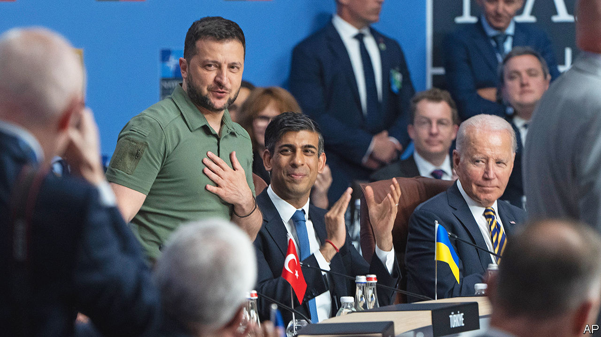
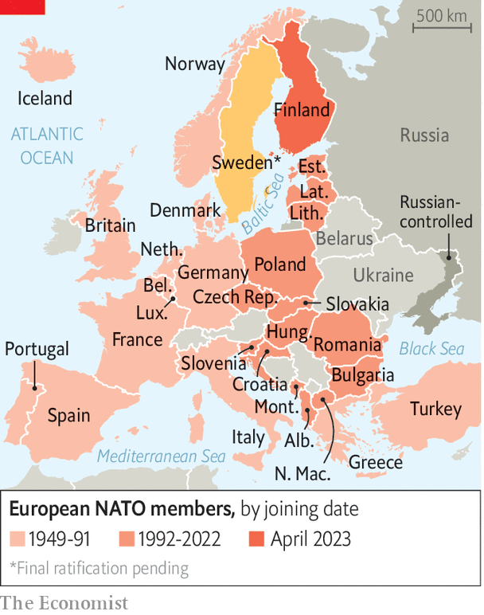

###### Progress and pitfalls

# NATO did not give Volodymyr Zelensky everything he wanted 

##### But he still got a lot 

 

> Jul 12th 2023 


Ahead of thIS week’s summit in Vilnius, Ukraine and its closest allies, including Lithuania, the host, and its neighbours in eastern Europe, had hoped the allies would offer Ukraine a clear and credible post-war pathway into NATO. They were haunted by the ghosts of a previous summit in Bucharest in 2008, which had declared that Ukraine “will” join NATO, without saying how or when. That provoked Russia without securing Ukraine, consigning it instead into a dangerous grey zone. “We understand that we cannot be a member of NATO during the war,” acknowledged Volodymyr Zelensky, Ukraine’s president, last month, “but we need to be sure that after the war we will be.”

In Vilnius, leaders did indeed affirm that “Ukraine’s future is in NATO” and said that it would not need to jump through the hoops of a “membership action plan” or MAP. But hoops there still will be. “We will be in a position to extend an invitation to Ukraine to join the alliance when allies agree and conditions are met,” declared the members, in distinctly gnomic fashion. (Concerns about corruption in Ukraine loom large for some NATO countries.) The pledge was “Bucharest minus”, suggested Samuel Charap of the RAND Corporation. At the summit, the mood among many eastern European experts and officials bordered on melancholy. 

They should not have been altogether surprised, and they ought to be more cheerful. Joe Biden, America’s president, had warned days before the summit that he would not wave Ukraine through. “I don’t think [Ukraine is] ready for membership in NATO,” he warned. “There’s other qualifications that need to be met, including democratisation and some of those issues.” Jake Sullivan, Mr Biden’s national security adviser, speaking on July 12th, defended the outcome as a compromise among allies. “I’m not sure what it means exactly to go further,” he said. Ukraine had made “substantial steps along the reforms path”, he acknowledged, “but there are more steps to take.”

Mr Zelensky, whose mid-summit tweet that the decision was “absurd” was thought to have irritated American officials, later struck a more emollient note. “The results of the summit are good,” he suggested, adding that “clear signals that [NATO membership] will happen were heard confidently today.” But there were also signs of friction among friends. America deserved “gratitude” from the world for its support for Ukraine, argued Mr Sullivan, clearly annoyed by accusations of insufficient resolve. “People want to see gratitude,” agreed Ben Wallace, Britain’s defence secretary, recalling that he had driven 11 hours to Kyiv only to be handed a wishlist of arms: “We’re not Amazon.” 

Others, though, offered a more sanguine assessment of Ukraine’s situation. “Ukraine is now closer to NATO than ever before,” insisted Jens Stoltenberg, the alliance’s secretary-general, pointing to initiatives designed to make Ukraine’s armed forces more interoperable with those of the alliance—a process already well under way owing to the flow of NATO-standard weapons. Gabrielius Landsbergis, Lithuania’s foreign minister, said that the Vilnius summit would be a “bridge” to NATO’s summit next year in Washington. 

 


And Boris Pistorius, Germany’s defence minister, suggested that the simplification of the accession process would speed things up: “Once the war is over, this can go very fast.” Some experts and officials at the summit suggested that NATO membership was being held back because it would be necessary as a bargaining chip later—for instance to help persuade Mr Zelensky to make concessions as part of a settlement with Russia. 

Mr Zelensky did not leave empty-handed, by any means. On the sidelines of the NATO summit, the G7 countries—America, Britain, Canada, France, Germany, Italy and Japan—issued a joint declaration setting out general principles on how each state would now offer “enduring” support for Ukraine. The document promised to work towards “specific, bilateral, long-term security commitments and arrangements” that would build up Ukraine’s armed forces, including with air defence, artillery, armoured vehicles and warplanes (a coalition of countries will begin training Ukrainian pilots on F-16 jets next month). The declaration added that Russian state assets abroad would remain “immobilised until Russia pays for the damage it has caused to Ukraine”, the strongest commitment to date to force Russia to pay for Ukrainian reconstruction.

The G7 members did not go so far as to offer Ukraine formal security guarantees along the lines of NATO’s Article 5 mutual-defence clause, according to which an attack on one is an attack on all. But they said that if, after this war, Russia attacked Ukraine again, allies would “immediately consult with Ukraine” and offer “swift and sustained security assistance” including “modern military equipment across land, sea and air domains”. It is now up to individual allies to flesh out these pledges. “You could expect more British troops in Ukraine after this conflict than you did before,” suggested Mr Wallace. The devil will be in the detail of these bilateral security promises, with America’s naturally being the most important. 

Despite the focus on Ukraine, the summit also saw significant progress on other issues. A flurry of last-minute diplomacy saw Recep Tayyip Erdogan, Turkey’s president, withdraw his blocking of Sweden’s bid for NATO membership on July 10th. Once Turkey’s parliament completes ratification, Sweden’s membership will complete Russia’s encirclement in the Baltic Sea and make it easier to plan the defence of the Baltic states to the south.

The allies also approved their first comprehensive (as in 4,000 pages long) defence plans since the end of the cold war, giving detailed guidance to armed forces on how to prepare for the defence of the north, central and southern parts of NATO’s borders, from the Arctic in the north to the Mediterranean in the south. And there were further boosts to the battle groups in the east, with Canada pledging to double the size of its deployment in Latvia with as many as 1,200 additional troops. Mr Putin invaded Ukraine to push NATO away from his borders. Instead, it has grown stronger and closer with every month. ■

