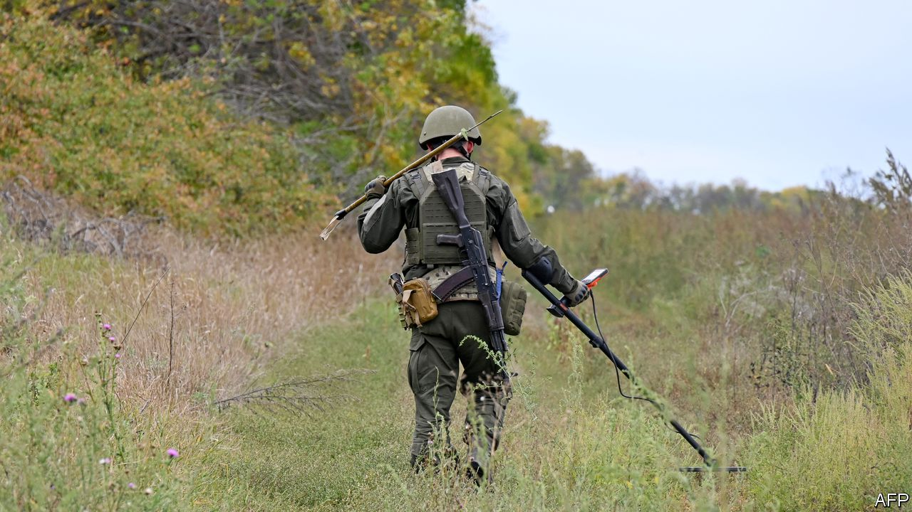
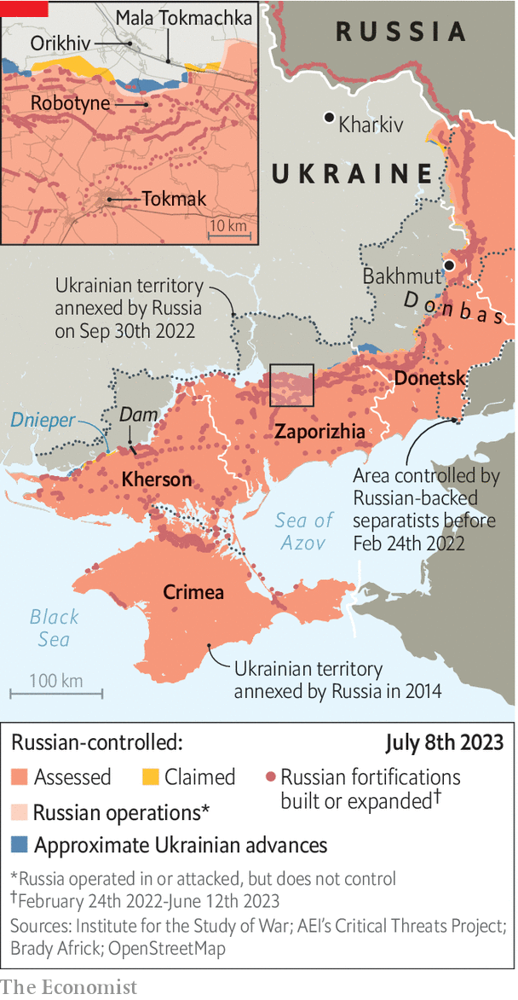

###### Sleepless in battle

# Sappers risk their lives to win Ukraine back, inch by inch 

##### Demining by hand, combat engineers try to break through Russian lines 

 

> Jul 9th 2023 


IN THIS GAME, 50 centimetres can make all the difference. “Tsar”, a 35-year-old veterinarian turned combat engineer, was part of a five-man group demining fields near Robotyne on June 27th. The sappers were three hours into their early-morning mission when artillery duels began. First came the —not in itself a signal to stop working. But then came , which began to explode overhead. “You know where you are with mortars. With clusters you’re in one of two camps: lucky or unlucky.” Tsar escaped with shrapnel injuries in the soft tissue of his backside, from which he is recovering in the local hospital. Five tourniquets could not save his comrade Dima Shulgin, just 50 centimetres to his side. He died from bleeding the next day, aged 35.

The fate of  hinges on the work of its combat engineers. Sappers are the key to breaking through at least three lines of well-planned Russian defences—and nowhere more so than in the open plains of Zaporizhia region, the main focus of Ukraine’s counter-offensive. Progress here is more strategically important than anywhere else. But Russia knows this and has built defences accordingly. The Ukrainian sappers given the job of finding a way through have to deal with around 1,500 mines per square kilometre. That is before Russian artillery, drones, aviation and  begin their work. “Sappers have become target number one,” says “Sleepless”, the company commander in charge of the ill-fated mission on June 27th. “It’s a hunt, pure and simple.” 

 


Ukraine changed tactics in the early days of the counter-offensive. An unsuccessful attack southwards from Mala Tokmachka on June 7th saw much of its most capable Western-supplied mine-clearing equipment bogged down—then targeted—in minefields. Now Ukraine throws sappers forward first in small groups of four or five, on foot, in the hope they go undetected; infantry then follows. It is a departure from NATO-standard doctrine, which emphasises the role of armour as protection. “This war is making us do non-standard things,” says “Beaver”, who commands the engineering regiment providing sappers to Ukraine’s attack brigades. “We don’t have air cover or plentiful Western equipment, so we risk our people. Small group tactics, like the Finns used in the winter war [of 1939-40].” Surprise tactics were the only way to breach an obstacle course like no other built since the second world war, he said. 

The work could not be more dangerous. Much of it is done at dawn. The Ukrainians have night-vision goggles provided by Western partners and local volunteers, but the optics are not perfect. “A sapper’s main weapon is his eye,” says Sleepless. So the engineers move forwards in the early morning at a snail’s pace, eight to ten metres from each other, probing at 45 degrees until they hit metal. All the while, drones hover above, and the sappers are at constant risk of triggering a barrage of artillery. Rain and cloud offer the best conditions, since they reduce visibility from the drones. But in southern Ukraine’s scorching summer, where sunstroke has become a common war affliction, such protection is rare. 

The exhausted sappers have to deal with a range of what are known in the profession as “surprises”. These include the entire inventory of Soviet anti-personnel and anti-tank mines; the OZM-72 “toad” mine that jumps out of the ground and releases shrapnel into the midriff; and booby-traps disguised as cigarette packs or attached to corpses. One of the Ukrainian dead in the failed Mala Tochmachka offensive in June was mined, for instance. Three soldiers sent out on an evacuation mission were badly injured when they moved the body. The mission was abandoned.

Much of the Russian engineering work is crafty, reports Tsar. “You can stumble on a trip-wire that would cause an explosion right at the spot your group is following behind you.” But there were examples of shoddy workmanship, too. “Quite often they forget to put a detonator in, or they short-circuit wires.” 

The sappers say progress would be much faster if Ukraine had sufficient engineering equipment and air cover to make a mechanical push viable. But the new small-group tactics are achieving modest results. A slow advance has inched Ukrainian positions near Robotyne towards their target of Tokmak to the south, an important rail hub that could put  within firing distance of the Russia-Crimea road link. Ukrainians are also applying new technological know-how. Drones equipped with heat sensors are the latest weapons. These seek out Russian mine positions by looking for heat signatures in the 30-60 minutes before sunset, when the metal mines have heated up just enough. 

But the biggest factor in determining Ukrainian success may well be morale. Beaver says the counter-offensive has inflicted on his combat engineering division worse casualty figures than on any in the army. “Frankly, many of our men became frightened.” One soldier breaks out in hives every time he hears buzzing; he is afraid of “flies”, the military jargon for drones. Others, like “Casper”, a 29-year-old company commander, admit to struggling with the more gruesome side of the job—working through the stench of blood and corpses. But there are signs the newest advances near Robotyne might have instilled a sense of courage among Ukrainian sappers. Casper reported he just returned from an operation to demine a medical-evacuation route running within 100 metres of Russian positions. 

The snail’s pace of advance means that this phase of the counter-offensive, focused on the attrition of Russian artillery firepower and reserves, may yet take months. Progress is not even, says Beaver; you can’t press ahead too rapidly, or you will be cut off from the flanks. The hope is that after breaking through the first lines, Russian defences in the second, third and in some places fourth echelons will prove to be less menacing. Then, the limited mechanised capacity that is currently being kept in store may yet have its day in the sunshine. The sappers express confidence they will eventually break down Russian defences and liberate occupied Ukraine. Every step forward was hope. “Like cockroaches, we’ll find a way through, because our lives depend on it,” says Tsar. He will be returning to the front line the moment his doctors let him.■


