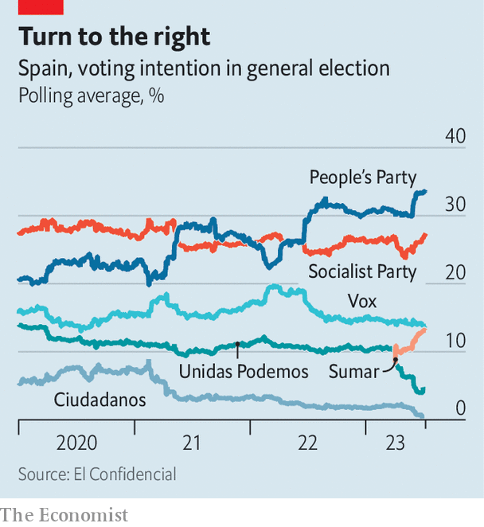

###### Heigh ho, it’s Feijoo

# Why Spain’s reasonably successful prime minister might lose his job 

##### Alberto Núñez Feijóo is leading in the polls 

 

> Jul 13th 2023 

IN A DEBATE between Spain’s main party leaders on July 10th, the moderators repeatedly had to ask the two men to stop speaking over each other, an instruction they ignored. It was a fitting moment for Spanish politics, where practitioners are better at talking than listening.

Pedro Sánchez, behind in polls, is battling to keep his job in elections on July 23rd. The leader of the Spanish Socialist Workers’ Party took power in a no-confidence vote against the government of the People’s Party (PP) in 2018. When he did so, he said in the debate, three concerns predominated: the economy, corruption and Catalonia. He can make a case that he has improved all three.

Covid-19 was an awful shock, especially the first wave, in which tens of thousands died and Mr Sánchez declared a heavy lockdown. An economy dependent on tourism took a nasty fall. The PP likes to note how many other countries recovered their pre-pandemic level of GDP before Spain did.

 


But Spain’s current recovery is well timed. GDP grew by 5.5% last year, and projections have been repeatedly revised upwards for this year too: the European Commission expects 1.9% growth, well ahead of Germany’s 0.2% and France’s 0.7%. Inflation is lower than in other euro-zone economies—which the Socialists attribute to their policies (though the country’s lack of dependence on Russian energy helps). Unemployment at 13% remains high for Europe, but it is low for Spain.

On corruption, too, there is little argument: the coalition government has been clean, with arguments over Mr Sánchez’s use of the official jet one of the few issues to speak of. It is on Catalonia that Mr Sánchez’s selling point is also a reason why he might soon be looking for a new job. 

In 2017 the Catalan regional government held an independence referendum that had been banned by Spain’s supreme court. The separatists claimed victory and declared independence, leading the Madrid government to revoke Catalonia’s autonomy and govern it directly. When new elections were held, separatist parties took a majority of the seats. 

Mr Sánchez has cooled the conflict. A “dialogue table” has produced little substance, but has kept the parties talking. Since the two main separatist parties fell out, one governs with the support of the Catalan affiliate of Mr Sánchez’s Socialists, who came first in the most recent regional election. After May’s local elections, the Socialists also retook the mayor’s job in Barcelona, the capital of Catalonia.

Many consider the concessions Mr Sánchez has made to be unforgivable. The first was to pardon nine separatist leaders (though they remain banned from politics). The second was to reform two laws under which they were convicted. An old, unusually harsh sedition law was replaced, introducing an unusually mild offence of “aggravated public disorder”. Misuse of public funds (which the Catalans used to hold the referendum) was split into an offence involving personal corruption and a milder one without. Justice “à la carte” for the separatists, howl those for whom the wounds left by the referendum remain raw. All this looks worse still when added to Mr Sánchez’s occasional deals with the deputies of EH Bildu, the successor to the political wing of ETA, a Basque terrorist group that killed hundreds of people in its campaign for independence.

Alberto Núñez Feijóo, who became leader of the PP last year, is the man hoping to take advantage of Mr Sánchez’s polarising nature. Born in a poor town, he studied law, ran the postal service and the health system before electoral politics, in which he won four successive absolute majorities to run Galicia, in the north-west, a feat in the era of fractured politics. His style is more wry than ostentatious. He does not speak English and has little background in foreign policy. He lists among his qualities that of being “predictable”.

In the debate Mr Feijóo promised never to deal with Bildu, and his PP says it will re-examine all laws passed with Bildu support. Mr Feijóo promises to restore the crime of sedition. He cannot afford to look soft next to Vox, a hard-right nationalist party that proposes recentralising Spain. But Mr Feijóo, who speaks Galician, talks of “cordial bilingualism” as a way of reconciling regional nationalists to Spain. He has also accepted legal abortion and speaks kindly of gay and trans citizens. In other words, he is no culture warrior.

Mr Sánchez is at pains to depict his rival as being at one with Vox. That is a hard case to make. It is true that Mr Feijóo will probably need Vox to govern, as he looks unlikely to win a majority. But that can be seen as a reason to vote PP: to reduce its need to depend on others. In any case Spaniards have learned that voting Socialist hardly means strong single-party government. For five years it has meant a prime minister all too capable of awkward coalitions of his own. ■

