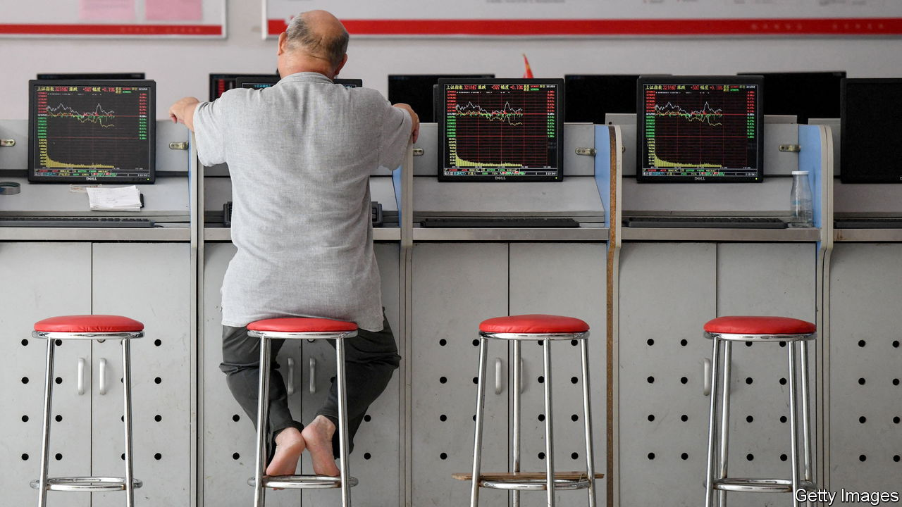

###### Making it through the insipid

# China’s war on financial reality 

##### The official market narrative is being policed with increasing ferocity 

 

> Jul 13th 2023 

Hu xijin is best known for his calls to prepare for war with America. But recently the 63-year-old nationalist media personality has been exhorting his countrymen to invest in Chinese stocks. On July 7th he told 25m followers on Weibo, a social-media site, that he had opened a trading account with 100,000 yuan ($13,900). Stop buying homes, he pleaded, and start piling into the stockmarket.

Chinese social media is full of positive takes on grim market news. Commentary such as this is becoming the main message netizens receive about the market, regardless of how it performs. As China’s economic recovery falters, authorities are cracking down on divergent or negative views. For some analysts at Western banks, who are tasked with keeping global clients informed, the backlash is proving painful.

Goldman Sachs, an American bank, is the latest to find itself in hot water. On July 4th an analyst at the firm downgraded his outlook for several Chinese financial institutions, advising clients to sell the shares of banks such as Industrial and Commercial Bank of China, owing to concerns about bad debts linked to local governments. This pushed down some Chinese bank stocks by several percent.

The response from the state was rapid. On July 7th , an official newspaper, rebuked Goldman, saying that its downgrade was based on misinterpretations. Then on July 10th Banxia Investment Management, a large hedge fund, insisted that the bank’s claims would be proven wrong. The same day China Merchants Bank, one of the lenders targeted in the downgrade, accused Goldman of misleading investors, according to a statement seen by Bloomberg, a news agency.

There is a reason why Goldman’s analysis has touched a nerve. The Shanghai Composite, a benchmark index, is down by more than 5% since this year’s peak in early May. The index is hovering around 3,200 points, where—except for a few boom-and-bust cycles—it has languished for more than a decade. An uptick in economic activity at the start of the year, as the country left behind its disastrous zero-covid policy, revived hopes of a surge. Now most economic indicators point to a slowdown.

Inflation data released on July 10th showed that consumer prices were flat year-on-year in June, indicating weakening demand. Goods-price disinflation is also intensifying as manufacturers sit on more capacity, according to hsbc, a bank. Growth in the seven-day moving average of home sales was down by 33% on July 9th, against a year earlier, according to Nomura, another bank. 

Discussing these trends on social media is becoming increasingly dangerous. Three bloggers, including Wu Xiaobo, one of China’s most prominent financial commentators, were blocked from Weibo in late June, after alluding to negative market moves. The social-media company accused Mr Wu of spreading false information related to the securities industry and undermining government policy.

More established firms are also feeling the heat. A financial-information provider was recently forced to stop granting overseas clients access to some data, including detailed property-sector indicators. Consulting companies have been targeted for researching sensitive topics. Chinese stock watchdogs have recently begun advocating for a revaluation of clunky state-owned enterprises, insisting that their value to society as a whole, not just annual returns, ought to be considered.

For tips on investing, Chinese netizens may have to turn to more upbeat commentators, such as Li Daxiao, an indefatigable perma-bull fund manager. Mr Li’s views have at times been so positive that authorities have told him to pipe down during market routs, lest unsuspecting retail investors take his advice and lose their savings. After a few recent rough days of trading, Mr Li posted a video on July 7th to comfort his followers. In it he concludes that “only by making it through the insipid can we receive future glory”. Who could doubt such fine rhetoric? ■


