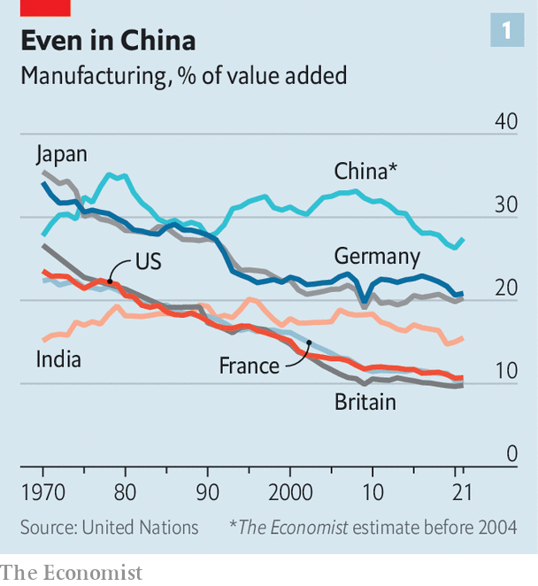

###### Economic policy

# The world is in the grip of a manufacturing delusion 

##### How to waste trillions of dollars 

 

> Jul 13th 2023 

Industry has an allure all of its own. “From manufacturing you may expect the two greatest ills of humanity, superstition and slavery, to be healed,” wrote Ferdinando Galiani, an Enlightenment thinker. More than 250 years on, governments share his view of factories as a cure for the ills of the age—including climate change, the loss of middle-class jobs, geopolitical strife and weak economic growth—with an enthusiasm and munificence surpassing anything seen in decades. 

Nowhere is spending more than America. “Folks, where is it written that [we] can’t once again be the manufacturing capital of the world?” Joe Biden, the country’s president, has asked. In search of an answer, he has committed around $1trn, or almost 5% of American gdp. In response, the eu has tweaked state-aid rules, so that national governments can splash out. These initiatives follow the example of rising Asian powers. China’s “Made in China” strategy aims to turn the country from a big manufacturing player into a dominant one. India’s “Make in India” strategy hopes to boost the industrial share of the economy to 25% of value added by 2025. Emerging markets with bountiful natural resources, including Indonesia and Zimbabwe, are busy banning the export of raw materials as part of attempts to incubate home-grown industries.

 


In the West the aim is to reverse industrial decline, which is keenly felt by voters. As a share of global economic output, manufacturing has dropped from 19% in 1997 to 16% today, with the fall steepest in rich countries. In China and India industry’s share of economic output appears to be roughly where it was three decades ago, but even in these countries it has slipped in recent years (see chart 1). 

Manufacturing boosters make four arguments in favour of attempting to reverse this trend. First, politicians in the West say that factories are a source of solid jobs that produce a bigger and more satisfied middle class. Second, boosters view manufacturing as a driver of innovation and growth. This is urgently needed to fuel the green transition—the third reason—which will be more palatable to electorates if it delivers local jobs. Finally, tensions between America and China have pushed world leaders to reconsider which goods are strategically important, and therefore should be produced closer to home.

Start by considering the type of employment on offer. The notion of a “good manufacturing job” is an old one. During the 20th century, those without a university education could find decent wages, job security, a bit of personal autonomy and career progression in factories. Indeed, just over a decade ago production jobs in America paid a premium of 5% compared with similar service-sector ones, and offered steady hours and generous benefits. 

 


More recently, though, the picture has changed: many good manufacturing jobs no longer exist (see chart 2 ). Across the rich world, employment that requires mid-level technical skills (think machine operators) has given way to a mix of high- and low-level jobs, mostly in service sectors (think coders and baristas). Wealthy populations spend more of their income on services; industrial demand is increasingly met by emerging markets. Whether in Detroit or Dortmund the consequences are obvious and, by now, familiar. At first glance, those who decry the loss of manufacturing jobs have a point. Surely it is worth paying to get them back?

There is a snag. It is far from clear such jobs can be brought back—no matter how much governments spend. For a start, the manufacturing wage premium has fallen sharply. Production workers’ wages in America now lag behind those of similar service-sector workers by 5%. Moreover, the sort of high-tech factories that America and Europe are attempting to attract are highly automated, meaning they are no longer a significant source of employment for people with few qualifications. 

Ford’s revamped electric-vehicle (ev) plant in Cologne, located on the banks of the Rhine in Germany’s industrial heartland, is one such example. The chassis and bodies of vehicles are coated in chemicals to prepare for painting and to prevent corrosion. This happens across multiple storeys; the number of workers involved in the work on site is precisely zero (two keep tabs remotely). Shiny yellow assembly robots further down the production line are sufficiently advanced as to be able to mostly monitor themselves. Although workers are required for assembly—about as many as for traditional petrol-powered vehicles—the activity requires a lot more training. This matches the national picture: according to a study by Wolfgang Dauth of the Institute for Employment Research and co-authors, industrial robots have made available work more complex.

Farming factories

Meanwhile, cutting-edge industry looks more like the service sector. According to the imf, manufacturing-associated services have grown as a share of global output in recent decades. The assembly of a gadget is not where the sort of money that leads to high-paying jobs is made. Motion sensors built by Bosch are advanced products. But the German technology firm also offers software and services to go with them, such as round-the-clock monitoring of goods at which the sensors are pointed. The design of these services, tailoring them to the needs of customers, servicing the gizmos—all are the sorts of things that are increasingly important to modern manufacturers, and few offer the sort of employment that industry used to provide. 

What about industry’s role as a source of innovation and economic growth? In developing countries, manufacturing draws workers from agriculture, a relatively unproductive form of employment. As a result of the reallocation of labour, output rises. Yet as supply chains have become more advanced, this path has become more difficult to follow. Making an iPhone involves a process of mind-boggling complexity. Despite the efforts of local officials, and strong geopolitical incentives for Apple to move away from China, India has struggled to become anything other than a destination for the device’s final assembly.

 


Economic historians are also increasingly questioning whether state support for manufacturing did, in fact, play as decisive role in the economic development of East Asia and the West as is commonly assumed. At the very least, productivity growth in services and the removal of protectionism was also crucial. Even if industrial policy was perfectly designed by a clear-sighted government, which used tax and subsidies to shift labour to industries with the greatest economies of scale, it would only bring a one-off 1-3% boost to gdp, according to a paper by Dominick Bartelme of the University of Michigan and co-authors. Indeed, in recent decades there has been next to no relationship between economic growth and manufacturing’s share of the economy among countries in the oecd (see chart 3). 

The oft-lauded superior productivity growth of manufacturing—versus services as well as agriculture—comes with caveats. Economists have found that financial, it and legal services can boost productivity elsewhere, including in industry. According to the imf, the gap between manufacturing and services productivity growth has shrunk in many countries since the turn of the millennium. In China and India its direction has flipped, with services productivity rising faster. Moreover, services are a broad church, ranging from teaching to tech. The latter boasts extremely fast productivity growth, which may soon be propelled further by artificial intelligence. 

Industry’s greater capacity for innovation also comes with something of a catch. “Measuring innovation spending is easier in manufacturing firms, [which tend to] have dedicated research-and-development (r&amp;d) departments,” notes Paul Hünermund of the Copenhagen Business School. State spending on r&amp;d is therefore often directed at industry, he explains, even though services may be more innovative than typical measures suggest. 

The strongest argument for manufacturing’s importance to innovation comes from economists who point out that lots of tech progress happens in places where industry and services co-exist. Gary Pisano and Willy Shih, both of Harvard Business School, stress the importance of learning-by-producing in industries such as high-tech chipmaking. The idea has been embraced by politicians, including in America, China and Germany. Yet even here evidence is mixed. In 2001 Taiwan eased an offshoring ban, resulting in some production moving to China. Academics who studied the consequences found that innovation in the affected goods did decrease, as the co-existence thesis suggests. It was, though, balanced by a rise in innovation in other goods and tech, since r&amp;d resources were freed up. The result was specialisation, not lower overall innovation.

Another case for spending state cash on industry—particularly the green kind—is that the world will soon need more physical goods if it is to reach net-zero emissions. The investment required for the green transition is indeed staggering: the entire capital stock that depends on fossil fuels will have to be replaced. This includes aeroplanes, heating systems, power plants and vehicles. Electrical grids around the world will need to become more resilient to withstand volatile renewable generation. The International Energy Agency, an official forecaster, estimates the total investment required at around $4trn (or 4% of present global gdp) a year by 2030. 

The extraction and refining of critical minerals is one area where money could be spent wisely. According to the Energy Transitions Commission, a think-tank, sufficient metals have been located to satisfy green appetites until 2050. Yet expanding supply takes time. And the risks are high: a shift in battery technology to sodium could, for instance, erode demand for lithium. Government investment to increase the supply and refining of metals may help overcome such barriers to investment. 

 


The same is not true for other green equipment, where demand will create supply. Solar panels show how the process will probably play out. The current boom in demand—America installed 47% more in the first quarter of 2023 than in the same quarter last year—has prompted companies in China and elsewhere to boost capacity. The Energy Transitions Commission reckons that existing production of solar panels already exceeds probable demand until 2030, which is also the case for batteries when planned production is included (see chart 4). In other areas, like heat pumps, capacity can be added quickly if desired. 

Politicians also hope that spending will create new firms and even industries. Tesla and byd, the American and Chinese upstarts of the ev age, are the sort of thing they have in mind. Energy-intensive factories in places with abundant, and cheap, renewable energy would also be nice. But from a global perspective, a subsidies race is ultimately zero-sum. The gigafactory attracted to France after the government offered ProLogium, a Taiwanese firm, sweeteners, cannot also be built in the Netherlands. Nor are countries likely to reap benefits that go much beyond the amounts they splash out. Reports suggest that Germany has increased its offer to Intel from roughly €7bn to €10bn in an attempt to entice the chipmaker to build a new fab in Magdeburg, two hours from Berlin. Although the region will benefit through jobs and visitors, Germany is unlikely to be better off, since taxpayers will have funded most of the wider benefits.

 


Governments have long protected military manufacturing in order to ensure they have plentiful supplies of weapons when required. But the list of goods for which countries do not want to depend on others has grown in recent years—the final argument for spending on industry. Supply disruptions during and after the covid-19 pandemic demonstrated widespread vulnerabilities: a scramble for protective medical equipment bolstered the case for stockpiling; a shortage of usually common chips slowed car production; a lack of gas in Europe after Russia curtailed supply provided an alarming example of how economic dependence could be exploited. 

Chinese wall

China has provided another nudge in this direction. On July 3rd the country announced plans to restrict the export of two metals, gallium and germanium, that are needed for optic and semiconductor technologies. Officials say the move is a response to America limiting the export of goods, such as high-tech chips and the machines that produce them. It is also a signal that China can hit the West where it hurts.

How disruptive are supply restrictions in reality? In the case of some rare , perhaps very. But market economies can adapt to painful limitations. When Russia launched its war in Ukraine last year, continental Europe received 40% of its gas from the invading country. Supplies dwindled in the summer; gas prices shot up four-fold. Politicians feared that entire industries would grind to a halt, disrupting supply chains and leading to a brutal recession. 

The actual outcome was more benign. Governments secured supplies elsewhere; firms invested in gas-saving equipment, or found different energy sources; households consumed less. European gas consumption in the seven months to March was almost a fifth lower than in previous years. The economy weakened, but a crash was avoided. It was a similar story when China cut the supply of rare earths to Japan in 2010. Companies found ways to replace these inputs without disrupting production too much. Markets have a natural capacity to overcome shortages, for the simple reason that firms seek to make money. 

Other research points to the benefits of diversification. Governments are now keener to boost domestic production in order to reduce their vulnerability to disruptions in foreign supplies. But research published last year by the imf suggests that greater self-sufficiency is likely to leave countries more vulnerable to future shocks, rather than less. Reshoring would make production dependent on conditions at home, and vulnerable to a big local shock. By comparison, diversified supply chains are more resilient, since they depend on the economic performance of a range of different countries. 

Officials designing policy think many of these drawbacks can be avoided. “There is no need to choose. America should go full-bore on its own green industrial policy, and help friends do the same,” says Jennifer Harris, until recently a White House official. To this end, the Biden administration has, since the laws governing its subsidies were passed, interpreted them in a way that makes some handouts available to foreign producers. The eu also wants to enter into partnerships with countries for the supply of critical materials. 

Such efforts could reduce the damage done by the manufacturing delusion, which may be the best that can be hoped for given the strength of its grip on politicians the world over. Only once the agenda fails—either because the green transition does not create the jobs or economic growth electorates have been led to expect, or because subsidised production falls short of hopes—will a new generation of leaders begin to question whether industry is the cure for humanity’s greatest ills. ■


