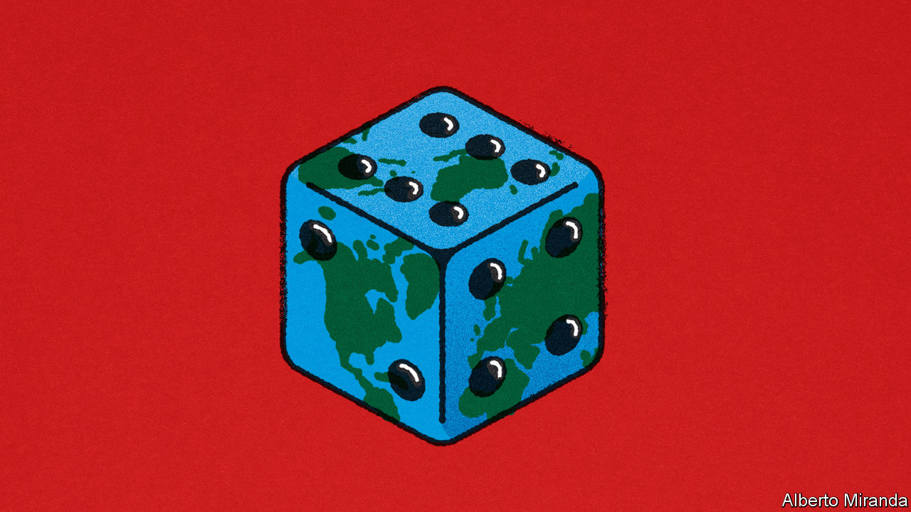

###### Free exchange

# Why people struggle to understand climate risk 

##### The confusion inherent in a hotter world 

 

> Jul 13th 2023 

Placed before you are two urns. Each contains 100 balls. You are given a clear description of the first urn’s contents, in which there are 50 red balls and 50 black balls. The economist running the experiment is tight-lipped about the second, saying only that there are 100 balls divided between red and black in some ratio. Then you are offered a choice. Pick a red ball from an urn and you will get a million dollars. Which urn would you like to pull from? Now try again, but select a black ball. Which urn this time?

Most people plump for the first urn both times, despite such a choice implying that there are both more and fewer red balls than in the second urn. This fact is known as the Ellsberg paradox after Daniel Ellsberg, a researcher at the rand corporation, a think-tank, better known for leaking documents detailing America’s involvement in the Vietnam war. Ellsberg, who died on June 16th, called the behaviour ambiguity aversion. It was a deviation from the model of rational choice developed by John von Neumann, a mathematician, and a demonstration that knowing the likelihood of something can alter decision-making. 

The experiment may seem like just another of the cutesy puzzles beloved by economists. In fact, it reveals a deeper problem facing the world as it struggles with climate change. Not only are the probabilities of outcomes not known—the likelihood, say, of hurricanes in the Caribbean ten years from now—nor is the damage they might do. Ignorance of the future carries a cost today: ambiguity makes risks uninsurable, or at the very least prohibitively expensive. The less insurers know about risks, the more capital they need to protect their balance-sheets against possible losses.

In May State Farm, California’s largest home-insurance provider, retreated from the market altogether, citing the cost of “rapidly growing catastrophe exposure”. Gallagher Re, a broker, estimates that the price of reinsurance in America has increased 50% this year after disasters in California and Florida. Few firms mention climate change specifically—perhaps a legacy of Republican attacks on “woke capitalism”—but it lurks behind the rising cost of insuring homeowners against fires, floods and hurricanes. 

Insurance is a tool of climate adaptation. Indeed, actuaries have as big a role to play as activists in the fight against climate change. Without insurance, those whose homes burn in a wildfire or are destroyed by a flood will lose everything. The destitute may become refugees. Insurance can also be a spur for corrective action. Higher premiums, which accurately reflect risk, provide an incentive to adapt sooner, whether by discouraging building in risky areas or encouraging people to move away from fire-prone land. If prices are wrong, society will be more hurt by a hotter world than otherwise would be the case. Politicians considering subsidies for home insurance on flood plains ought to take note.

The task of setting the appropriate price is made even more difficult by the fact that, in the language of economists, a warming world faces “uncertainty” as well as “risk”. John Maynard Keynes described uncertainty as a situation where there is “no scientific basis to form any calculable probability whatever”. He gave the example of predicting the likelihood of a war in Europe or whether a new invention would become obsolete. Risk, by contrast, means situations where the relative probabilities are well known: picking a red ball from the first urn, for instance. 

When it comes to climate change, reality is not quite as bad as Keynes’s framework suggests, since scientists can help resolve some sorts of uncertainty. This is particularly true of those forms labelled “internal uncertainty” by Daniel Kahneman and Amos Tversky, two behavioural economists, which relate to things known about the world, rather than unknowable future events. Unlike the models of economists, climate models are based on laws of physics that have made their mark on the planet, in fossils and Antarctic ice cores, for millennia. It is as if a scientist has observed the second urn for centuries, noting the number of black and red balls pulled out by different people over time. With solid evidence and a clear understanding of the process by which the observations are generated, the ambiguity disappears and the probabilities of potential disasters become better understood.

Natural-disaster reinsurance is typically based on models incorporating the latest science rather than historical statistics, since extreme events are by definition rare. For reinsurers, who ultimately care about their financial exposure, models must be kept up to date with the state of the built environment in vulnerable areas, which helps them calculate potential losses when paired with knowledge of environmental conditions that determine disasters. The former is generally more of a cause of uncertainty than the latter, since the science of climate change is well understood and data improve all the time. Premiums may be on the rise because of better knowledge, rather than continued ignorance.

Disaster capitalism

Yet even a perfect scientific model could not banish all uncertainty. Climate change involves the messy world of policy as well as the clarity of physics. Scientists may be able to model how a planet that is 2°C warmer than in pre-industrial times increases the risk of wildfires in a particular area, but there is no model that can predict whether policymakers will pull the levers that are available to them to prevent such fires from happening. Imagine the economist running Ellsberg’s experiment was taking and adding balls to the second urn depending on the outcome of some democratic process, international diplomacy or the whims of a dictator.

Policy can also prevent a proper accounting of risk. Californian regulations forbid insurers from using the latest climate models to set prices, since protection would become more costly. Premiums must be based on the average payout over the past 20 years, rather than the latest science. Shying away from ambiguity is understandable. Sticking your head in the sand is plain foolish. ■


