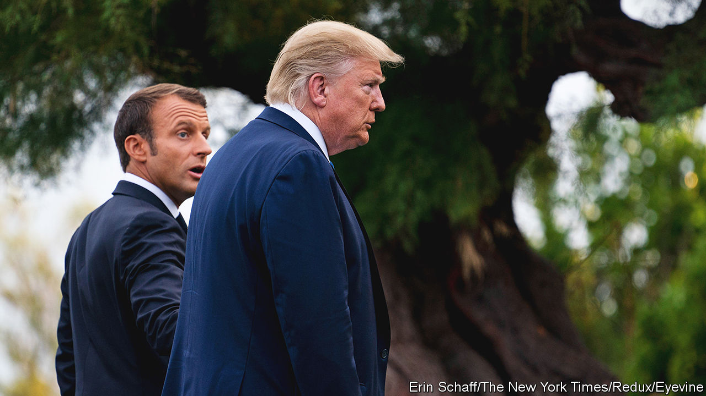
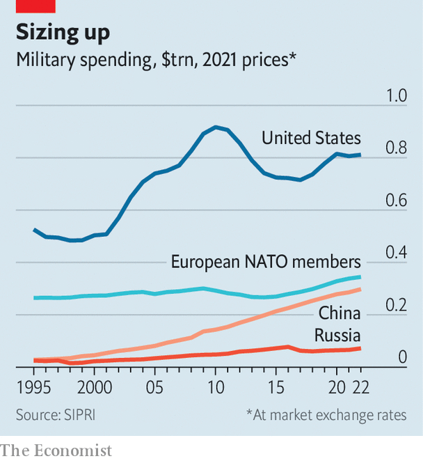

###### Seeking “strategic autonomy”

# What would Europe do if Trump won? 

##### Even as NATO meets, Europeans are exploring a plan B 

 

> Jul 11th 2023 

DONALD TRUMP’S cant about the war in Ukraine drifts over the battlefields, dark as the pall of Russian bombs. “I want everybody to stop dying. They’re dying. Russians and Ukrainians,” he declared in May. If re-elected president next year, he would end the war “in 24 hours”. How? He did not say, but his words imply halting military aid to Ukraine and letting Russia keep the gains of its invasion. 

If so, the return of a “Trump unbound”—more resentful, more organised and less constrained than in his first term—could be a calamity for Ukraine. It might be a disaster for Europe in other ways. He might well enact a threat, dating from his first term, to leave NATO. He would face stern opposition in Congress. But alliances rely on trust. And merely suggesting he would not fight for allies could complete the destruction of the European order that Russia is attempting. 

Under President Joe Biden, America has provided the lion’s share of  to Ukraine and the leadership to muster the West’s response. If the war shows the value of American protection, Trumpian populism may prove how fast it can be lost.

European governments are thus in the grip of three fears: of attack by Russia, of economic evisceration by China and of abandonment by America. France offers a clear answer to all three: European “strategic autonomy”. Speaking in Bratislava in May, the French president, Emmanuel Macron, posed the unspeakable question: “Will [the American] administration always be the same? Nobody can tell, and we cannot delegate our collective security and our stability to the choices of American voters.” Europeans, he argued, needed to be able to defend themselves, not just militarily but also economically.

 


Critics regard such calls as an attempt to sever Europe’s bonds with America. But what if America cuts Europe loose? French officials think a transatlantic separation is already under way, as America turns inward and its foreign policy focuses on China. Mr Trump is merely the most brutal expression of the trend. On trade, they note, Mr Biden is scarcely less . Amid a European outcry, he told Mr Macron he “didn’t know” the vast green subsidies in the Inflation Reduction Act would threaten Europe’s industry.

America’s priority, their argument goes, is its . Sooner or later, even Mr Biden will want to do less in Europe to focus on Asia. It could be sooner if a crisis erupts over Taiwan. The difference between future Democratic or Republican presidents may be only the speed and extent to which America pivots away from Europe. Most European governments do not fully share this analysis—America’s military commitment to Europe is rising—yet few discount it. 

Can Europe fend for itself if abandoned? In theory, yes. European nato allies are industrialised and count nearly 600m people. They have nearly 2m people under arms and decades of experience operating together. Two of them, Britain and France, have nuclear weapons and permanent seats on the UN Security Council. 

Granted, nato is backed by America’s might, which accounts for two-thirds of total NATO military spending. Only ten of America’s 30 allies will meet the defence-spending target of 2% of GDP this year. Even this ought to be enough to fend off Russia. The Stockholm International Peace Research Institute, a think-tank, reckons European allies collectively spent $333bn in 2022. This compares with perhaps $86bn by Russia. Doubling or tripling this sum to account for its greater purchasing power still leaves a large gap. But Europe does not act collectively. Its spending is scattered among dozens of often underpowered armies, air forces and navies. Much of it goes to coddled national industries.

Fundamentally, Europeans suffer from “vassalisation”, argues a recent paper for the European Council on Foreign Relations (ECFR), a think-tank. Europeans do not agree on priorities. Nor do they trust each other enough to decide on what greater autonomy should entail. Europe’s two most important institutions—nato and the EU—do not fully mesh. Important allies such as Britain, Norway and Turkey are outside the eu. Collective defence is NATO’s business, directed by America. Economic policy is handled mainly by the EU, which was created as the antithesis of a military alliance. France, in particular, has sought to use it as a counterweight to America.

Going it alone?

Were America to forsake Ukraine, despite promises by a nato summit on July 11th to support it “for as long as it takes”, would Europeans keep up the war effort? Some diplomats say they would; many doubt it. Europe’s arsenals are smaller and more depleted than America’s. Its defence industry suffers similar ills to America’s—just-in-time production at peacetime levels—compounded by a lack of scale. Paradoxically, the war in Ukraine is making things worse, says Nathalie Tocci of Istituto Affari Internazionali, an Italian think-tank, as countries rush to buy off-the-shelf kit from America, Israel, South Korea and others. 

France shuns the German-led Sky Shield project to develop air defences because it relies on non-European suppliers. German officials retort that France treats strategic autonomy as a way to use German money to support French firms. Still, there is some progress. The EU is offering incentives for co-operative arms projects, is using common funds to pay for military materiel and is pushing firms to supply Ukraine with 1m artillery rounds in a year.

Were Mr Trump to pull America out of NATO altogether, Europeans would try to take over its machinery rather than turn the EU into a military alliance, says Camille Grand of the ECFR, a former assistant secretary-general of nato. Europeans would have to plug gaps filled by America’s 85,000-odd troops in Europe, among them headquarters staff and 22 combat battalions (roughly as many as Britain has in total). They would also have to procure the expensive “enablers”—such as air transport and refuelling, space assets and  (intelligence, surveillance and reconnaissance)—that America supplies in abundance. All this might take Europe a decade to build up, believes Mr Grand.

Leadership would be a problem. Multinational decision-making is difficult at the best of times, all the more so on military matters. The Europeans lack a leader to replace the American hegemon. Germany is steeped in pacifism despite its promise to boost its forces. Britain is semi-detached from European affairs, owing to Brexit. France aspires to lead a stronger Europe but is widely distrusted.

Then there is nuclear deterrence. Russia has nearly 6,000 nuclear warheads; Britain and France about 200-300 each. Mr Grand reckons that, without America, European nuclear powers will have to rethink their stockpiles, doctrine and collaboration with remaining allies.

As for the economic dimension of autonomy, the eu has made marked progress. In Brussels it is sometimes called “open strategic autonomy”, to signal openness to the world. Europeans are gradually pooling more economic policymaking within the eu. And they have good reason to do so, after a succession of shocks, from the shortage of vaccines during the pandemic to Russia’s invasion.

The most striking success has been Europe’s shift away from Russia’s oil and gas. The transition has been helped by alternative supplies from America and elsewhere, and the EU’s internal market for energy, which allows gas and electricity to be traded across borders. Much of the EU’s new economic arsenal is directed at China. A forthcoming “anti-coercion” instrument allows trade retaliation to prevent a repeat of  after it tilted towards Taiwan. New rules tighten the screening of investments by foreigners. National and EU subsidies, like America’s, seek to boost semiconductor production and green energy. Europeans are working with America to diversify supplies of critical minerals and restrict outbound investment in sensitive technology.

For Mr Macron such moves are the “building blocks” of strategic autonomy. “Today the ideological battle is won,” he believes. Yet two models vie for the soul of Europe, and of Mr Macron himself. The good version holds that Europe should fortify itself to become more capable of defending common values and interests with America. The bad one, which is in the French Gaullist tradition, seeks to pull Europe away from America and create a rival geopolitical pole.

In Bratislava Mr Macron’s better angels prevailed as he argued for Europe to take up more of the defence burden. Making a U-turn, he backed Ukraine’s membership of NATO and the EU’s eastward enlargement. Yet a month earlier, after visiting Beijing, he displayed a worse nature. Europe, he said, must not become tangled in Sino-American rivalry and a crisis over Taiwan “that is not ours”. Mr Macron has back-pedalled since, and sent a warship through the Taiwan Strait. He nevertheless outraged many European leaders by weakening an undeclared pact: in return for America’s help to repel Russia, Europe should support its ally to deter China.

The election of Mr Trump would be a “catastrophe foretold”, says Constanze Stelzenmüller of the Brookings Institution, an American think-tank. Few European leaders have a good answer to it. Many ignore it; others pray Mr Trump would prove less destructive than feared, perhaps restrained by Congress and the Pentagon. Some talk of wooing his more moderate acolytes. Sophia Besch of the Carnegie Endowment for International Peace, another think-tank, predicts many would scramble to “bilateralise” relations with him. They might resort to flattery, such as Poland’s short-lived plan to rename a base “Fort Trump”, or buy more American weapons and other things to offer him a “good deal”. 

One question is the extent to which the election of Mr Trump might boost mini-Trumps on Europe’s hard right. Opinion polls show that Alternative for Germany is level-pegging with the Social Democratic Party of Germany’s chancellor, Olaf Scholz. In France, meanwhile, there are growing worries that Marine Le Pen, leader of the National Rally, could become president in 2027. Both parties are close to Russia and criticise Western support for Ukraine. Just as Mr Biden proved that American power can unite Europeans, Mr Trump might yet display its power to divide them.

NATO’s purpose, it is often said, is “to keep the Soviet Union out, the Americans in, and the Germans down”. Perhaps strategic autonomy can do something similar. If it generates more military capabilities, it will let Europe take greater charge of its security as America turns to Asia—and provide a hedge should the great ally turn hostile. Indeed, it may be the best way to rebuff Trumpian charges of freeloading, and demonstrate Europe’s worth to America. Done right, it might just help to keep Russia out, the Americans in, China away—and NATO together. ■


