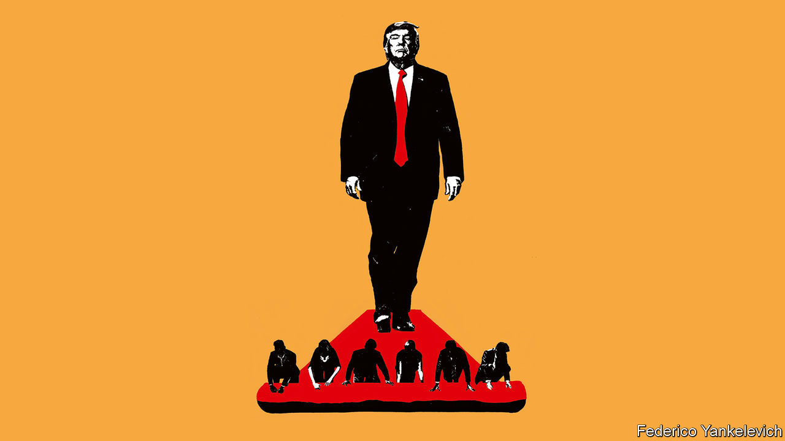

###### Preparing for government

# How MAGA Republicans plan to make Donald Trump’s second term count 

##### They think they know how to banish the chaos and frustrations of his first four years 

 

> Jul 13th 2023 

THE OVERWHELMING memory of Donald Trump’s time in office is of chaos and resentment. It was summed up by the shameful end to his presidency, when his whipped-up supporters sacked the Capitol in a bid to keep him in power. Mr Trump has since lurched from an ignominious post-electoral impeachment to two criminal indictments, with perhaps more in the offing. The former president seems obsessed with relitigating his election loss in 2020: “I am your justice,” he thundered to a crowd of supporters this year. “I am your retribution.” 

Mr Trump is likely to win the Republican presidential nomination for 2024. You might think victory in the general election would foreshadow even more chaos—this time without the grown-ups who, it turns out, at first reined in their impulsive new boss. In fact, a professional corps of America First populists are dedicating themselves to ensuring that Trump Two will be disciplined and focused on getting things done. They are preparing the way and you should not dismiss their efforts. 

In contrast to the slapdash insurgency that captured the White House in 2016, the veterans of Mr Trump’s first term have been years at work, as our  this week lays out. Even at this early stage, the details are something to behold. Thousand-page policy documents set out ideas that were once outlandish in Republican circles but have now become orthodox: finishing the border wall, raising tariffs on allies and competitors alike, making unfunded tax cuts permanent and ending automatic citizenship for anyone born in the United States. They evince scepticism for  and pledge to “end the war on fossil fuels”, by nixing policies designed to limit climate change.

Alongside these proposals is something that aims to revolutionise the structure of government itself. MAGA Republicans believe that they will be able to enact their programme only if they first defang the deep state by making tens of thousands of top civil servants sackable. Around 50,000 officials would be newly subject to being fired at will, under a proposed scheme known as Schedule F. 

At the same time, to fill the thousands of political appointments at the top of the American civil service, the America Firsters are creating a “conservative LinkedIn” of candidates whose personal loyalty to Mr Trump is beyond question. Merely expressing qualms about the storming of the Capitol on January 6th 2021 is grounds for disqualification. None of this is a shadowy conspiracy: it is being planned in the open. 

America Firsters will argue that civil-service reform promises to enhance democracy by preventing the unelected bureaucracy from stymying the programme of an elected president. Although checks and balances are an important part of America’s constitutional design, the civil service is not one of the three branches of government it enshrines.

That argument does not wash. One objection is practical. The draining of brains from government would come just as the expansion of the American state across the economy makes a competent bureaucracy more important than ever. Running a modern nation state requires expertise in administration, economics, foreign affairs and science. If officials cannot challenge political appointees’ madder proposals for fear of being fired, policy will rot from the inside. 

A second objection is political. A future Democratic president endowed with imperial powers and unchecked by reality is not something Republicans should wish for. One reason for the professionalisation of the bureaucracy in the 19th century was to provide the ship of state with enough ballast to keep sailing from one administration to the next.

A third objection is that these changes would give an overmighty president direct control of the Department of Justice. By being able to sack all of its purported dissenters, the administration would obliterate the norm of legal independence. If so, Trumpian resentment would be channelled into concrete vengeance. That prospect should concern all Americans. 

Having encountered resistance from his previous attorneys-general, the prime criterion for Mr Trump’s next one would be a suppleness of spine: a willingness to quash investigations into the president and his allies and to authorise them against his long list of real and perceived political enemies. Although Mr Trump would have little practical reason to continue to foment distrust in the electoral system—since the constitution precludes a third term—the need to be vindicated about his supposedly stolen election in 2020 may lead him to do so, all the same. 

If the Republicans win both houses of Congress, as is possible, nobody in the executive or the legislature will be in a position to stop Mr Trump. After all, most of those in charge will already have publicly attested to the legitimacy of storming the Capitol. The federal courts will become one of the few remaining redoubts of independence and expertise in the American system. It is hard to see how they will not also come under sustained attack.

If these carefully laid plans were enacted, America would follow Hungary and Poland down the path of illiberal democracy. True, America has more guardrails against backsliding—including centuries of democratic history and a more raucous and more decentralised media. However, these guardrails are weaker than in the past. Moreover, many Americans would be left worse off by these plans. Trust in institutions and the rule of the law would suffer, leaving the country yet more divided.


Some people will try to take comfort from the idea that Mr Trump will not win the primary, or that he will lose the general election. Perhaps his nominees will not be confirmed, or the emperor of entropy will sabotage his own supporters’ designs. That is unforgivably complacent. 

Mr Trump is favourite to win the nomination in a country where general elections are determined by a few tens of thousands of votes. In victory, a team of practised demolition experts would prime their explosive ideas. The deconstruction of the administrative state could begin. The vain and tyrannical whims of an emperor-president would emerge from the rubble. ■


