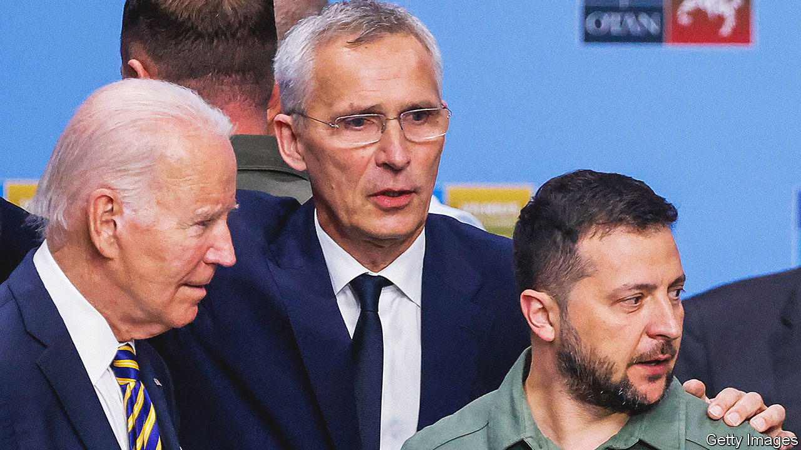

###### Pledges in Vilnius

# NATO’s promises to Ukraine mark real progress 

##### But the alliance has much more work to do 

 

> Jul 12th 2023 


As he headed to NATO’s gathering in Vilnius, a tetchy Volodymyr Zelensky called it “unprecedented and absurd” that Ukraine was apparently not being given a  of the alliance. If that was meant as a last-ditch attempt to twist arms, it failed. The final communiqué, as he feared, refers to a need for conditions to be met and for allies to agree, even as it avoids dates and timelines. 

That may have cheered Vladimir Putin, who is always on the lookout for signs of Western disunity in the face of his gory invasion of his neighbour. The reality, however, is different. Though the summit could have done more, and avoided the impression of differences with Ukraine, it inflicted several reverses on Russia’s president, with the promise of many more to come. 

Mr Putin’s first defeat was over a different expansion of NATO. Turkey’s president, Recep Tayyip Erdogan, said he is dropping his objections to Sweden’s membership, enabling it to follow its Nordic neighbour, Finland, into the alliance. That will strengthen the Baltic states and the High North, and tie up more of Mr Putin’s resources should he attempt mischief against NATO anywhere along its frontier.

Mr Erdogan has hitherto been equidistant between Russia and NATO. Coming after his defiance of Mr Putin earlier in the week, by repatriating some captured Ukrainian defenders of Mariupol, the concession on Sweden marks a shift. A Turkey that is bound more tightly into the alliance is a diplomatic plus.

Mr Zelensky also got more than he initially thought. NATO was never going to admit Ukraine while intense fighting is going on, because that would have risked direct fighting between Russia and the West, which could threaten nuclear escalation. But Ukraine has been offered an accelerated process for membership once the war is over. The alliance has agreed to waive the requirement for Ukraine to go through an arduous “membership action plan” before it is admitted. Although a promise that admission will happen quickly after hostilities cease would have been better, this also marks a step forward. 

Even that is somewhat beside the point. For now, genuine peace talks are unlikely. Indeed, the fact that Russia knows that NATO will not admit Ukraine as long as war rages gives it an incentive to keep fighting. What counts is less the conditions for some hypothetical NATO membership in the future, so much as a concrete and lasting programme to defend Ukraine right now. That is where the summit made real progress. 

This came in the form of a punchy pledge by the G7 countries (all bar Japan are also NATO members) to provide Ukraine with more defence equipment, increased intelligence-sharing, expanded training programmes and the like. The G7 members promise that this will be an “enduring” commitment, and that each country will, individually, craft its own security guarantees for Ukraine that will give it a “sustainable force capable of defending Ukraine now and deterring Russian aggression in the future”. The more other countries that sign up to the pledge, by making offers of their own, the better. This matters because it helps disabuse Mr Putin and his elites of the belief that Western resolve will crumble if only Russia clings on. 

One way of underscoring that message would be to put promises into law, as America’s Congress did in 1979 with the Taiwan Relations Act. This requires the president to make available “such defence articles and defence services in such quantity as may be necessary to enable Taiwan to maintain a sufficient self-defence capability”. America should do the same for Ukraine. A future Congress could reverse such a law, but legislation would set the bar higher. Well ahead of the election, Joe Biden’s Democrats should pass such a bill in the Senate, and urge the Republican-led House of Representatives to vote on it, too. Vilnius was a golden opportunity to unveil something with real bite. It partly succeeded in that task. Time to finish the job. ■

