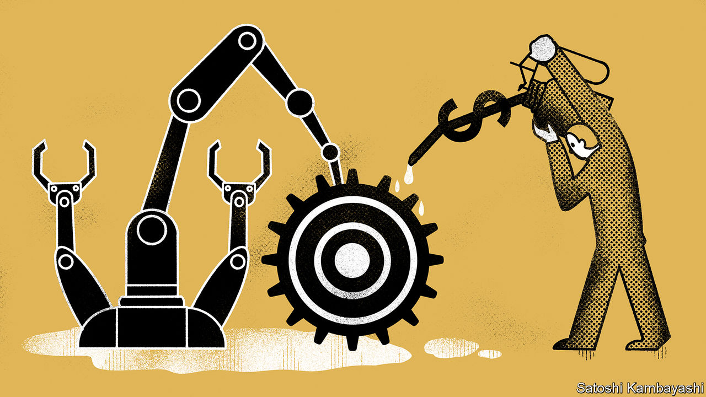
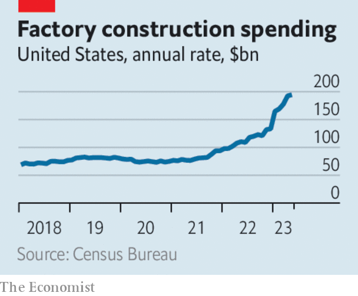

###### The manufacturing delusion

# Subsidies and protection for manufacturing will harm the world economy 

##### Reshaping the world’s supply chains comes at a great cost 

 

> Jul 13th 2023 

Politicians have always been captivated by manufacturing, but rarely has their desire to make things been as zealous as it is today. In the West they are doling out enormous subsidies to manufacturers, especially chipmakers and those behind green technologies, such as batteries. They say they are fighting climate change, enhancing national security and correcting for four decades of globalisation during which workers suffered and growth slowed. In the emerging world, governments hope that subsidies can secure a foothold in supply chains as worried Westerners move production out of China. 

The sums being spent are vast, and growing. Since they were signed into law, the estimated ten-year cost of America’s green subsidies has risen by at least two-thirds, and is likely to pass $1trn. The Biden administration has also expanded the eligibility for chipmaking subsidies. In June Germany increased its handout to Intel to build a chip plant, from €6.8bn ($7.6bn) to €9.9bn. India’s central government is subsidising a Micron factory in Gujarat to “assemble and test” chips, spending an amount equal to a quarter of its annual budget for higher education. Eventually, Britain’s opposition Labour Party wants to lavish £28bn ($36bn) a year on green handouts which, as a share of gdp, would be nearly ten times more than America’s.

 


An industrial arms race is under way. America welcomes it, saying the world needs green technologies and a diversified supply of chips. It is true that an ocean of public money is bound to accelerate the green transition and reshape supply chains in ways that should increase the security of democracies. Alas, the accompanying economic benefits being promised are an illusion. , governments that subsidise and protect manufacturing are more likely to harm their economies than help them.

In ideal conditions, promoting manufacturing can add to innovation and growth. Towards the end of the 20th century South Korea and Taiwan caught up with the West thanks to the careful promotion of manufacturing exports. In industries like planemaking the enormous costs of entry and uncertain future demand can justify support for new firms, as when Europe backed Airbus in the 1970s. Likewise, targeted help can boost national security.

But today’s schemes are likely either to fail or to prove needlessly costly. Countries subsidising chips and batteries are not pursuing catch-up growth but fighting over cutting-edge technology. The market for electric vehicles and batteries is unlikely to become an Airbus-Boeing style duopoly. In the 1980s protectionists argued that Japan would dominate the strategically vital semiconductor industry, owing to its subsidised mastery of memory-chip making. It did not turn out that way.

Duplicating production reduces specialisation, raising costs and hitting economic growth. Some analysts expect the price of a chip produced in Texas to be 30% higher than one made in Taiwan. The Biden administration is belatedly seeking ways to open up its electric-vehicle subsidies to carmakers from friendly countries. But most of the “Buy American” requirements are written into laws that may be all but impossible to amend. And they are being copied. A decade ago about 9,000 protectionist measures were in place worldwide, reckons Global Trade Alert, a charity. Today there are around 35,000. 

European leaders think they must match America or face catastrophic deindustrialisation. They have forgotten the logic of comparative advantage, which guarantees that countries will always have something to export, no matter how many cheques foreign governments write or how productive their trading partners become. Denmark has no car industry to speak of, but GDP per person is 11% higher than in Germany. Even the benefits to workers are overstated, because manufacturing jobs no longer pay a premium over comparable service work.

The potential for the manufacturing obsession to backfire is enormous. The state of New York spent nearly $1bn building a solar-panel factory which Tesla pays $1 a year to rent. The idea was to create a manufacturing hub but the project has returned only 54 cents in benefits per dollar spent; according to the , the only new nearby business is a coffee shop. India’s attempt to boost its mobile-phone industry appears to have brought mainly low-value assembly work. The lesson from South Korea is that national champions must be exposed to global competition and allowed to fail. The temptation today will be to protect them, come what may.

America says it wants a “small yard and a high fence”. For national security, in particular, access to vital technologies is worth paying for. Yet unless policymakers are clear about the dangers of subsidies, the fenced-in yard will only get bigger. However well-intentioned those doling out money today, their successors are likely to be less focused and more lobbied. Governments are not wrong to pursue good jobs, the green transition or national security. But if they succumb to the manufacturing delusion, they will leave their countries worse off. ■

