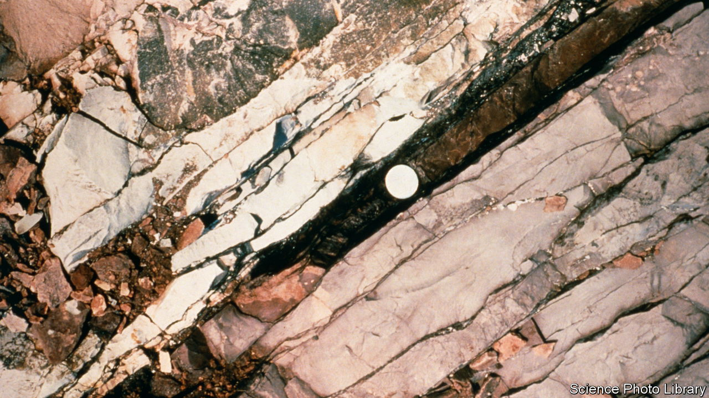

###### Tomorrow and tomorrow and tomorrow

# What matters about the Anthropocene is not when it began, but how it might end 

##### It is all too easy to imagine an era that is nasty, brutish and short 

 

> Jul 13th 2023 

It is by their beginnings that the ages of the Earth are known. Agreeing on the precise point at which each particular syllable of recorded time began is a fundamental, often fractious and frequently long-winded part of geological science. The Cretaceous period, for example, was first identified by Jean Baptiste Julien d’Omalius d’Halloy, a Belgian geologist, in 1822. But which rocks were the earliest to belong to it remains undecided. A working group of the International Subcommission on Cretaceous Stratigraphy recently spent a decade exploring the pros and cons of an outcrop in the French Alps. In the end the subcommission felt unable to accept its findings, and the group was disbanded. A reconstituted working group is now trying again. The depths of geological time teach patience. 

Nowadays, though, geological time has fast-flowing shallows. In 2000 Paul Crutzen, a Dutch Earth scientist, made a public plea that the role humankind now plays in shaping the Earth be made explicit; science should recognise the advent of the Anthropocene, “the recent age of man”. 

In 2009 the Anthropocene working group of the Subcommission on Quaternary Stratigraphy was charged with deciding whether the Earth’s transformation at human hands was significant enough to declare the beginning of a new epoch. In 2016 the working group answered “Yes”, and said that it began in the mid-20th century. On July 11th this year it announced that it had chosen the bit of rock that should be taken as marking this beginning. It is a  laid down in Crawford Lake, near Toronto, in 1950, shortly after the start of the nuclear age. 

The idea of the Anthropocene is a striking expression of a profound truth. Human activity is having effects that will be visible for periods of time far longer than recorded history. Humans are responsible for physical, chemical and biological changes previously brought about only by the great forces of nature. Part of the idea’s imaginative and rhetorical power comes from the fact that geologists, readers and curators of the record in the rocks vouch for its validity. There is an undeniable bathos in the crusted ooze at the bottom of a Canadian sinkhole being called to stand in for all the change humankind has wrought. But the most important thing about the Anthropocene is not when and where it began, but when and how it might end. 

It is possible to imagine an Anthropocene that endures. This would be a world where human activity on its current scale continues, but human institutions rein in its excesses. Its carbon cycle is rebalanced; its climate cools; the chemistry of its abused oceans is tempered; its ice sheets and rainforests are restored. 

It is also possible to imagine an Anthropocene which fades away as the economy and the environment are decoupled. Humans continue to thrive, but they take their largely virtual pleasures in fusion-powered, AI-optimised, indoor-farm-fed, everything-recycled cities—jewels of light on a planet slowly returning to wilderness. 

Alas, it is easy—perhaps too easy—to imagine instead an Anthropocene which is nasty, brutish and short. The nuclear weapons whose testing produced the telltale layers of fallout in Crawford Lake still abound. At some point a geopolitical rupture will see them used, possibly one exacerbated by the environmental catastrophes caused by Anthropocene excess. What remains of civilisation would fall back to a level where its technology no longer rivalled the volcanoes and ocean currents. Perhaps, in time, civilisation would grow back up, perhaps not. 

Think again about the Cretaceous. What captures the imagination is how it ended: in fire, tsunami and a deep, wintry darkness brought about by the impact of a massive asteroid. Its gravestone is a worldwide layer of extraterrestrially tainted clay and ash sitting like a rocky shroud over the bones of the last dinosaurs. The less the Anthropocene looks like that, the better. ■

