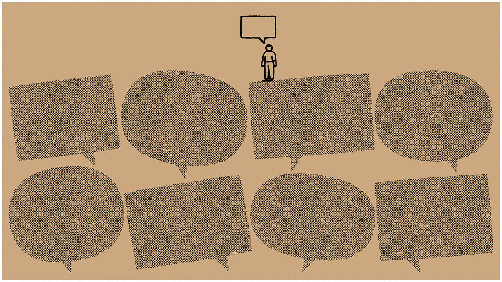
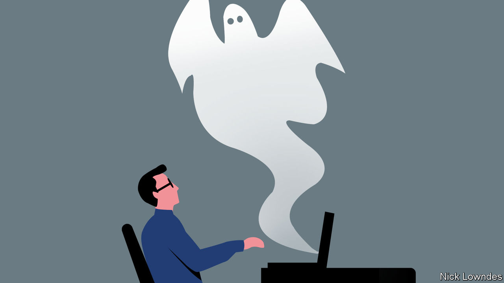

###### On aboriginal rights in Australia, artificial intelligence, designing flags

# Letters to the editor 

##### A selection of correspondence 

 

> Jul 13th 2023 


No need for a louder Voice

Australians have good reason to be suspicious of the proposed constitutional amendment that would create an Aboriginal body, known as the Voice, to advise Parliament (, July 1st). The governing Labor Party has provided little information and debate about how this would work, asking voters instead to just go with the vibe. The government spends generously on improving the lives of Aboriginal and Torres Strait Islanders. And the National Indigenous Australians Agency already ensures that Aboriginals are “heard, recognised and empowered”. There is also the Coalition of Peaks, representing 80 community-controlled Aboriginal organisations, in addition to land councils and Aboriginal corporations. Not to mention the 11 indigenous Australians in Parliament itself, about 5% of the total lawmakers. There is a federal minister for Aboriginal affairs and one in each of the six states.

The government has made the fundamental error of ascribing any indigenous disadvantage to race, rather than isolation and poverty. Aboriginal advisory bodies have come and gone over the years; they were often disbanded because they were ineffective or accused of corruption. Enshrining an advisory body within the constitution will not ensure its success. 

Australia is one of the most diverse, tolerant and generous countries in the world. The number of mixed-race couples where one partner is Aboriginal has almost doubled over the past decade. Australians do not want to be divided along racial lines. 

John Watson


It is ironic that  supported the Voice referendum in the same week that it rightly applauded the American Supreme Court for declaring race-based college admissions unconstitutional (“”, June 30th). Racial preferences, however well intentioned, should have no place in the constitution of a democracy. 

Michael Gronow


The Voice would be an advisory body with no veto power and is a fair way forward. The opposition has responded with venom; old warhorses are trotted out to bray their obsolete views on democracy. Even in this century policymakers have undermined the teaching of indigenous languages and compared homelands to cultural museums. 

Better health outcomes for Aboriginals occur when community-controlled health organisations are supported. Sir Michael Marmot, known for his work on the social determinants of health, has found that low levels of autonomy and low self-esteem are related to worse health. The Voice to Parliament will be potent for indigenous aspirations. That is its vision.

Craig Brown

Fellow

Australian College of Rural and Remote Medicine


 


AI doesn’t “think”

Thank you for the reminder not to anthropomorphise artificial intelligence (, June 24th). Machine learning doesn’t “hallucinate”, “lie”, “feel”, or “think”; it is just another form of automation, be it to classify a face or predict some text. We need national and international conversations about what we mean by responsible AI: when, how and where we employ it and how we indicate we have used it. Those conversations will be much more productive if we remember we are dealing with inanimate machines, built from algorithms and data. 

The predictive text on my phone suggests my name is Muggy, not as a value judgment, but because people don’t type my name very often.

Professor Dame Muffy Calder

Vice-principal

University of Glasgow

 


Standards practice

I enjoyed the informative and entertaining article on attempts to redesign America’s state flags (“”, July 1st). Maryland’s flag bears the arms of the Calvert (Lord Baltimore) and Crossland families of England. It is the only state flag to feature the arms of colonial founders. During the civil war Union Marylanders flew the black and gold Calvert colours and Confederate Marylanders used the red and white Crossland colours. 

Robert Lanza


Various efforts have been made to change Milwaukee’s flag, which is described as the “kitchen sink”. In 2016 a competition settled on a simple motif (one of ’s recommendations). Two years later Milwaukee’s council rejected it, the chief complaint being that it would cost too much to replace the flags on municipal buildings. Never mind that private donations had been pledged to cover those costs. However, not even bureaucratic paralysis could stop its adoption. Now endearingly referred to as the People’s Flag, it is flown all over Milwaukee, so much so that one may be forgiven for believing it is the city’s official flag. 

BenJee Cascio


Brazil’s first flag was designed by Jean-Baptiste Debret, a French painter, upon independence in 1822. The yellow rhomboid honours our first empress, a Habsburg, and the green background our Braganza emperor. With the fall of the monarchy 67 years later the coat of arms was swapped for an orb with the positivist motto “Love, Order and Progress”. But “Love” was left out because of a lack of space.

John Davies


The design rules you listed come from heraldry, invented in the early 12th century with the purpose of designing coats of arms distinctive enough to differentiate between armoured knights on a medieval battlefield. Before heraldry knights had to open their helmet visor to show their soldiers they were still alive, a risky gesture as it could expose the eye to a hostile arrow. From around 1130, perhaps starting in Normandy, fighters would wear personal colours and banners during battles. 

In sporting tournaments heralds would describe aloud the coat of arms of each opponent for the public to recognise them. Heralds devised a concise and explicit language to describe the arms, record then and uphold the rules. They were so successful that heraldry served as the basis not only for devising national flags but also the system of international maritime signal flags and road signs. 

The main rule when designing a coat of arms is not to place “metals” (gold and silver) near “colours” (blue, red, black, green). Most international flags and road signs adhere to this rule.

Olivier Hergault

Creator

MyBlazon.com


Canada’s red maple leaf symbol has advertised the country on many backpacks across the world. Any Canadian tourist can tell you of the endless occasions on which they have approached someone bearing the flag thinking they were greeting a fellow citizen, only to be told that they were speaking to an American.

Michael Royce


John Wayne once said, “Sure I wave the American flag. Do you know a better flag to wave?” Yes. The flag of Wales. It’s got a dragon. It’s badass.

Dermot Whelan


