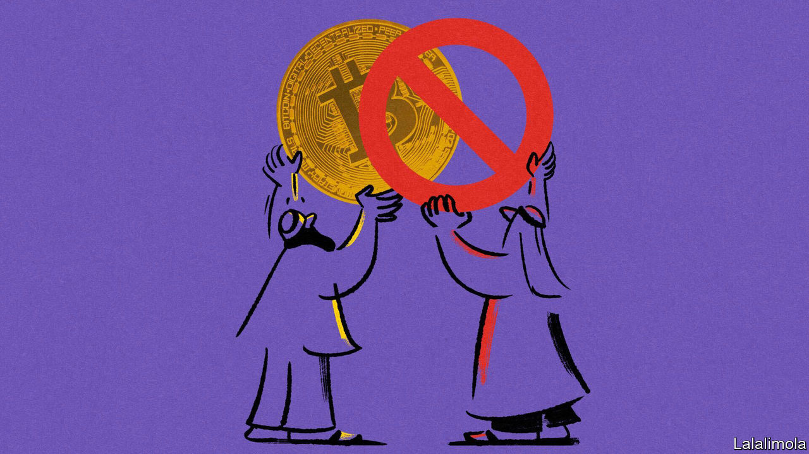

###### Crypto-godly

# Does Islam smile on cryptocurrency? 

##### Islamic scholars can’t agree on whether cryptocurrency is sharia-compliant 

 

> Jul 13th 2023 

“You know why they call it Bitcoin?” asks Ismail ibn Musa Menk, a Muslim scholar in Zimbabwe whose online videos have a big international viewership. “It bit us all,” he laments. “I got bitten too, you know.” Social-media users began to speculate if he had dabbled in the cryptocurrency.

If he did, some of his peers would tut-tut. Shawki Allam, Egypt’s grand mufti, is a naysayer. In 2018 he endorsed an Egyptian government ban on Bitcoin trading, issuing a  that cryptocurrency is (forbidden). 

But others are less sure. As well as scouring the relevant passages in Islamic law, scholars say they need to understand the ins and outs of crypto before deciding whether it should be embraced or damned. So far views are mixed. 

Some have endorsed mainstream cryptocurrencies, arguing that they are permissible partly because they do not generate , or interest, which is . But anti-crypto muftis reckon that Muslims should avoid anything that involves too much , or speculation. 

This lack of consensus has not deterred people in Muslim countries from trading in crypto. Last year the Middle East and north Africa (with Morocco to the fore) had the fastest-growing cryptocurrency market in the world, according to Chainalysis, a data firm in New York. Despite the hostile ruling by their grand mufti, Egyptians,  and the devaluation of their country’s currency, led the surge. 

Some Middle East governments want to regulate trading and control crypto-exchanges. Bahrain was an early pioneer in the region: in 2019 its central bank was the first to issue a regulatory licence to a cryptocurrency exchange, Rain, and declared it sharia-compliant.

The United Arab Emirates has become a regional crypto-hub. Islamic Coin, a new local cryptocurrency backed by several ruling-family members, is set to be publicly traded. Its founders say it is the world’s first “100% cryptocurrency, with 10% of any issued amount going to a Muslim charity. They even boast of a that validates their claim. But since plenty of conventional currencies are endorsed by religious leaders, pious tech-savvy Muslims may wonder whether a new coin backed by a is really any better in Allah’s eyes. ■

