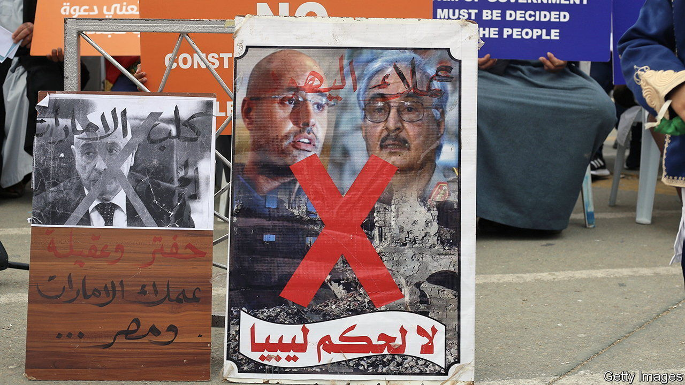

###### Libya’s elections

# Politicians in Libya make another ill-fated push for elections 

##### Expectations for the polls are the definition of insanity 

 

> Jul 13th 2023 

To call it déjà vu would be to understate. Last month Libyan politicians, drawn from the country’s two rival legislatures (one based in Tripoli, the capital, the other in the eastern city of Tobruk) met in Morocco to agree on draft electoral laws. They did not share the text with the public, but drew praise from Western diplomats. After years of delay, perhaps Libya was close to choosing a new government that would end its long political stalemate.

Then came the caveats. The heads of  were meant personally to sign the draft but backed out at the last minute. Lawmakers in one part of the divided country called for elections within eight months. The UN special envoy suggested this was optimistic, as “legal loopholes and technical shortcomings” meant the new electoral laws would not wash.

Libya has been here before. It slipped into civil war and territorial division after the overthrow of Muammar Qaddafi in 2011. The un and Western powers view elections as the way out of this crisis and have tried repeatedly to organise them. Every attempt has failed—and yet they are now asking the same politicians and militia leaders to give it another shot.

The most recent failure was in 2021, when the authorities set an election date and registered almost 3m voters. They are still waiting. Officially the ballot was postponed because of legal issues, including eligibility. Libya had neither a constitution nor electoral laws, a dilemma the talks in Morocco were meant to resolve.

For some participants, the biggest issue was the question of who is eligible to run for president, a debate aimed at one man: Khalifa Haftar, the  who tried in vain to conquer Tripoli, in 2019. Politicians there want to disqualify him, either by barring military men or people who hold dual citizenship (Mr Haftar has an American passport).

The draft electoral laws are said to require would-be candidates to hang up their army uniforms. But that is hardly a durable solution. Mr Haftar could hand over control of his self-styled Libyan National Army to his son Saddam, whom he has groomed for the job. Should he lose the election, however, he could take them back—and perhaps try to change the result by force.

For all the high-minded talk about electoral laws, this is the real, grubby reason why Libya has yet to choose a new government: no one has an incentive to hold elections that might force them out of power.

In 2021, when Abdul Hamid Dbeibeh, a construction magnate, was named prime minister of the internationally recognised government in Tripoli, he promised not to run for president. He later reneged. Aguila Saleh, the head of an expired rump parliament in the east, fears losing his grip on power and has sought to obstruct any political progress.

Lurking in the background is , the second son of the deposed dictator. He has been quietly plotting a return—never mind that he was sentenced to death by a court in Tripoli and indicted by the International Criminal Court. He registered as a presidential candidate before the aborted 2021 election.

He has kept a low profile: two years ago, in a rare interview with the , he likened his comeback to a “striptease”. Should Libya’s rival factions agree on an election date, however, he will probably step up his campaign and cast himself as a unifying figure. It might work: 12 years after they overthrew him, many Libyans look back on the Qaddafi era as a time of relative stability. That is another reason for the country’s current rulers to delay.

At least for now, the stalemate does not seem so bad. Violence has ebbed. High oil prices keep billions flowing into the treasury, which helps to buy calm. But this is not sustainable: if the political process fails, fighting is likely to resume. Libya’s leaders would still rather take power by force than earn it through elections. ■

