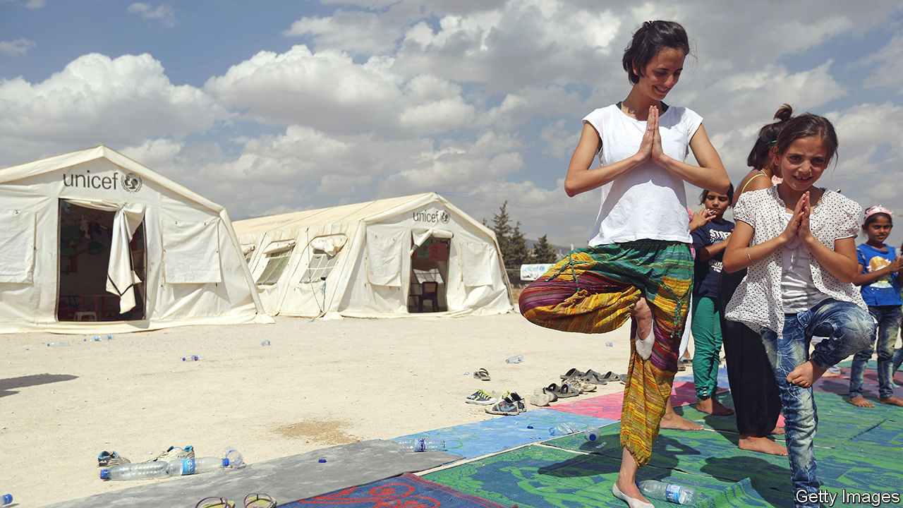

###### Both oppressor and protector

# Syria’s president wants non-Muslim religions to help end his pariah status 

##### Bashar al-Assad is encouraging a wider range of religions 

 

> Jul 13th 2023 

In woods, playgrounds and stadiums across Syria, children and adults perform yoga routines. Their palms open in supplication, their arms flung back, they chant “Surya Namaskar “. It sounds like an Arabic blessing for Syria, but means “sun salutation” in Sanskrit. Instructors in Hindu monks’ robes preach the teachings of Shiva, an Indian god said to have founded the practice. “We are offering relief from the stress of real and economic wars,” says a Syrian tutor. Two decades ago a Syrian known as Mazen Isa returned from Rishikesh, a city in the Himalayan foothills known for its yoga studies, and opened a yoga practice in Syria. Scores of meditation centres now operate, free of charge, across the country. A key to their success is that President Bashar al-Assad backs them.

For over a half century the Assad dynasty has allied its own Alawite sect, an offshoot of Shia Islam, with Syria’s myriad religious minorities in order to bolster the regime’s dominance over the country’s Sunni Muslim majority. But lately he has enabled other denominations to spread their roots. As well as encouraging yoga, he has let evangelical Christians open churches in houses where converted Muslims can worship. He has even encouraged Jews of Syrian origin to visit Damascus, the capital. This religious influx, he hopes, will swell the regime’s minority base and end his status as a pariah across the world. “It’s his programme for normalisation,” says Ayman Abdelnour, a Syrian Christian and former friend turned dissident.

For many Syrians the new religions offer communal relief in a country devastated by a civil war. More than 350,000 people are thought to have died. Nearly half the population of 22m-plus in 2012 has been displaced or forced abroad; 90% of those still in Syria are reckoned to live in poverty. Civil society and political gatherings are still muzzled.

The Syrian Centre for Yoga and Meditation, based in the coastal city of Latakia, says yoga centres have more than quadrupled since the war began in 2011. The sports ministry provides them with football pitches for yoga practice. The number of Christians belonging to long-established denominations in Syria has plummeted from around 2.5m before the war to some 500,000 today, according to a Christian delegation that recently visited Damascus. But new evangelical house churches are said to be opening every month, particularly in the Kurdish-ruled north-east.

Among Syrian refugees a similar trend is noticeable. The International Association of Human Values, a uk-based charity, has been holding yoga classes in Zaatari, a camp for Syrians in Jordan. Evangelical churches are mushrooming in Lebanon. Syrian Muslim leaders used to denounce far smaller divergences from orthodox Islam as apostasy, but now think it wise to hold their tongue.

Although the security services still keep a tight control over the state, Mr Assad blesses this religious pluralism. He sends his officials to celebrate World Yoga Day. A Catholic college opened in Damascus in 2021. Sometimes he and his wife attend church. “He showed us the spirit of love for all religions and said he wanted to rebuild the church in the Middle East,” says Bishop Daniel, an Australian prelate who recently met Mr Assad in Damascus. The president has even sent his officials to meet Jews of Syrian origin in America, asking for their help to rebuild synagogues in Aleppo, a city in Syria’s north. He sent condolences in 2021 after Avraham Hamra, Syria’s former chief rabbi, died in Israel. “Jewish ties are a priority for him,” says an emissary between Mr Assad and Syrian Jews.

While he is gradually being welcomed back into the Arab world, Mr Assad hopes his multi-faith policy will help him end his isolation elsewhere. Yoga has helped him strengthen ties with India. He thinks outreach to Jews might improve relations with America and Israel. The Australian bishop declared after his visit: “We are praying for the leaders of the world to lift the sanctions on Syria so that they can rebuild the nation again.” Many Christian groups abroad oppose economic sanctions against Syria on the grounds that they hurt ordinary Syrians more than the regime—and that for all his destruction Mr Assad is a bulwark against Muslim extremism. ■

