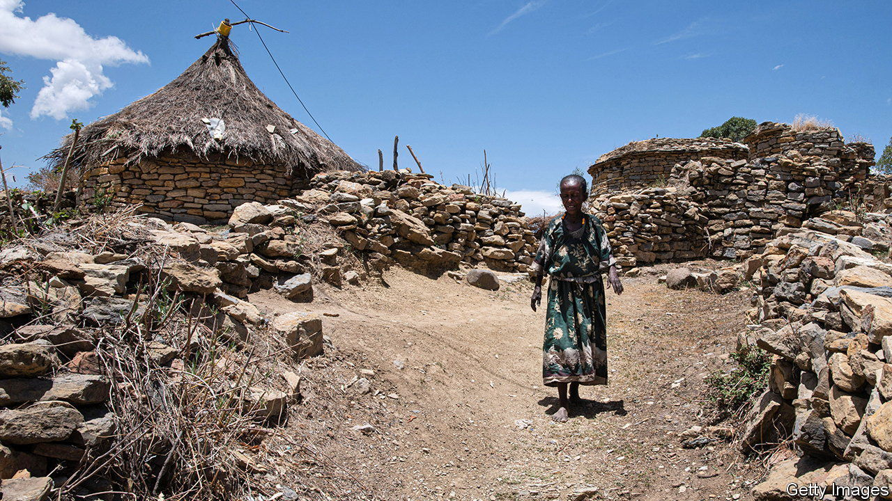
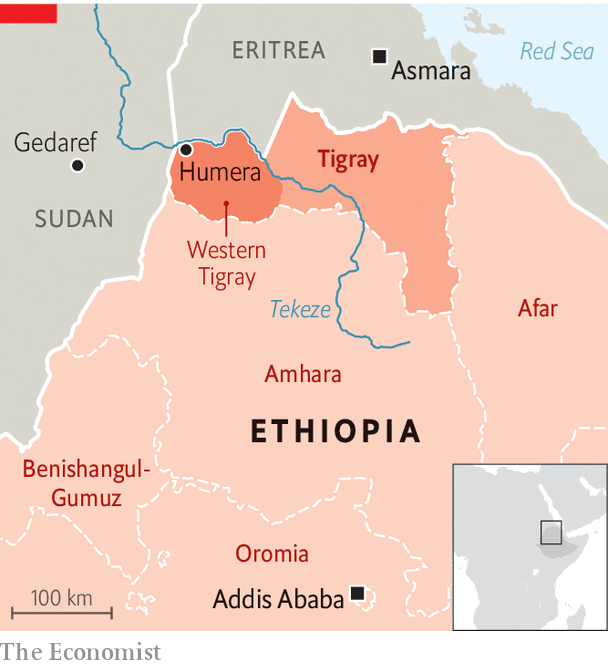

###### Ethiopia’s forgotten civil war

# War crimes in Tigray may be covered up or forgotten 

##### New satellite images suggest burial grounds are being burned 

 

> Jul 9th 2023 

Earlier this year alarming reports spread through refugee camps in  that host refugees from , a region of Ethiopia where a vicious civil war erupted in 2020 but  last year. A trader from a contested area officially known as Western Tigray said the remains of Tigrayans murdered during recent rounds of ethnic cleansing were being dug up or set on fire. The aim, he told refugees by text messages, was “to hide the bodies”. 

Claims that evidence of  committed during Ethiopia’s horror-strewn civil war is being destroyed are not new. In April last year, Human Rights Watch and Amnesty International, two rights groups, published a lengthy joint report which concluded that authorities from Ethiopia’s Amhara region had systematically killed or evicted hundreds of thousands of Tigrayans from Western Tigray. A month later, the BBC reported that security forces from Amhara, which have occupied the area since the war began, had been digging up mass graves and disposing of bodies. 

Holding to account those responsible for war crimes and crimes against humanity is part of the peace agreement reached in November by the government of Abiy Ahmed, Ethiopia’s prime minister, and the Tigrayan People’s Liberation Front (TPLF). In theory it is also a condition for Ethiopia to improve its relations with the West after more than two years in the diplomatic deep freeze. But while Abiy’s government says it is espousing “transitional justice”, it is blocking efforts to uncover the truth and punish the perpetrators.

It may also be complicit in a cover-up. More than 100 satellite images of known detention sites and suspected burial grounds in Western Tigray suggest that some evidence has already been disturbed or destroyed. The imagery, collected and analysed by Vigil Monitor, a British-based conflict-research group, shows disturbances at places eyewitnesses separately identified as body-disposal sites. Near three prison camps these disturbances, such as freshly scorched earth, became visible shortly after the peace deal was signed.

 


In the walls of Bet Hinsets prison in Humera, close to Ethiopia’s border with both Sudan and Eritrea (see map), burns appeared on ground identified precisely by many former inmates as a mass grave. Vigil argues that such unusual burns noticed in various sites suggest that “evidence is being destroyed at numerous locations”. In several of them scorch marks appeared simultaneously at the end of March. This coincided with debates in the UN’s Human Rights Council about further international investigations in Tigray.

Could some of these disturbances be innocuously explained? The massacre of Bosnian Muslims at Srebrenica in 1995 involved interring corpses in designated mass graves. The disposal of bodies in Western Tigray, by contrast, appears to have been carried out more haphazardly. Early in the Tigrayan war, corpses were discovered floating down the Tekeze river into next-door Sudan. After an international outcry “the tactics seem to have changed”, says a researcher for another rights group.

At times, say eyewitnesses and former detainees, bodies were left in the open to be eaten by animals. A Tigrayan man who spent more than a year and a half in prison in Humera before escaping to Sudan says prison guards made him load the corpses of 16 fellow inmates onto tractors which were then carted to places unknown.

Since November 2020, journalists and aid-workers have generally been barred from Western Tigray. UN investigators who visited Ethiopia last year were prevented from travelling outside Addis Ababa, the capital. Thanks to lobbying by Ethiopian diplomats, the UN is unlikely to renew its investigators’ mandate. This means that even if some evidence has degraded, rather than being deliberately destroyed, the effect will be the same. Forensic material that could confirm exactly what happened will gradually disappear.

Ducking and weaving

Ethiopia’s government responds that it will publish its framework for transitional justice later this year. But few expect this to include a thorough investigation of past atrocities. Nor is it likely that senior officials or military commanders who perpetrated or ordered such crimes will be punished. A new report by Human Rights Watch notes that not one Ethiopian official responsible for ethnic cleansing has been removed or brought to justice. “In all likelihood they will just move straight on to reconciliation and sweep atrocities under the rug,” says an Ethiopian consultant who has been pushing for justice.

It helps that the TPLF, whose forces also stand accused of committing war crimes, no longer seems to be especially bothered. During peace talks “the parties both talked a good game”, explains an American official. “But it would be fair to say that each was looking for accountability for abuses done by the other side.” 

Last month the Biden administration, marking a step towards fully resuming American aid and development assistance, notified Congress that Ethiopia’s government was no longer engaged in a pattern of “gross violations of human rights”. But however tempting it may be to let truth and justice be set quietly aside, it is a weak foundation for a lasting peace. “Now I’ll never know if my husband is alive or dead,” lamented a Tigrayan woman on hearing the news of graves being destroyed. “I can never bury his body.” ■

