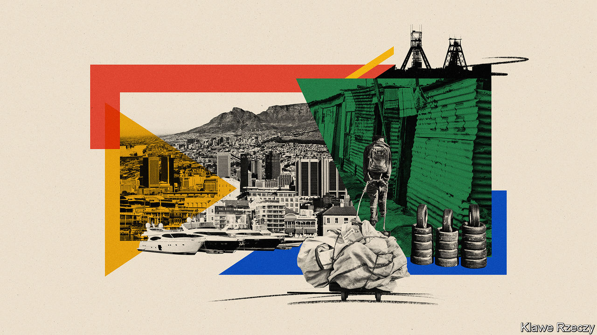
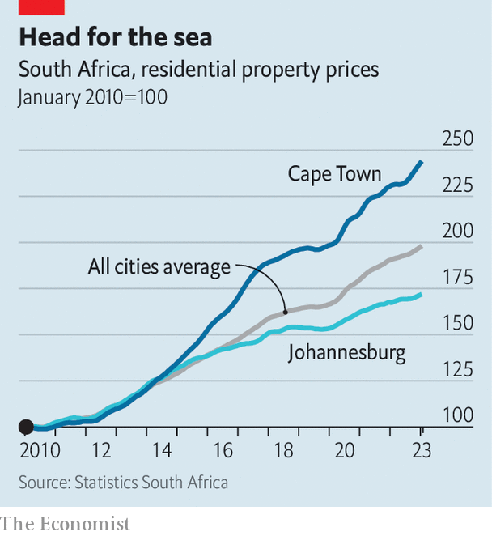

###### The tarnished city of gold

# Why Cape Town beats Johannesburg 

##### The tale of two cities is a story about modern South Africa 

 

> Jul 12th 2023 

A drive through Johannesburg,  biggest city, can feel dystopian. For-sale signs line suburban lawns; empty offices advertise vacancies; sewage gurgles over uncollected rubbish. Lights are often out at junctions. Potholes circled in paint are labelled ANC, a dig at the African National Congress, the ruling party that many residents .

Johannesburg has been at the heart of South Africa’s economy since the discovery of gold in the mid-1880s. Today it is in crisis. Many affluent South Africans are leaving for Cape Town, the country’s second city, and the Western Cape province of which it is the hub. In doing so they are reshaping the country. 

Internal migration has long influenced the course of South Africa. In the 19th century Afrikaners (whites of mostly Dutch descent) trekked from the British Cape Colony to the hinterland and black Africans were scattered during the (crushing) caused by the expansion of the Zulu kingdom. Under apartheid, the movement of black people was controlled through racist laws. Since the ANC came to power in 1994, poor South Africans have continued to move to the Western Cape and Gauteng, the province containing Johannesburg. From 2002 to 2022 internal migration was the main reason why those two provinces’ share of South Africa’s population rose from 31.4% to 38.5%.

 


Locals call the new trend “semigration”: richer South Africans, who are disproportionately white, swap Gauteng for the Cape, often as an alternative to the more widely noticed practice of emigrating entirely. One sign of semigration is the property market. From 2010 to 2022 nominal house prices increased by an average of 98% across South Africa’s eight largest cities, slightly above consumer-price inflation, according to official data. But in Cape Town the increase (141%) was almost twice as big as in Johannesburg (71%). 

According to Lightstone, a property analytics firm, half of South Africans who sold a house in one province and bought in another in 2022 moved to the Western Cape. The share was 58% among those leaving Gauteng. Investec, a private bank, says that the Western Cape is its fastest-growing region by amount of client activity. Johannesburg still has more dollar millionaires than Cape Town, reckons Henley &amp; Partners, a consultancy. But on current trends that will be reversed by 2040. 

What explains the shift? Cape Town is naturally more beautiful than Johannesburg. But that isn’t new. While covid-19 encouraged South Africans to rethink where they work, factors predating the pandemic influenced their decisions—such as the collapse of Johannesburg’s infrastructure. Rolling blackouts occur nationwide because of the failure of Eskom, the state-owned utility. But many South Africans, including residents of Johannesburg, spend extra time in the dark because substations regularly break down. City Power, Johannesburg’s electricity distributor, says 60 transformers need replacing now and 73 more in the next decade; it changes three to five every year. Water outages are becoming more common. Potholes are so bad that in 2021 Discovery, an insurance firm, launched a joint initiative to fill them.

Cape Town has its problems but gets more of the basics right. A hydropower dam means that blackouts are rarer. Under Geordin Hill-Lewis, the mayor, the city is developing a battery-storage plant and paying for surplus electricity generated by those with solar panels. After drought led to a water crisis between 2016 and 2018, the city adopted several measures to soften demand and improve supply. Over the next three years Cape Town will spend more on infrastructure than Johannesburg and Durban, the third-largest city, combined, says Mr Hill-Lewis: “We are building resilience in response to state failure.”

Differences in pipes, power and potholes reflect differences in politics. Johannesburg has had six new mayors in the past two years, as coalitions established via proportional representation rise and fall. The current mayor, Kabelo Gwamanda, is from a Muslim political party which won less than 1% of the vote at local elections in 2021. He is propped up by the ANC and its hard-left offshoot, the Economic Freedom Fighters (EFF). Last month it was reported that authorities were investigating his involvement in a funeral-insurance scheme which allegedly defrauded the poor. 

At a national level the Democratic Alliance (DA), South Africa’s official opposition, suffers from weak leadership. A liberal party with Western leanings, it remains popular among South Africa’s minorities but has made few inroads among black voters (the country is 81% black; 8.8% “coloured”, or mixed-race; 7.7% white; and 2.6% of Asian, mostly Indian, descent). But the DA runs towns and cities, such as Cape Town, relatively well. Of the 257 local governments in South Africa audited in 2021-22 by an official watchdog, just 38 had clean financial records—and 23 of them were run by the DA, 21 in the Western Cape. 

Good governance is helping Cape Town rival Johannesburg as the country’s commercial capital, too. Amazon is building its African headquarters there. Since 2013 it has attracted 20 new direct flight routes from “major global markets”, says McKinsey, a consultancy. The office vacancy rate is almost half Johannesburg’s. From 2017 to 2021 the city’s GDP growth rate tracked South Africa’s as a whole, but Cape Town’s officials reckon that over the next five years the city will grow around 0.5 percentage points faster than the country, reaching 2.8% a year versus 2.3% nationally in 2028. The gap in GDP per person between the Western Cape and Gauteng has narrowed since 2010, notes Johan Fourie of Stellenbosch University. 

The divergence offers two lessons. The coalition politics of Johannesburg are messy—and offer a warning ahead of national elections next year. If the ANC loses its national majority, it may need to co-opt smaller parties to stay in power. A second implication concerns the unity of South Africa. The Western Cape has long had a distinct identity, partly reflecting its demography. Black South Africans are a minority; the largest group is mixed-race “coloureds”, who often say that they have been marginalised under both white rule and the ANC. The Western Cape wants more powers from a national government it sees as holding it back. The provincial parliament is currently debating a bill (which the national government will probably challenge in the constitutional court) to bring about more devolution. 

Some would consider going further still. In 2021 a poll suggested that 58% of those in the Western Cape would support a referendum on independence for the province, and that 42% would vote to secede. That should be taken with a pinch of Atlantic sea salt. But if Cape Town and the Western Cape continue to diverge from the rest of the country, autonomy may seem ever more appealing. ■

