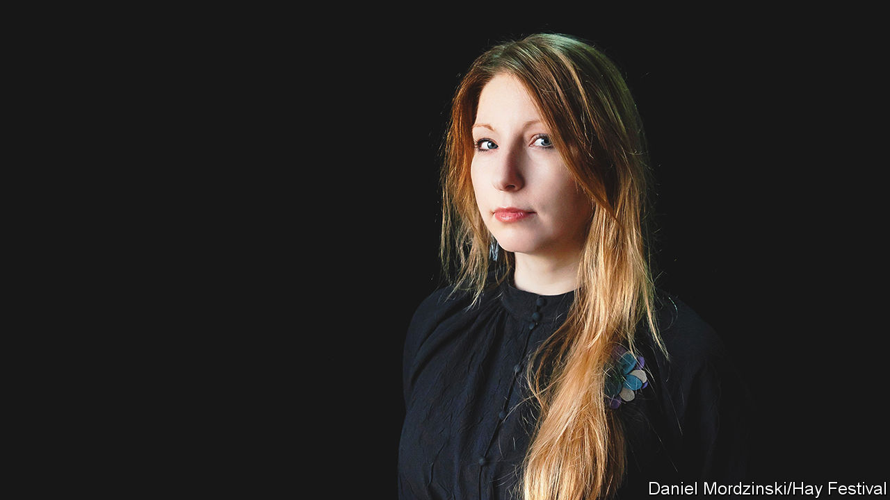

###### Truth, and how to find it

# Victoria Amelina explored a land of atrocities and secrets 

##### The Ukrainian writer and civil-rights campaigner died on July 1st, aged 37, from injuries sustained in a Russian missile attack 

 

> Jul 13th 2023 

The summer grass was long under the cherry tree, and they did not know where to dig at first. Victoria Amelina was standing in a garden in the village of Kapytolivka, near Izyum in eastern Ukraine, with the aged father of Volodymyr Vakulenko, a poet. The poet had been shot by the Russians, his body hastily buried in one of 400 graves. His father, desperate with grief, could cling only to one thing: that Volodymyr had told him he had buried his diary of the Russian occupation under the cherry tree.

She found it before he did. The loose pages were wrapped in rolled-up cellophane, muddy but safe. She photographed herself holding them like a weapon, because they held the truth.

She had gone to Kapytolivka as a field researcher for Truth Hounds, a group dedicated to uncovering war crimes, hunting the perpetrators and (faint hope) bringing them to justice. The group had been formed soon after the Russian invasion; she was an early recruit, joining shadowy figures called “Sherlock” or “Wasabi”. Her self-appointed mission was to talk to people on the front line in eastern and southern Ukraine. 

Sometimes she made herself more immediately useful, handing out humanitarian aid and travelling with tourniquets in her backpack. But salvaging the truth was just as vital. There might be no one else prepared to sit down with a man weeping over the ruins of his house, or a stressed-out soldier behind the lines, or a grandmother whose son had been rough-armed away. And those stories, especially the victims’ names, had to be preserved. 

Her first novel, “The November Syndrome” had been about a man who had the gift, or complaint, of total empathy with the suffering of others, entering their minds and, in the end, their actual lives. She seemed to have a form of that. Her pale face and long curtain of hair made her look shy, even fragile, but army boots and a flak jacket soon gave her a tough edge. She needed one. 

In particular she talked to women for a book she called “War and Justice Diary: Looking at Women Looking at War.” It was in English, to win more readers, and almost finished. Sometimes the looking was simply a scene she would turn into a poem:

In a barren springtime field/Stands a woman dressed in black/Crying her sisters’ names/Like a bird in the empty sky/She’ll cry them all out of herself/...She’ll cry them all into the ground/As though sowing the field with pain/...She will stay in this field for ever/Because only this cry of hers/ Holds all those swallows in the air

She had not written much poetry before. But war gave her no option. Missile strikes shattered language as well as buildings. She was left with a debris of words for what was often indescribable anyway. In 2021 she founded a literary festival in a town in front-line Donetsk, to keep the flag flying. 

Her life had taken some strange twists. At university she studied computer science and was a programmer for years. It was good money, but increasingly it felt empty, a mistake. Instead, she became an activist. After the Maidan revolution in 2014, when the Russian puppet Viktor Yanukovych was forced from power by the people, she joined the campaign to free Oleg Sentsov, a Crimean film-maker, from a Russian jail. It worked; in five years he was out, and promptly joined the Ukrainian army. 

The Sentsov case, she clearly saw, was part of a broader Russian agenda to destroy Ukraine: its language, its culture, its separate history and identity. Stalin had tried that with the Holodomor, the Terror-Famine, of 1932-33, and with the wholesale arrest and murder of a hive of artists and intellectuals in Kharkiv. On the cultural map of Europe (Dante here, Shakespeare there) Ukraine became, in her words, a vast gap. Now Vladimir Putin with his weapons had made sure that Artem Datsyshyn, a ballet star, would never dance again, and that Oleksandra Kuvshinova, a journalist, would never file another word. How many more would join that list? 

As a child, though, she had naturally thought Moscow the centre of the world. She grew up in Lviv speaking Russian, going to Russian school, praying in Russian church. At 15, to her surprise, she discovered that Muscovites thought she was oppressed. She told them she was not, but the propaganda went on. Within her own family, too, and neighbours’ families, there was silence about what exactly had happened during the Holodomor, the war, and afterwards. Which side had people been on this time? The one that applauded the Soviets, or the one that clung to the hope of a free Ukraine? The side that took all the food, or the side that starved? 

Those questions constantly bothered her. They fed into her second and last novel, “A Home for Dom”, which detailed the experiences of three generations in a house in Lviv, narrated by a poodle called Domenicus. The central theme was the lack of openness between the characters. Arm-in-arm on the Maidan in 2014, she had felt at last that Ukrainians were a united people, taking risks together. By the time of the Russian invasion, she was not so sure. Distrust ran deep. “Why do you resemble them?” she asked Ukrainian soldiers in another poem. “You’re brothers, perhaps?” 

“No, our arms crossed/Not in embrace, but in battle/Our blood mingled with the earth/From which they gathered our harvest/...Our language was burnt alive/After shouting on the Maidan/And we picked another/Like a stranger’s rifle/...When our battle begins/You had better not ask/Why we resemble those/Who have been killing us since time began”

By this year she was worn out, and had accepted a year’s writing residency in Paris. But she made just one more trip east, to show some Latin American writers what the front line was like. She took them to RAI Pizza in Kramatorsk on the evening when two Russian missiles left the place in ruins. It was, the Russians said in their last big lie to her, a legitimate military target. 

Vakulenko’s fierce words from under the cherry tree had been put on public display in Kharkiv. That sort of thing, she had said then, was what she would want for hers. ■

