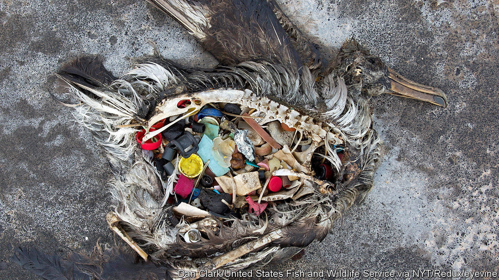

###### Choosing a fingerprint

# A Canadian lake could mark the start of humanity’s geological epoch 

##### Plutonium, carbon and plastic mark a new phase in Earth’s history 

 

> Jul 12th 2023 

One way to view the history of science is as a repeated puncturing of humanity’s claims to be special. In scientific terms  is an oddly hairless species of ape that has existed for 200,000 years—an eyeblink in Earth’s 4.5bn-year history. 

For the past couple of decades, though, some scientists have been arguing that perhaps humans do deserve a bit of special recognition after all. In 2000 Paul Crutzen, a Dutch meteorologist and chemist, suggested that human influence over Earth was sufficiently profound that its effects would remain visible in the geological record for millions of years. For that reason, he argued, it was time to bring down the curtain on the Holocene—the current geological epoch, which has lasted for the past 12,000 years or so—and ring in a new one: the Anthropocene. 

The idea quickly caught on. In 2016 the Anthropocene Working Group (AWG), an appendage of the International Union of Geological Sciences (IUGS), voted in favour of adopting it in principle. And on July 11th it suggested a precise geological feature, dating back to the 1950s, that could mark the Anthropocene’s beginning. The committee recommended bestowing the honour upon sediments laid down at the bottom of Crawford Lake, a flooded sinkhole about 20 miles from Toronto. 

The beginning of the Holocene was marked by a natural warming of the climate and the retreat of the world’s ice sheets. The idea behind the Anthropocene is that human activity has disturbed the planet on a similarly grand scale. Humans have boosted the concentration of carbon dioxide in the atmosphere by about half in the past 250 years, to its highest level in around 3m years. That spike will be clearly visible to geologists 100,000 years from now, assuming any exist, and may have delayed the start of the next ice age by tens of thousands of years. 

There are markers besides climate change, too. Microplastics in oceans and rivers are laying down sedimentary layers of chemicals never seen before in nature. Nitrogen fertilisers have altered the balance of chemical isotopes in peat bogs. The world is in the midst of a mass extinction. At the same time shipping and air travel have scattered much of the remaining flora and fauna far from where they evolved. Both the extinction and the redistribution will be visible when what is alive today joins the fossil record of the past. 

The IUGS’s rules say that geological transitions must be marked not just by a particular event, but by a specific alteration in a specific geological feature. (For instance, the start of the Edicarian period, 635m years ago, is defined by a visible change in a band of exposed rocks in southern Australia.) The AWG’s announcement marked the end of a years-long search for a suitable marker for the Anthropocene. Scientists examined sites from the estuaries of San Francisco to the sediment beneath Vienna’s main square, before settling on Crawford Lake. 

The lake has several advantages. Every summer, as the surface waters warm, flakes of calcium carbonate precipitate out and drift to the bottom. There they form regular white bands amid the sediments, much like age rings in trees. The sediments themselves lie deep enough that they remain undisturbed by the wind and waves above. They therefore contain records, in date order, of everything from CO concentrations to particles of plutonium from the explosions of nuclear weapons, the first of which happened in 1945. 

Indeed, the AWG has proposed that the subsequent spike in plutonium—an element which was vanishingly rare before the atomic age—should serve as the “primary marker” for the beginning of the Anthropocene. Not everyone is convinced, for plutonium is unstable. The isotopes that the AWG have in mind have half-lives of 6,500 and 24,000 years, meaning almost all the plutonium will be gone within 200,000 years. Dissidents suggest that fly ash from fossil-fuel combustion would make a better alternative. Like plutonium, it is not something that the planet has seen before. And unlike plutonium, it will, if left undisturbed, hang around in the rocks for many millions of years to come. ■


