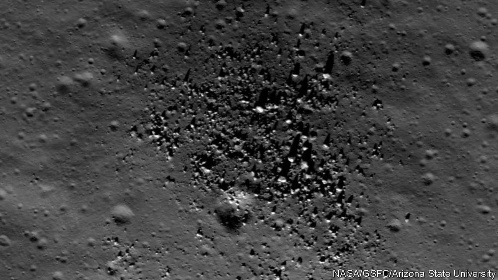

###### Not that sort of monolith

# An enormous—and unexpected—lump of granite has been found on the Moon 

##### The discovery sheds light on lunar history, and suggests how other moons might be explored 

 

> Jul 12th 2023 

In “2001: A Space Odyssey”, Stanley Kubrick and Arthur C. Clarke imagined a monolith buried beneath the surface of the Moon which turned out to be an alien artefact that set humankind on a path to the stars. The “batholith” that has been discovered below Compton-Belkovich, a volcanic-looking set of features on the far side of the Moon, hardly promises that. But it sheds some interesting light on the Moon’s past, and shows the power of a new way of peering into the crusts of other planets. 

A batholith is a geological formation created when a vast quantity of molten rock rises through a planet’s crust, spreading out sideways as it does so. On Earth, these batholiths are composed mostly of granite; the rocks of Yosemite, for example, are parts of the Sierra Nevada batholith uncovered and spectacularly sculpted by subsequent erosion. 

The Compton-Belkovich batholith is also made of granite, which is what gave it away. Granite is richer in thorium than other igneous—that is, once molten—rocks, such as basalt, and thorium is radioactive. Its decay heats the granite that hosts it. Measurements of microwave emissions made by the first two Chinese satellites to orbit the Moon, Chang’e 1 and Chang’e 2, allowed a team of scientists led by Matthew Siegler and Jianqing Feng of the Planetary Science Institute in Tucson, Arizona and Southern Methodist University in Dallas, Texas to calculate how much heat was being given off by rocks under the surface at Compton-Belkovich. 

Assuming that the thorium was present at the sort of concentrations typically seen in granite allowed the scientists to calculate a likely shape for the source. Their best guess, published in last week, was that there is one smallish hot blob, maybe 10-20km across and a few kilometres deep, balanced on top of a much bigger, deeper one that might be 50km across and go down for tens of kilometres. 

This suggests interesting goings-on in the depths of the Moon of a sort not previously recognised. Igneous rocks are made through a sort of geological distillation. When rocks far below the surface are heated, some components melt more easily than others; when the molten rock solidifies its mineral make-up is not the same as that of the original parent. 

To turn rock from the mantle of Earth, or the Moon, into basalt requires just one cycle of distillation; basalt thus created makes up the solid crust under the oceans of Earth and the smooth lava plains of the Moon. To make granite, though, requires a number of separate distillations (which is what gives it high thorium concentrations). On Earth this is easily arranged; the collisions of tectonic plates provides lots of opportunities. On the placid, plateless Moon there is no such mechanism, and it has been easy to assume that basalt is for the most part all the planet has to offer. The granite batholith suggests something new at play. Perhaps the rocks in the area were unusually rich in water. Perhaps pulses of heat from below made them melt and freeze repeatedly. 

The lunar discovery suggests that similar microwave measurements might provide novel insights into the innards of other planets. That this has not been tried before is due to a preconception. Satellites orbiting Earth use microwave receivers to measure water in the atmosphere. Because the solar system’s other rocky planets do not have watery atmospheres, such instruments have not been sent to them. 

But when China launched Chang’e 1 and 2 its aim was to show that it could do science round the Moon, not necessarily to do the best such science. Dr Siegler thinks the microwave antennae were put on board simply because they had been shown to work and there were no more suitable instruments to hand. Now they have proved their worth, he hopes to see the designers of future spacecraft take note. One target where they might come in handy would be the moons of Jupiter, where their sensitivity to heat and moisture might be a useful addition to other sub-surface probes. Fans of “2001” will remember that its monolith spurred a new mission to Jupiter. Maybe the batholith will, too. ■


