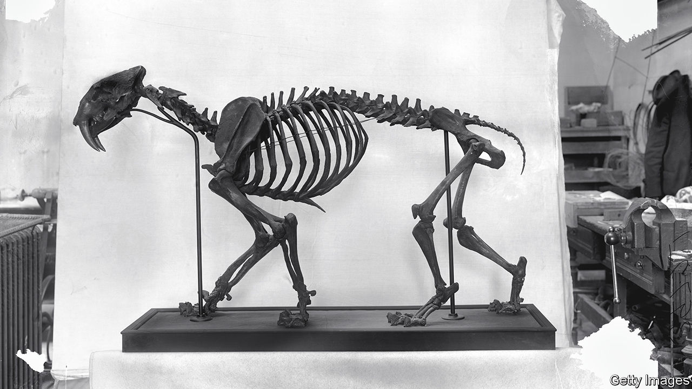

###### What the bones tell

# Sabre tooth tigers and dire wolves were in trouble before they vanished 

##### Bones recovered from tar pits suggest both animals were becoming badly inbred 

 

> Jul 12th 2023 

Along with the mammoth and the dire wolf, the sabre-tooth tiger was a casualty of the Quaternary Extinction, a die-off that happened between 50,000 and 10,000 years ago that seems to have affected big animals in particular. 

Exactly what caused the  is still a matter of debate. (Two popular possibilities are a warming in the climate, and the arrival of humans.) A new paper by Hugo Schmökel, a veterinary surgeon at the Evidensia Academy, a veterinary college in Sweden, and his colleagues, suggests that, for both the sabre-tooth tiger and the dire wolf, inbreeding played a part.

Dr Schmökel arrived at that conclusion after examining bones from the Rancho La Brea tar pits in Los Angeles. These are gold mines for palaeontologists because they were death traps for the animals of the day. Rainwater can accumulate on top of the tar. A large herbivore, like a mastodon or giant sloth, that ventured in for a drink would risk becoming ensnared. Its subsequent attempts to free itself would attract predators, which would take advantage of its distress and attack—but then become trapped themselves. As a result Rancho La Brea contains bones from thousands of animals. 

That allows for statistical studies that cannot be done anywhere else. Dr Schmökel examined 834 sabre-tooth-cat femurs dated to between 12,000 and 10,000 years ago. Around 6% had defects suggestive of a bone disease known as osteochondrosis dissecans. This is caused by small fragments of bone underlying the cartilage in a joint dying and breaking loose. It causes joint pain, loss of motion, and becomes crippling in old age. An analysis of 266 dire-wolf femurs found that 2.6% likewise had defects indicative of the disease. 

Several things, including diet and injury, can cause osteochondrosis dissecans. But one of the biggest predisposing factors is genetics. Indeed, though the disease is rare in wild animals today, it is common in domesticated dog breeds that have been heavily inbred. Around 9% of border collies, for instance, suffer from it. But inbreeding is not always a consequence of human interference. In the wild, it is usually a consequence of a shrinking population in which fewer and fewer mates are available with every passing generation.

That suggests both the sabre-tooth tigers and the dire wolves were locked in a miserable downward spiral. Not only were their populations already shrinking, but the disease caused by the resulting inbreeding would have made it harder for the remaining individuals to survive, especially as they got older. It is impossible, at least for now, to discern what led these animals to become inbred in the first place. But the evidence from the tar pits suggests they were on a genetic knife’s edge for thousands of years before they finally succumbed. ■


