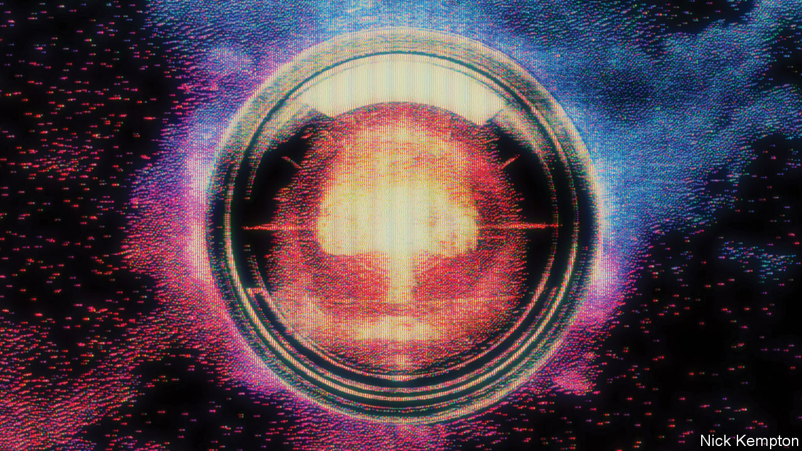
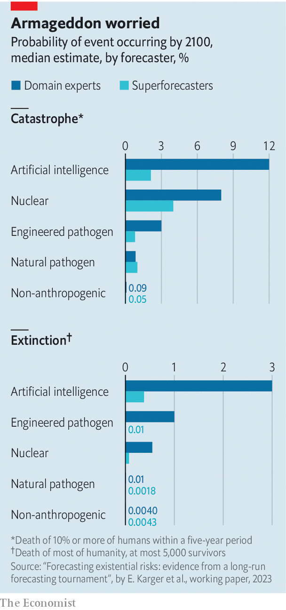

###### Superforecasting the end of the world

# What are the chances of an AI apocalypse? 

##### Professional “superforecasters” are more optimistic about the future than AI experts 

 

> Jul 10th 2023 

In 1945, just before the test of the first nuclear bomb in the New Mexico desert, Enrico Fermi, one of the physicists who had helped build it, offered his fellow scientists a wager. Would the heat of the blast ignite a nuclear conflagration in the atmosphere? If so, would the firestorm destroy only New Mexico? Or would the entire world be consumed? (The test was not quite as reckless as Fermi’s mischievous bet suggests: Hans Bethe, another physicist, had calculated that such an inferno was almost certainly impossible.) 

These days, worries about “existential risks”—those that pose a threat to humanity as a species, rather than to individuals—are not confined to military scientists. Nuclear war; nuclear winter; plagues (whether natural, like covid-19, or engineered); asteroid strikes and more could all wipe out most or all of the human race. The newest doomsday threat is artificial intelligence (ai). In May a group of luminaries in the field signed a one-sentence open letter stating: “Mitigating the risk of extinction from AI should be a global priority alongside other societal-scale risks such as pandemics and nuclear war.”

But just how worried is it rational to be? On July 10th a group of researchers including Ezra Karger, an economist at the Federal Reserve Bank of Chicago, and Philip Tetlock, a political scientist at the University of Pennsylvania, published a working paper that tries to shed light on that question by systematically surveying two different sorts of experts. On the one hand were subject-matter, or “domain”, experts in nuclear war, bio-weapons, AI and extinction itself. On the other were a group of “superforecasters”—general-purpose prognosticators with a record of making accurate predictions on all sorts of topics, from election results to the outbreak of wars.

The researchers recruited 89 superforecasters, 65 domain experts and 15 experts in “extinction risk” more generally. The assembled seers were given two different kinds of disaster to consider. A “catastrophe” was defined as something that killed a mere 10% of the humans in the world, or around 800m people. (The second world war, by way of comparison, is estimated to have killed about 3% of the world’s population of 2bn at the time.) An “extinction” was defined as an event that wiped out everyone with the possible exception of, at most, 5,000 lucky (or unlucky) souls. 

We will all go together when we go

The two groups were asked to estimate the likelihood of everything from terminal events like an AI-caused extinction or a nuclear war to smaller questions, such as whether worrying advances in the abilities of AIs might come to pass that could act as signposts on the road to a future disaster. 

The most striking conclusion of the study was that the domain experts, who tend to dominate public conversations around existential risks, appear to be gloomier about the future than the superforecasters. The experts reckoned there was about a 20% chance of a catastrophe by 2100, and a 6% chance of extinction. The superforecasters gave those events probabilities of 9% and 1% each. 

 


That broad split disguised some interesting details. The difference between the two groups was greatest when considering the risks posed by AI. The median superforecaster reckoned there was a 2.1% chance of an AI-caused catastrophe, and a 0.38% chance of an AI-caused extinction, by the end of the century. AI experts, by contrast, assigned the two events a 12% and 3% chance, respectively. When it came to pandemics, superforecasters were more pessimistic than domain experts on the risks posed by naturally occurring disease.

Perhaps the most interesting result was that, although the groups disagreed on the exact size of the risk, both pegged AI as the biggest worry whether thinking about catastrophe or extinction (see chart). One reason for AI’s strong showing, says Dan Mayland, a superforecaster who participated in the study, is that it acts as a “force multiplier” on other risks like nuclear weapons. As with nuclear war or an asteroid strike, AI (in the form of armed robots, say) could conceivably kill humans directly. But it could also serve to sharpen another executioner’s axe, as it were. If humans used AI to help design more potent bio-weapons, for instance, it would have contributed fundamentally, albeit indirectly, to any ensuing disaster. 

But though the superforecasters were pessimistic about AI, they were also relatively uncertain about it. The world has lived with nuclear weapons for nearly 80 years. That a nuclear war has not yet happened constitutes valuable data that can be fed into forecasts of whether one might happen in future. AI, at least in the current meaning of the term, is much newer. The emergence of modern, powerful machine-learning models dates to the early years of the 2010s. And the field is still developing quickly. That leaves much less historical data on which to base predictions. 

 


Dr Tetlock in particular has done a great deal of work looking at the problem of predicting the future. It was he who first identified and named the “superforecasters”, a group of people who seemed to be unusually good at predicting future developments in all kinds of domains. Such people share a few characteristics, such as careful, numerical thinking and an awareness of the cognitive biases that might lead them astray. Despite their lack of specific expertise, superforecasters have a solid record of outperforming experts in technical fields from finance to .

The differences between the groups partly reflect differences in their models of how the world works. Catastrophic risks depend not just on how sophisticated or powerful a technology becomes, but also how humans react to it. After scares in the early cold war, for example, America and the Soviet Union, the world’s two biggest nuclear powers, began to co-operate. Initiatives like a Moscow-Washington “hotline”, agreements to inspect each other’s weapons and treaties designed to limit the sizes of stockpiles all helped cut the risk of nuclear war. 

But superforecasters and AI experts held very different views of how societies might respond to small-scale damage caused by AI. Superforecasters tended to think such damage would prompt heavy scrutiny and regulation to head off bigger problems later. Domain experts, by contrast, tended to think that commercial and geopolitical incentives might outweigh worries about safety, even after real harm had been caused. 

Superforecasters and experts also had different views about the limits of intelligence on its own. Kjirste Morrell, another superforecaster involved in the study, puts it simply: “It’s just not easy to kill everybody.” Doing so, she points out, probably requires “a certain amount of ability to interact with the physical world…you probably need a lot of advancement in robotics before you get to that.”

The fundamental problem with this sort of prediction, of course, is that unlike with repeated, lower-stakes events (such as predicting the movements of share prices, or the outcome of elections) there will never be any way to know which side is closer to identifying the true level of risk. But if the superforecasters are so good at predictions, and experts have so much topic-specific knowledge, you might at least expect the two groups to influence each other’s beliefs.

Reading the runes

The study tried to encourage such mutual persuasion through group discussions, monetary incentives for better arguments and the like. Nevertheless, and perhaps surprisingly, both sides stuck resolutely to their guns. (One AI expert fingered “deliberation fatigue” as the problem—in other words, both sides were simply exhausted from all the forecasting they had already been asked to do.)

Changing minds, or “updating priors”, as the forecasters would call it, might be easier with new evidence. So Drs Karger and Tetlock are hoping to collect some. They have asked participants in the current study to answer another set of questions about a series of “early-warning indicators”—measures that would suggest whether the world is on a path towards one catastrophic scenario or another. The amount of computer power used in large AI training runs might serve to track the general progress of the field, for instance. The eventual fate of nuclear  might be another factor. The hope is that these shorter-run questions, some of which will be resolved by 2024 and 2030, will provide a sense of whose predictions to take more seriously—and therefore, how worried you should be. ■


