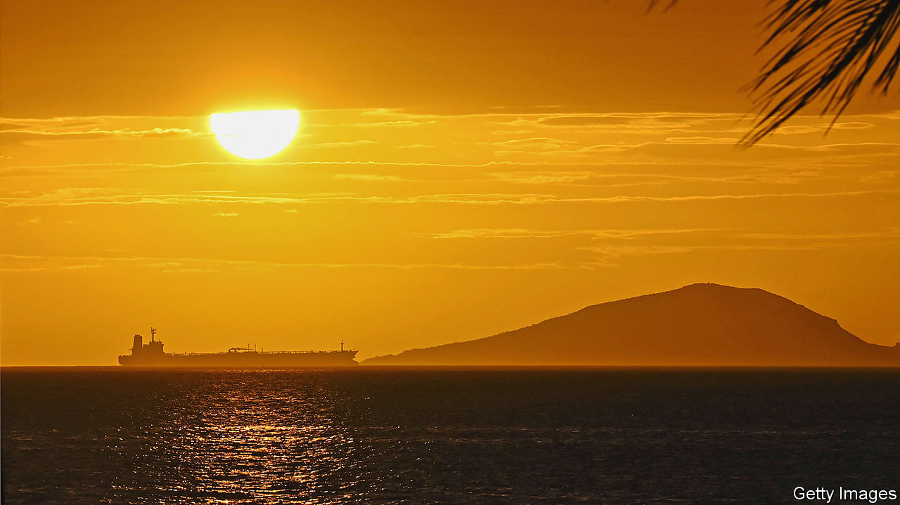
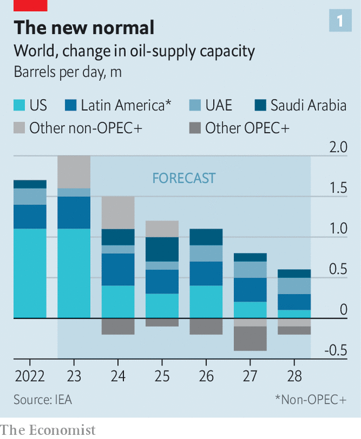
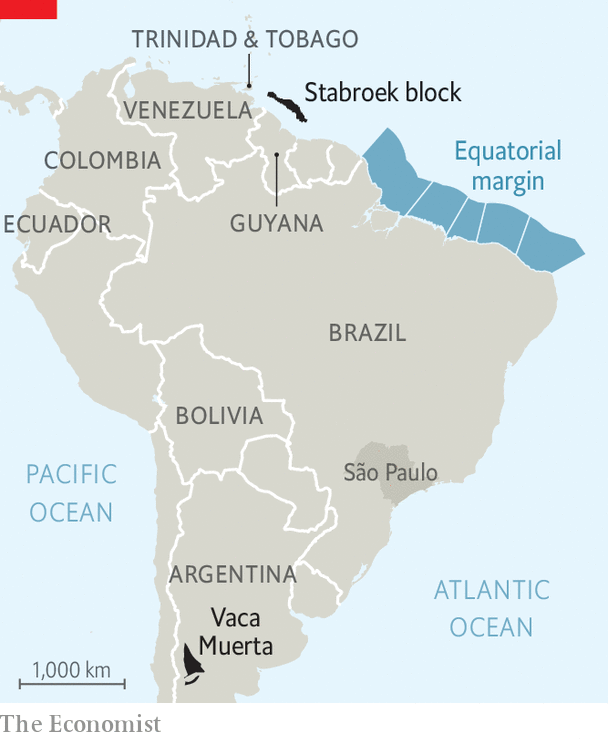

###### The new geography of oil

# Latin America is set to become a major oil producer this decade 

##### Brazil and Guyana are preparing for a bonanza. But declining demand threatens the rest of the region 

 

> Jul 11th 2023 

In deep blue waters off the coast of Guyana, gargantuan ships are sucking oil from reservoirs three kilometres below the surface. These machines are transforming the fortunes of one of South America’s smallest and poorest countries. In 2015 ExxonMobil, an American oil giant, found the first of what are now around 11bn barrels of proven crude oil reserves, or around 0.6% of the world’s total. Production began three years ago, and is now picking up pace. By 2028 it could reach 1.2m barrels a day—a rate that today would make Guyana one of the top 20 oil producers. That is a stunning bonanza for a country of only 800,000 inhabitants. Foreign politicians no longer struggle to find it on the map. On July 6th Antony Blinken, the US secretary of state, paid a visit.

 


Guyana’s windfall is reviving Latin American oil production. According to a recent report by the International Energy Agency, global production will increase by 5.8m barrels per day between now and 2028. About a quarter of the additional supply will come from Latin America, turning around a decade of declining output in the region (see chart 1). Within that, Argentina, Brazil and Guyana will grow and everywhere else will decline. 

 


Globally, demand for oil is set to peak in the coming decades, as cleaner energy alternatives take off. While oil will still be required throughout the energy transition, it will have to be produced cheaply and with low carbon emissions to remain competitive. Brazil and Guyana are likely to benefit more than most exporters. In Guyana, ExxonMobil and its partners are wasting no time bringing it to market. “It is both the government’s objective—and ours as well—to accelerate development of the resources here as quickly as possible,” says Meghan Macdonald, a company spokesperson. In part that also is to maximise profits while oil prices are high. 

By contrast the energy transition will be punishing for other parts of Latin America. Many state oil firms are inefficient and produce dirty barrels. Places such as Ecuador and Venezuela are woefully unprepared. Mexico’s president is wasting billions to coddle the incompetent state oil firm. These countries’ refusal to adjust could have grim economic consequences. The new geography of oil in the region holds lessons for the world. 

In Brazil this upcoming boom dates back decades. In 2006 engineers at Petrobras, Brazil’s state oil firm, made a blockbuster discovery. Off the coast of São Paulo state, and under three kilometres of water and five more of rock and salt, lay one of the world’s greatest offshore oilfields. For the president at the time, Luiz Inácio Lula da Silva, the discovery proved that “God is Brazilian”. The so-called pre-salt fields appear bottomless. Over a hundred wells have been drilled, with each gushing the black stuff. Production of the fields increased from 41,000 barrels per day in 2010 to 2.2m per day last year.

God is Brazilian, or Guyanese?

The pre-salt fields transformed Brazil from a marginal oil producer into the world’s eighth largest. Their geology, along with Petrobras’s investments in the latest technology, makes extraction particularly efficient. According to Schreiner Parker of Rystad Energy, a consultancy, Brazil and Guyana can produce oil profitably at $35 per barrel, less than half of today’s price. The amount of CO equivalent emitted per barrel is 10kg, compared with a global average of 26kg. “Brazil and Guyana have the privileged barrels the market is going to seek out,” thinks Mr Parker.

 


Now Lula, who is back in office, is betting on another round of good news. Petrobras plans to spend nearly half of its $6bn exploration budget over the next five years on the equatorial margin, an area in northeastern Brazil near Guyana (see map). The government expects the area to hold upwards of 10bn barrels of recoverable oil, roughly equivalent to the pre-salt fields. Brazil’s environmental regulator recently denied the company a licence to drill in the area, but Petrobras says it will appeal the decision. It has the backing of several political heavyweights. Alexandre Silveira, the mining minister, has called the equatorial margin a “passport to the future”. 

The new oiligarchy

Brazil’s natural endowments alone did not lead to Petrobras’s good fortune. Sound policy was crucial. The groundwork was laid in the 1990s, when a centrist government created an independent regulatory agency and started investing heavily in exploration. The firm’s fortunes reversed during the administration of Dilma Rousseff, Lula’s protégée, who governed from 2011 to 2016. Under her rule, Petrobras spent billions of dollars subsidising domestic fuel, even as global oil prices crashed. By 2015 it had racked up debts of more than $100bn. An investigation revealed it was at the heart of a gigantic kickback scheme to buy political support. 

After Ms Rousseff was impeached, on charges that she had fiddled public accounts to hide the size of Brazil’s economic crisis, the government learnt to “treat Petrobras like a business rather than a ministry,” says Mr Parker. Pedro Parente, the CEO, sold off assets in order to focus on the pre-salt fields and slashed the workforce. A new law allowed international firms to participate in exploration and production, increasing competition. Last year Petrobras’s profits were a record $36bn (this was partly because of higher oil prices). 

Few oil firms in the region have learnt the lessons of Petrobras’s extraordinary turnaround—or had the good luck of tapping new discoveries. Latin America has the second-largest proven oil reserves in the world after the Middle East, yet its state firms have repeatedly squandered opportunities. Unlike most Gulf countries, the region’s governments have generally failed to set up sophisticated sovereign-wealth funds to channel oil revenues into long-term investments. Instead, they have become dependent on oil as a source of foreign exchange and fiscal revenues. 

Perhaps no company in the world is as closely linked to its country’s collapse as Venezuela’s state oil firm, PDVSA. At its peak in 1998, it provided 5% of global supply. But that year Hugo Chávez, a left-wing autocrat, was elected president. In 2003, after workers from PDVSA went on strike, Chávez fired 18,000 employees—half the workforce—and replaced them with loyalists. He later demanded that foreign oil firms renegotiate their contracts to give PDVSA majority control. It became a cash cow to buy political support. 

Production of Venezuela’s mostly heavy, dense oil has plummeted from 3.4m barrels a day in 1998 to 700,000 today. Corruption is rife at PDVSA, which is also subject to American sanctions. Between January 2020 and March 2023, it received only $4bn in payments, though oil exports were worth $25bn. Yet Nicolás Maduro, Chávez’s hand-picked successor, is clinging to rosy predictions. After Russia invaded Ukraine he said PDVSA could “grow one, two, three million barrels per day if needed”. 

Venezuela’s case is extreme, but mismanagement and policy instability are the norm in the region. According to Francisco Monaldi of Rice University in Houston, if all of the region’s oil were exploited with the same expertise and in a similar regulatory environment as in Texas, Latin America would be producing more oil than the United States, instead of about half. Colombia, Ecuador and Mexico produced only 3.8% of global output in 2021. Output is set to shrink due to a mixture of bad geology and bad policy, or both. 

Take Mexico, whose ageing fields are sputtering. Production peaked in 2004 and has roughly fallen by half. That should not be a problem, since Mexico has a large and diversified economy, with a solid manufacturing industry thanks to a free-trade deal with the United States and Canada. Yet President Andrés Manuel López Obrador is determined to make Mexico self-sufficient in energy and sees Pemex, the state oil firm, as essential to achieving it. 

Since coming to power in 2018 his administration has lavished the company with $45bn in tax breaks and other financial support. A much-touted new refinery, which may have cost up to $18bn to build—more than double the original price tag—was inaugurated last year. All told, Pemex is now a drain on the country’s coffers rather than a provider to them. With more than $100bn in debt, it is the world’s most-indebted oil company. In May its refineries operated at less than half their capacity. New reserves are located in deep water, which Pemex lacks the funding or know-how to exploit. On July 11th Reuters reported that a huge fire at an offshore platform had left two dead, and would reduce Pemex’s output by at least 2m barrels this month alone.

Oleaginous follies

Mexico’s economy can cushion the blow from declining oil production. Other countries are not so lucky. Ecuador’s government depends on oil revenues more than any other in Latin America (Venezuela’s data are unreliable). Fiscal income from the exploration and production of oil accounted for 24% of total government revenues between 2015 and 2019, according to an analysis by Boston University. Yet despite high oil prices, production is expected to fall from 460,000 barrels per day today to 370,000 by 2028. A new constitution in 2008 increased government control over oil, stymying efforts to modernise Petroecuador, the state-owned firm. Corruption is thought to be rampant. Fernando Santos, the energy minister, reckons that several former senior employees are being investigated for, or have been charged with, corruption offences. The firm has never been externally audited. 

The government is trying to diversify its sources of revenue. It recently signed a free-trade deal with China that it hopes will boost non-oil exports by $3bn-4bn annually over the next decade, and has sold some debt in exchange for boosting green efforts. Yet it is still banking on oil. “Now that the global trend is to abandon fossil fuels, the time has come to extract every last drop of benefit from our oil,” Guillermo Lasso, the president, said last year. 

Petroecuador plans to expand production in and around a national park inside the Amazon rainforest. Ramón Correa, the company’s boss, estimates that output in the area could provide cumulatively almost $14bn in revenues for the state by 2043, or the equivalent of 13% of today’s GDP. That windfall looks increasingly distant. On August 20th Ecuadorians will elect a new president and legislature, and vote in a referendum on whether to cease all production in parts of the national park. More voters are currently in favour of blocking rather than expanding it.

Some countries, such as Argentina, have fared better. Triple-digit inflation and crippling capital controls have not prevented it from increasing its oil-and-gas output. Sanctions on Russian oil have led to an increase in production in Vaca Muerta, a mammoth field in Argentina’s far west. It holds the world’s second-largest shale gas deposits and its fourth-largest shale oil reserves, but had struggled to attract investment for decades. Rystad Energy expects shale-oil production in Argentina will more than double by the end of the decade, to over a million barrels per day. 

A continent of stranded assets

Across parts of the region the decline in oil revenues could have severe consequences. The Inter-American Development Bank (IDB) reckons that if the world limits global warming to 1.5°C (which remains very unlikely) fiscal revenues in Latin America could be reduced cumulatively to between $1.3trn and $2.6trn by 2035. If reserves were strongly exploited, by contrast, the IDB estimates that those revenues would be between $2.7trn and $6.8trn. Gas exporters will be similarly hit. Bolivia and Trinidad &amp; Tobago depend on revenues from the production of natural gas for 17% of their fiscal revenue. Yet Bolivian gas exports are set to end by 2030. In Trinidad &amp; Tobago production has declined by 40% since 2010. 

Past shocks point to a difficult future. Between 2014 and 2016, when commodities prices fell, fiscal accounts deteriorated. In Brazil, which suffered from a broader economic crisis, public debt rose from 57% of GDP in 2013 to 84% by 2017. For some countries, hydrocarbons are the main source of foreign exchange. In Colombia extractive industries amount to 50% of exports. Between 2014 and 2020 the sector absorbed 28% of all foreign direct investment. Some states will struggle to find alternative revenue sources. Tax revenues make up only a fifth of GDP in Ecuador, compared with an average of 34% across the OECD, a club of mostly rich countries. 

 


Some countries are trying to do things differently. Gustavo Petro, Colombia’s left-wing president, was elected last year on a promise to forbid new licences for oil exploration. Instead he wants to boost sectors such as tourism, agriculture and manufacturing. In recent weeks, Colombia’s environmental regulator granted five licences for renewable-energy projects to start operating in La Guajira, a poor northern province rich in wind and sun. Mr Petro claims the energy generated there can supply all of Colombia’s electricity in the coming years. Ecopetrol, the state oil firm, is diversifying rapidly. Almost a quarter of its investments this year will go into hydrogen production, renewable energy and electricity transmission. Along with Petrobras, Ecopetrol has been one of the most thoughtful state oil companies when it comes to planning for the energy transition, says Mr Monaldi.

But it will be difficult for Colombia to make up for declining oil exports. “Everyone agrees with the need to develop new export sectors here,” says Mauricio Cárdenas, a former mining and finance minister. Yet, he warns, there “is more rhetoric than reality”. According to one estimate, Colombia would have to attract as many tourists as Argentina and Brazil combined for the sector to generate the same revenues as hydrocarbons. Mr Cárdenas says the plan lacks a detailed discussion of the sectors that could replace hydrocarbons as sources of foreign exchange, exports and investment. Ricardo Bonilla, the finance minister, admitted as much in June when he told journalists that Colombia would extract fossil fuels for “a long time yet”.

Entering the oil market late may help Guyana avoid too many mistakes. “If we had found oil in the 1970s, when the country was about to fall into dictatorship, you could rest assured that the money would have been squandered completely,” says Robin Muneshwer, who leases a shore base used by ExxonMobil. Bharrat Jagdeo, Guyana’s vice-president, says the government is “very conscious” of mistakes made by other oil-producing countries. “We’re not going to go the populist route,” he says. Since regaining power in 2020 his party has tightened the law that governs its sovereign-wealth fund to make it easier for citizens to track how much should be in it and to limit the amount the finance ministry can withdraw each year. 

Mr Jagdeo denies that the oil industry is at odds with his country’s support for swift global decarbonisation. He argues that revenues from oil and gas are needed to help the country defend itself against the impacts of climate change, such as rising sea levels. Oil will undoubtedly transform the tiny country. The question, says Mr Muneshwer, is: “Will we be a Singapore, a Dubai, a Trinidad, a Nigeria or a Venezuela? Or somewhere in between?” ■


